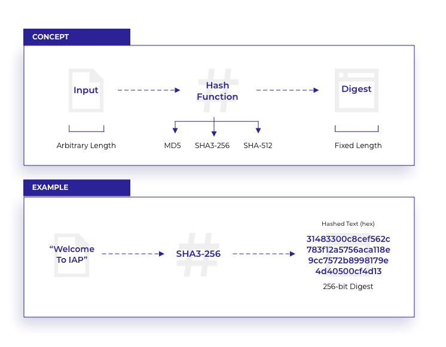
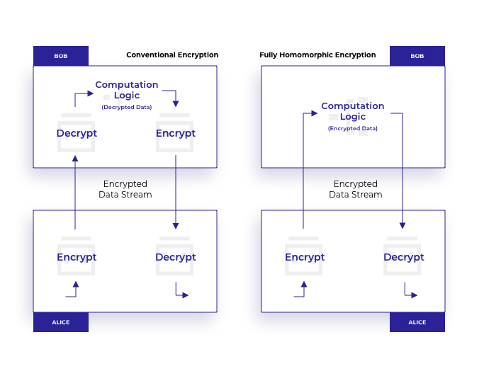

# Information Assurance Platform: Computational Verification and Privacy

[team@iap.network](mailto:team@iap.network)

## Abstract

This document explains the computational verification techniques utilised within the Information Assurance Platform (IAP). Computational integrity and privacy (CIP) is predominantely required with regards to off-chain computations, although is not limited to this use case. In such settings a client wants to prove that the result of the computation performed off-chain, in a non-observable manner, is correct. The incentive for performing off-chain computations may be to preserve privacy, but is more commonly for reasons of efficiency. Off-chain computations do not need to be verified by the whole blockchain. In order to verify the correctness of the computation whilst preserving the privacy (i.e. not to reveal information about the computation), techniques such as a zero-knowledge proof can be used. In this document we elaborate on zero-knowledge proofs that are relevant to the IAP. Concretely, we describe a specific type of a zero-knowledge proof i.e. ZK-STARKs --- ZK-STARKs are utilised within the IAP to ensure computational verification, integrity and privacy of computations.

## Index

- [Information Assurance Platform: Computational Verification and Privacy](#information-assurance-platform-computational-verification-and-privacy)
  - [Abstract](#abstract)
  - [Index](#index)
  - [Introduction](#introduction)
  - [Preliminaries](#preliminaries)
    - [Definitions and Notations of Zero-Knowledge Proofs](#definitions-and-notations-of-zero-knowledge-proofs)
      - [The Involved Parties: Peggy and Victor](#the-involved-parties-peggy-and-victor)
      - [Making a Statement](#making-a-statement)
      - [Notions of Proof Systems](#notions-of-proof-systems)
      - [Computational Complexity Classes](#computational-complexity-classes)
      - [Assessing Scalability](#assessing-scalability)
      - [Modes of Operations](#modes-of-operations)
    - [Cryptographic Definitions](#cryptographic-definitions)
    - [Adversarial Model](#adversarial-model)
    - [Hash functions](#hash-functions)
    - [Elliptic Curves and Pairings](#elliptic-curves-and-pairings)
    - [Quadratic Arithmetic Program](#quadratic-arithmetic-program)
    - [Homomorphic Encryption](#homomorphic-encryption)
  - [Proof of Knowledge Systems](#proof-of-knowledge-systems)
    - [Interactive Proofs](#interactive-proofs)
    - [Non-deterministic Polynomial Time Proofs (NP)](#non-deterministic-polynomial-time-proofs-np)
    - [Interactive Polynomial Time Proofs (IP)](#interactive-polynomial-time-proofs-ip)
    - [Arthur-Merlin Proofs (AM)](#arthur-merlin-proofs-am)
    - [Multi-Prover Interactive Proofs (MIP)](#multi-prover-interactive-proofs-mip)
    - [Non-Interactive Proofs (NIP)](#non-interactive-proofs-nip)
    - [Probabilistic Checkable Proofs (PCP)](#probabilistic-checkable-proofs-pcp)
      - [Probabilistic Checkable Interactive Proofs (PCIP)](#probabilistic-checkable-interactive-proofs-pcip)
      - [Linear Probabilistic Checkable Proofs (LPCP)](#linear-probabilistic-checkable-proofs-lpcp)
    - [Probabilistic Checkable Proofs of Proximity (PCPP)](#probabilistic-checkable-proofs-of-proximity-pcpp)
    - [Interactive Oracle Proofs (IOP)](#interactive-oracle-proofs-iop)
    - [Interactive Oracle Proofs of Proximity (IOPP)](#interactive-oracle-proofs-of-proximity-iopp)
    - [Summarising PoK Systems](#summarising-pok-systems)
  - [Zero-Knowledge Proofs](#zero-knowledge-proofs)
    - [Variants of Zero-Knowledge Proofs](#variants-of-zero-knowledge-proofs)
    - [Advanced Zero-Knowledge Proofs](#advanced-zero-knowledge-proofs)
    - [(Desirable) Properties of Proof Systems](#desirable-properties-of-proof-systems)
  - [Practical Zero-Knowledge Proofs](#practical-zero-knowledge-proofs)
    - [Existing Libraries and Implementations](#existing-libraries-and-implementations)
    - [Use Cases](#use-cases)
      - [IAP Network Use Cases](#iap-network-use-cases)
      - [Use of ZK Proofs in IAP Stack](#use-of-zk-proofs-in-iap-stack)
  - [ZK-SNARKs](#zk-snarks)
    - [Formal Definition of ZK-SNARKs](#formal-definition-of-zk-snarks)
    - [Theoretical Realisation of ZK-SNARKs](#theoretical-realisation-of-zk-snarks)
    - [Practical Implementations of ZK-SNARKs](#practical-implementations-of-zk-snarks)
  - [ZK-STARKs](#zk-starks)
    - [Advanced Properties and Improvements to Related Work](#advanced-properties-and-improvements-to-related-work)
    - [Definitions of ZK-STIKs and ZK-STARKs](#definitions-of-zk-stiks-and-zk-starks)
    - [Transformation from a High-level Problem Statement to a ZK-STARK](#transformation-from-a-high-level-problem-statement-to-a-zk-stark)
      - [Transformation of *C* to *P*(*x*)](#transformation-of-c-to-px)
    - [Underlying Protocols and Steps of ZK-STARKs](#underlying-protocols-and-steps-of-zk-starks)
    - [Usage of a ZK-STARK](#usage-of-a-zk-stark)
    - [Performance Evaluation of ZK-STARKs](#performance-evaluation-of-zk-starks)
  - [Active Research and Development](#active-research-and-development)
  - [Conclusion](#conclusion)
  - [Copyright](#copyright)
  - [Disclaimer](#disclaimer)
  - [References](#references)

## Introduction

Anonymous transactions were popularized by the [Bitcoin](https://bitcoin.org/) blockchain and have recently evolved into sophisticated tools layered with unique flexibility.  The [Ethereum](https://www.ethereum.org/) ledger[A1](#a1) capabilities have aided the growth of anonymous transaction products like [Zcash](https://z.cash/), JPMorgan's [Quorum](https://github.com/jpmorganchase/quorum) platform, and as of October 2018 Ernst & Young's [EY Ops Chain](https://www.ey.com/en_gl/news/2018/10/ey-launches-the-world-s-first-secure-private-transactions-over-the-ethereu-public-blockchain) Public Edition.  Zero knowledge proofs are the cryptographic tool enabling each of these products, ensuring the privacy of their respective clients and client transactions.  The IAP has partnered with several international organisations (e.g. [BDO](https://www.bdo.com/), [EY Global](https://www.ey.com/)) to collaborate on research and development of next generation applications of such technology.

Zero knowledge proofs (ZKP) are generic constructions that allow one to prove the validity of a statement without leaking any additional information.  A ZKP can be used to prove one has a sufficient account balance to support a transaction without revealing the actual balance.  ZKPs are also found in digital signatures, secret sharing, electronic voting, and other instances where privacy or anonymity are concerned. A ZKP provides computational integrity while preserving privacy (CIP). The IAP is most concerned with the ability of ZKP to provide transparency while retaining the quality of privacy.

This is of utmost importance in off-chain computations. Off-chain computations improve the efficiency of blockchain computations and save costs associated with a computation. An off-chain computation can be performed on a side or private chain; examples of which are integral to the IAP[A2](#a2). While this can improve efficiency, it leads to the problem of verifiability of the result of said computations. ZKPs are used to ensure the integrity of the result reported while keeping the off-chain computations private.

Other more practical examples of ZKPs comprise the following: the IAP uses ZKPs to drive one of its four main tools in the Information Assurance Toolbelt (IAT); CyberShields[A3](#a3). EY's prototype specifically uses ZKPs to verify token exchange between private clients while maintaining consensus.  [StarkWare](https://www.starkware.co/), an emerging company with specific interests in ZKPs on blockchains, raised $30M[1](#1) in funding as of October 2018. [ING Bank](https://www.ing.com/) announced its Zero Knowledge Range Proof[2](#2) solution in Amsterdam at the Enterprise Ethereum Alliance Event.  These companies are poised to lead a new wave of technological advancement fueled by ZKPs.

While ZKPs are valuable tools used to ensure statement integrity, the proof sizes can be large in practice.  ZK-STARKs are a special category of non-interactive zero knowledge proofs designed so that verification of a proof is succinct.  This emerging technology comes as a successor to ZK-SNARKs, another special category of non-interactive ZKPs.  The core technology of Zcash is currently based on ZK-SNARKs which provide succinct, non-interactive proofs of knowledge.  The ZK-SNARK creators have improved upon the original design principal which includes a trusted set-up phase.  The set-up phase could jeopardize the long-term security of ZK-SNARK proofs if secret values used to generate the set-up were ever leaked.  To move toward fully trustless applications ZK-STARKs have been developed.  ZK-STARKs avoid a trusted set-up phase and are thus considered to be transparent.  

In driving its platform for information assurance, cybersecurity and regulatory technology applications, the IAP includes tools that focus on relevant ZKPs; including ZK-STARKs. In this document, we define ZKPs, present a brief history of developments, and illustrate how they will be used in the IAP Network.

## Preliminaries

In this section, we present definitions and notations of zero-knowledge proof systems as well as cover the necessary background information of the technologies utilised in zero-knowledge proofs. We state the following definitions for Proof of Knowledge systems (PoK); however, these definitions also hold for Zero-Knowledge Proof systems (ZKP). PoK systems can be seen as a similar type of ZKPs, whereby a ZKP has in some aspects stricter requirements (e.g. the zero-knowledge property). 

### Definitions and Notations of Zero-Knowledge Proofs

#### The Involved Parties: Peggy and Victor

There are typically two parties involved in a Proof of Knowledge (PoK) system: a prover (who we will refer to as Peggy) and a verifier (who we further call Victor). Although the reader is welcome to think of Peggy and Victor as people, Peggy and Victor are represented as [Turing machines](https://complexityzoo.uwaterloo.ca/Petting_Zoo#Deterministic_Turing_Machine) in the context of PoK systems. Note that a Turing machine is solely a mathematical abstraction of a computer. Fortunately, a PoK protocol generally works under both assumptions. Peggy and Victor may also have a specified 'level' of power: they may be all-powerful or may be computationally-bounded. By all-powerful the reader can understand an 'idealistic' case: a theoretical assumption that there exists no computational limitations (for example, with regards to the number of bits of storage). By computationally-bounded the reader can consider the real-world case: every computational device is in some way bounded by the number of bits it can process or store. These are assumptions over which a specific PoK system is defined.

#### Making a Statement

Peggy's objective in a PoK system is to convince Victor that her statement is correct while Victor wants to verify that Peggy's statement is correct.  One statement mentioned previously might be Peggy's claim that her banking account balance exceeds a particular threshold.  A more general example of a statement is: Peggy claims she 'has knowledge of a value *v*'. Victor wants to verify if Peggy indeed has knowledge of this value without requiring Peggy to confess *v*.

Informally, a statement *x* is 'something' that Peggy wants to prove to Victor. With 'something' we typically understand a decision problem: if *x* is 'true' then Peggy is able to convince Victor with high probability (formally, Pr(*P*(*x*,*w*) &harr; *V*(*x*) &rarr; 1) > 0.99). If a statement is true (we may say a statement is valid, correct or good) then the statement is included in a 'language' *L*. The language *L* contains all 'similar' statements *y* &ne; *x*, which are defined over a well-defined structure.

To foster a better understanding of the above terms, we may phrase a statement in terms with a natural language (for example, English):

Natural language | Formal
---------------- | ------
*x* is an instance of an alphabet &sum; | *a* &isin; {a,b,c,...,y,z}
a word is the collection of some finite elements of &sum; — in sequence | hello
&sum;* is the set of all words | {'hello',' hola',' hallo', . . . }
a language *L* is defined over &sum;* more concretely, *L* is a subset of &sum;*  | {'hello',' blockchain',' proof', . . . } [English]

In software engineering, we are generally interested in solving algorithms. As such, let us represent these definitions in terms of a function: consider the output of a function *b*=*f*(*a*), where *a* is some secret input, *f*(*a*) is some sort of public function and *b* is a public output — *b* here is equal to the statement *x* above. The language *L* formally defines rules that statements must fulfill in order to be contained in the language.  A formalization of the language *L* which corresponds to the statement "I have knowledge of a secret value whose output under public function *f* is *b*" would be:  *x* &isin; *L* if *x*=*f*(*a*); *f*() defines the structure for language *L*.

Statements are associated with a 'witness' *w* (where *w* &isin; *W* and *W* denotes the set of all witnesses for statement *x*). A witness, in this context, is a piece of information that efficiently allows someone to verify the correctness (i.e. truth) of a statement. For example, if a statement claims "*n* is the product of two primes *n*=*p***q*" (the integer factorisation problem[3](#3)), then a witness would be one of the prime numbers *p* or *q*[4](#4).

The input pair of statement and witness (*x*,*w*) to a PoK system is used to create a proof string *&pi;*. Thus, *&pi;* is associated to the statement *x* where *&pi;* acts as a certificate of the statement *x*. Peggy sends *&pi;* to Victor, who can then evaluate it and make a decision to either accept the proof *&pi;* or to reject it.

Peggy has her private input *a* and wants to compute function *b*=*f*(*a*). She wants to prove to Victor that *b* is indeed the output of *f*(*a*). By utilising a PoK system she makes the statement *x* (i.e. *x* &isin; *L* which is equivalent to *b*=*f*(*a*)) and the PoK system outputs a proof *&pi;* for a witness *w*. Peggy can then send *&pi;* to Victor (either by publicly announcing *&pi;* or solely distributing *&pi;* to Victor for verification).

#### Notions of Proof Systems

Having defined the actors, formally defined a statement, and provided a PoK system overview, we define two notions which are indispensable to proof systems: the properties of completeness and soundness. Further, in PoK systems, the notion of validity extends the notion of soundness. 

We always discuss the definition in natural language and then provide a formal definition. To set-up these notions we say a relation R is defined as follows:

A relation *R* is a tuple (*x*,*w*) where the instance *x* is an element of the language *L* and the witness *w* is an element of the set of all witnesses *W*. Formally, this is stated as: *R* = {(*x*,*w*) : *x* &isin; *L*, *w* &isin; *W*}.

<a id="completeness">**Definition: Completeness**</a>: A PoK system satisfies the completeness property if an honest prover (Peggy) is able to convince an honest verifier (Victor) about the truth of a correct statement *x*.

Let (*x*,*w*) &isin; *R*. Then Peggy (*P*), with knowledge of witness *w*, succeeds to convince Victor (*V*) about statement *x* of length *n*. With probability Pr, it holds that Pr(*P*(*x*,*w*) &harr; *V*(*x*) &rarr; 1) = *c*(*n*).  *c*(*n*) is typically 1, except otherwise stated.

<a id="soundness">**Definition: Soundness**</a>: A PoK system satisfies the soundness property if a malicious prover, Pat, is not able to convince a honest verifier, Victor, about the truth of a false statement *x*.

Let (*x*,*w*) &isin; *R*. Then Pat (*P*'), without knowledge of witness *w*, should not be able to successfully convince Victor about the truth of a statement *x*' (*x*' denotes a 'false' statement — a statement where *P*' doesn't know *w* or a statement which is not included in the relation *x*' &notin; *R*). As such, it holds that Pr(*P*'(*x*') &harr; *V*(*x*') &rarr; 1) &le; *s*(*n*).

Given the previous defintions, in proof systems it is possible to satisfy the properties of completeness and soundness, yet, Peggy may not 'know' the witness *w*. As such, a stronger definition than soundness is the definition of validity. The notion of valitity is defined to prove 'knowledge' of a witness. 

<a id="validity">**Definition: Validity**</a>: A PoK system satisfies the validity property if the success probability of a 'knowledge extractor' (*E*), in extracting the witness *w*, being able to interact with a poentially malicous prover, Pat (*P*'), must be at least as high as Pat (interacting with Victor), being able to convince *V* about the truth of the statement *x*.

Let (*x*,*w*) &isin; *R*, *w* be a witness, *W*(*x*) be the set of all witnesses, *&kappa;* denote the knowledge error and *E**P*(*x*) denote oracle access of the knowledge extractor with the prover. Then the PoK system satisfies the validity property, if *E* given access to any prover *P*' the following statement holds: Pr(*E**P*'(*x*) &isin; *W*(*x*)) &ge; Pr(*P*'(*x*) &harr; V*(*x*') &rarr; 1) - *&kappa;*(*x*).

#### Computational Complexity Classes

A PoK is typically associated with a computational complexity class. Complexity classes organize computational problems according to their hardness. The hardness of a problem is measured by the resources it takes to solve the problem. We quantify this in terms of time complexity and space complexity, where the former evaluates the execution time of solutions to the problem and the latter evaluates the memory used to solve the problem.

For PoK systems there exist multiple complexity classes. Two prominent classes are [P](https://complexityzoo.uwaterloo.ca/Complexity_Zoo:P#p) and [NP](https://complexityzoo.uwaterloo.ca/Complexity_Zoo:N#np). P stands for polynomial time and includes all problems that are solvable in polynomial time. One may conceptualize a polynomial time algorithm as something a personal computer can process in less than a few hours. NP stands for non-deterministic polynomial time and includes problems that are not solvable in polynomial time but checkable in polynomial time. This means that given a solution to the problem, it can be verified in polynomial time whether the solution is correct or false. Other complexity classes which are applicable to PoK systems include [AM](https://complexityzoo.uwaterloo.ca/Complexity_Zoo:A#am) (Arthur Merlin), [IP](https://complexityzoo.uwaterloo.ca/Complexity_Zoo:I#ip) (Interactive Polynomial Time), [QIP](https://complexityzoo.uwaterloo.ca/Complexity_Zoo:Q#qip) (Quantum Interactive Polynomial Time), [MIP](https://complexityzoo.uwaterloo.ca/Complexity_Zoo:M#mip) (Multiple-Prover Interactive Polynomial Time) and [PCP](https://complexityzoo.uwaterloo.ca/Complexity_Zoo:P#pcp) (Probabilistically Checkable Proofs).

#### Assessing Scalability

The measures of time and space complexity are used to assess the efficiency and scalability of the prover and the verifier of PoK systems. The time complexity evaluates the amount of time it takes to run an algorithm. Factors that influence the time complexity of a protocol are:

(a) the number of rounds of the protocol, and
(b) the size of the inputs.

The space complexity evaluates the amount of memory used by the algorithm. Factors that contribute to the space complexity of a protocol are:

(a) the number of messages sent throughout a protocol, and
(b) the length of the messages.

Via these measures, it can be assessed how 'scalable' a systems is. Scalability enables us to understand whether a compuational problem can be solved or checked within given time and/or memory contraints.

#### Modes of Operations

In a PoK system Peggy exchanges messages with Victor in order to convince Victor about a statement Peggy made. Such a message exchange follows either in an interactive or non-interactive fashion.

*Interactive Proofs*: In an interactive protocol, Peggy and Victor exchange messages over *k* rounds. After the *k* rounds Victor either accepts or rejects the proof.

*Non-interactive Proofs*: In a non-interactive protocol, Peggy sends one message to Victor. Victor evaluates and either accepts or rejects the proof. We emphasize that Victor does not send messages to Peggy.

In the soundness property we have already indicated that Peggy must know a witness *w* in order to create a valid statement. If Peggy knows *w* she should be able to convince Victor that the statement is true and convince Victor to accept the proof. The phrase 'knows' in this context maps to the second part of a PoK. These proofs can be further refined according to the power or strength of a prover into the following two cases:

*Proof of Knowledge (PoK)*: In a 'proof' of knowledge, we assume that Peggy is all-powerful. This means that Peggy is not computationally restricted in any of her executions.

*Arguments of Knowledge (ARG)*: In an 'argument' of knowledge, we assume that Peggy is computationally bounded. As such, there is a limit in either time and/or memory complexity which she can't exceed in order to convince Victor about the truth of her statement *x*.

### Cryptographic Definitions

Zero-knowledge proofs offer computational[5](#5) integrity while preserving privacy. To this end, we haven't defined the terms 'integrity' and 'privacy' so far.  The following two definitions clarify the terms.

<a id="integrity">**Definition: Integrity**</a>: A system provides integrity if any unauthorised modification can be detected. Consider a transcript being transferred from Peggy to Victor. A system is integrity-preserving if the transcript is the same after being transferred over an untrusted channel. Typically such checking involves 'generate' and 'verify' algorithms. The generate algorithm creates a transcript and a certificate of integrity. The verify algorithm takes the transferred transcript with the certificate and accepts if the transcript is the same or rejects if not. [Hash functions](#Hash-functions) are typically used to create such a proof of integrity.

<a id="privacy">**Definition: Privacy**</a>:  A system provides privacy if it does not leak information to any unintended participant. In the context of ZKPs, the proof certificate 𝜋 should not leak any information about the witness *w*.

### Adversarial Model

In PoK/ZKP systems we consider the following adversaries:

1. a malicious prover
2. a malicious verifier
3. an interested outsider.

In the case an entity behaves honestly we assume that entity follows the given zero-knowledge protocol and sends legitimate messages. A malicious entity may deviate from the protocol to send falsified messages in order to 'break' the protocol and learn any additional information as a result. We assume that both Peggy and Victor have the incentive to complete the protocol; Victor either accepts or rejects the proof. We exclude denial of service attacks from the attack surface[6](#6).

In the case of a malicious prover we consider that Pat wants to convince an honest Victor about a false statement. A ZKP prevents Pat from successfully convincing Victor following the soundness property.

In the case of a malicious verifier we consider that Vanna wants to extract knowledge about the witness *w* from honest Peggy. Depending on the zero-knowledge protocol, Vanna is able to send challenges to Peggy and learn from the response of her queries. Strictly following a secure zero-knowledge protocol prevents such a case following the zero-knowledge property.

In the case of an interested observer of the communication between Victor and Peggy the observer may learn information from the interaction. The observer may read or alter a message. Reading messages sent between Peggy and Victor should not reveal sensitive information to the observer following a secure zero-knowledge protocol (zero-knowledge property). If the observer alters the message the protocol may fail or Victor may reject the proof. It is therefore important that during the exchange, participants digitally sign their message in order to ensure integrity and authenticity of the messages. Digitally signing a message with an user-specific private key also solves the problem of impersonation attacks (the associated public key can be used to verify the signature of the messages). A special case of alteration attacks is when an observer deletes a message, known as a denial of service attack. If Peggy or Victor detects that a message didn't arrive after a given time, she/he could either try to resend it or both parties change the communication channel (which the observer hopefully can not alter). An external observer may reuse or replay an old message (or parts or a message) from a successful result of the protocol execution. To prevent such cases some sort of freshness guarantee must be added to the messages. This could be either a timestamp, a counter or a cryptographic nonce.

We exclude any type of side-channel attacks from our threat model where the adversary has access to the computational machines of Peggy or Victor. We assume that both Peggy and Victor are running their protocols on secure and trusted machines. We assume that Peggy and Victor are following the zero-knowledge protocol and have no incentive[7](#7) to do otherwise.

### Hash functions

Hash functions are used in several zero knowledge protocols, including ZK-SNARKs and ZK-STARKs.

<a id="hash-function">**Definition: Hash function**</a>: A hash function maps bit strings of arbitrary length to fixed-length outputs.  More formally, for a function *H* : {0,1}&#42; &rarr; {0,1}n for finite *n*, we say *H* is a hash function.  

The flexible input size to hash functions makes them useful for constructing digital signatures, ZKPs, and other algorithms.  For use in secure protocols, cryptographic hash functions must always be *one-way*.  

<a id="one-way-function">**Definition:  One-way function**</a>: Given *b* in the image space of *H*, it must be infeasible to recover an input string *a* that satisfies *H*(*a*)=*b*.  

If the image space of a hash function *H* is smaller than the size of the domain, then *H* may also be considered a compression function.  In this case it is expected that several such *a* exist to satisfy *H*(*a*)=*b* .  

Additional security definitions imposed on hash functions are *preimage resistance*, *second-preimage resistance*, and *collision resistance*.  We outline the definitions below.

<a id="preimage-resistance">**Definition. Preimage resistance**</a>: Given *y* an element in the image space of *H*, it is infeasible to find a preimage *a* such that *H*(*a*)=*y*.

<a id="second-preimage-resistance">**Definition. Second-preimage resistance**</a>: Given *a*, it is infeasible to find a second pre-image *b* such that *H*(*a*)=*H*(*b*).

<a id="collision-resistance">**Definition. Collision resistance**</a>:  It is infeasible to find *a*,*b* with *a* &ne; *b*,such that *H*(*a*)=*H*(*b*).

In the context of advanced ZKPs, we are particularly interested in the last property of collision resistance. Collision resistant hash functions like SHA-2 and SHA-3 are believed to be post-quantum secure (meaning that they withstand attacks by a quantum computer). Collision resistance also implies second-preimage resistance[A33](#a33).

### Elliptic Curves and Pairings

Elliptic Curves and Pairings are essential parts of [ZK-SNARKs](#ZK-SNARKs), a special kind of ZKP discussed below. An elliptic curve is an algebraic structure defined by a curve equation *y*2 = *x*3 + *Ax* + *B* over a field: e.g. the real numbers, the complex numbers, the rational numbers, or a finite field *F**p*. Elliptic curve cryptography (ECC) defines curves over finite fields.  The points (*x*,*y*) over the field which satisfy the curve equation, combined with the *point at infinity* form the elliptic curve. The point at infinity is added to ensure the set of elliptic curve points form an additive group under a special group law[8](#8),[9](#9),[A30](#a30) . For an elliptic curve *C* defined over finite field *F**p*, let *C*(*F**p*) denote the group formed by the points of *C*[A30](#a30).

Suppose for now that the size of *C*(*F**p*) is a prime number *r* &ne; *p*.  In this case, *C*(*F**p*) is almost cyclic since any element besides the point at infinity generates the whole group. The smallest integer *k* such that *r* &mid; *p**k* - 1 is known as the *embedding degree* of *C*.  Let us denote the group *C*(*F**p*) by *G*1.  The multiplicative group of extension field *F**p**k* contains a subgroup of order *r* which we denote by *G**T*.  The elliptic curve with points from this extension field *C*(*F**p**k*) also forms a group and this group contains *G*1. *C*(*F**p**k*) contains another subgroup of order *r* which we may call *G*2.

<a id="tate-pairing">**Definition: Tate pairing**</a>: Let *g*, *h* be generators of *G*1, *G*2 respectively.  There exists a map called a Tate pairing that maps *G*1, *G*2 to *G**T* such that:

- Tate maps the generators *g*,*h* to a generator **g** of *G**T*
- For field elements *a*,*b* Tate preserves the following equality Tate(*ag*,*bh*)=**g***ab*.

Zcash[10](#10), one real-world implementation that uses ZK-SNARKs, digresses to introduce a term called homomorphic hiding in their blog series[11](#11), not found in the scientific literature, but which captures an essential concept. Homomorphic hiding is the simplest form of homomorphic encryption, and is a function *H*() which satisfies:

- Given *H*(*x*), *H*(*y*), one can compute an algebraic combination, e.g. *H*(*x*+*y*), *H*(*xy*), etc.
- *H*(*x*) is easy to compute.
- Given *H*(*x*) it is difficult to recover *x*, for most *x*.

Let *Z**p* denote the finite field of *p* elements: {0,1,...,*p*-1} and *Z**p*&#42; the corresponding multiplicative group *Z**p*&setminus;{0}.  The group *Z**p*&#42; is cyclic and thus can be generated by some element *g* &isin; *Z**p*&#42;.  Then the HH properties are satisfied by the function *H*(*x*) = *g*^{*x* mod p-1}, where \<g\>=*Z**p*&#42; and is illustrated as follows:

- *H*(*x*)*H*(*y*) = *g*^{*x* mod p-1} *g*^{*y* mod p-1} = *g*^{*x*+*y* mod p-1} = *H*(*x*+*y*)
- Modular exponentiation is efficiently computable.
- Given *g*, *g*x it is difficult, given only classical computational power, to recover input *x* for most *x*.  This is known as the discrete logarithm problem.

The above Tate pairing construction allows us to generate a HH that preserves addition and multiplication, but first we define three functions:
- *E*1(*x*) = *x* &#183; *g*
- *E*2(*x*) = *x* &#183; *h*
- *E*(*x*) = *x* &#183; **g**

where *x* &#183; *g* denotes adding the elliptic curve point *g* to itself *x* times, or scalar multiplication.  Given two values *E*1(*x*), *E*2(*y*), one can compute *E*(*xy*) using the Tate pairing.

### Quadratic Arithmetic Program

One ingredient of ZK-SNARKs that adds to their efficiency is an Quadratic Arithmetic Program (QAP).  A technique emerged in 1992 for translating PoK statements to polynomials for interactive proof systems.  In 2013 it was shown how to extend this concept in a non-interactive way by using QAPs.  

Arithmetic circuits are a collection of gates and wires used to connect the gates such that for a finite input set the circuit will perform a computation and produce an output.  To construct a QAP from a given PoK statement the statement is first converted into an arithmetic circuit.  The circuit's multiplication gates must have exactly two input wires: one left and one right, to be converted to a QAP. These help to define a *legal assignment* for the circuit; a set of input wires and output wires that are the result of a multiplication between exactly two wires.

In the QAP each multiplication gate is associated with a field element called a *target point*. The left and right input wires correspond to left and right polynomials.  The output of each multiplication corresponds to an output wire polynomial.  The left and right polynomials are defined to be zero on all target points except the ones to which they correspond.  The legal assignment elements are coefficients of the left, right, and output polynomials.  This construction is carefully designed so that a legal assignment is valid if and only if the polynomial P = LR-O is zero for all the target points[12](#12).

### Homomorphic Encryption

Fully homomorphic encryption (FHE), hailed by some as the "Holy Grail" of cryptography[13](#13),[A32](#a32) has revolutionized digital privacy in some trustless applications. This primitive ensures that data encrypted in a particular way can be processed without access to the secret decryption key.  The result of decrypting first then running some computation, *C*, on plaintext will yield the same result as running *C* on ciphertext and then decrypting.  FHE allows ciphertext data to be manipulated, queried, and operated on without compromising the privacy of the underlying plaintext; removing the need for trust.  An untrusted server or third-party may then compute on user encrypted data and return the encrypted results of the query or operation to the users who then use their own private key to decrypt the results.  

The first FHE scheme was proposed in 2009[A25](#a25), and improvements made in 2011 still yielded implementation results with public keys exceeding 2GB[A26](#a26).  Several homomorphic encryption libraries exist[14](#14) and although FHE is still under development the significance of this cryptographic primitive will fundamentally change cloud computing and storage. It also holds promise in such advanced areas as unlocking the relationships between DNA sequencing and disease.

IAP Network is currently incorporating homomorphic encryption libraries into the base library of the open source IAP Client, extending the verification capabilities of the IAT[15](#15) CyberShield tool.  These privacy preserving abilities of homomorphic encryption allow non-trusted parties to perform computations on sensitive data without the ability to view the plaintext data. This will be extended to FHE once libraries become available.

Database security includes encrypting stored data[16](#16). The queries to databases can leak information about the corresponding plaintext data and should also be secured.  Queries by a lawyer for past cases involving workplace misconduct or other controversial topics might reveal sensitive information about a client.  Queries by an employee about job openings might reveal the intention to leave his current employer.  The ideal scenario is for a user to encrypt her queries, send the encrypted queries to the server and receive encrypted results from the server.  When she is ready she can decrypt the results which are the response to her plaintext query.

Suppose users allow financial holdings to be monitored in real-time by third-party services.  These services might include alerts about suspicious activity, predictions based on spending habits, and forecasts for expected future balances.  These services are currently provided by trusted parties. Fully homomorphic encryption would allow user financial data to remain encrypted while being analyzed by such business entities.

IAP Network is actively researching additional use cases for FHE with regards to the IAT.  FHE has been shown in the literature to provide theoretical solutions for achieving verifiable computation on private data[A24](#a24).  This is especially useful for outsourced and cloud computations.  CyberTraces and CyberShields are two components of the IAT that offer independently verifiable evidence events.  FHE-based verifiable computation would enhance CyberTraces and CyberShields by adding to the variety of security models and assumptions.

One of the most interesting implications of FHE is the opportunity for scientists to study DNA sequencing in a privacy-preserving manner.  Genome analysis seeks to study genetic information to identify genetic predispositions and in doing so prevent fatal conditions.  Though this line of research offers promising benefits to patients, genetic information is and must remain confidential.  Researchers are pursuing FHE as a solution.  Since 2014 the annual iDASH Privacy & Security Workshop has sought to address biomedical challenges involving big data.  

IAP Network continues to monitor the progress relating to FHE and the analysis tools emerging from the iDASH workshop series. These state-of-the-art techniques may readily extend to identity management and privacy, a major use case of the IAP, by better detecting fraudulent activity based on private user history.  Other sensitive data like private votes may be protected; ensuring accurate government polling of electorates.  The tallying of private votes can be displayed using CyberChains[A8](#a8) to maximize transparency.

## Proof of Knowledge Systems

The following section provides an overview of current Proof of Knowledge (PoK) systems. A PoK can be seen as something similar, yet separate to a zero-knowledge proof (ZKP). PoKs have the similar properties as ZKPs in terms of completeness and soundness, but PoKs typically include an extractability property in contrast to the zero-knowledge property of a ZKP. The following presents a theoretical overview of PoK systems, followed by an overview of ZKP systems. Further, in the Practical Zero-Knowledge Proofs section we present an overview of practical implementations of zero-knowledge proofs.

### Interactive Proofs

The first class of PoK systems in the IAP are so called interactive proof (IP) systems. IP systems are by far one of the biggest class of proof systems and include multiple specialisations (explained further below in this section). In an IP system the prover and the verifier engage in an interactive protocol; messages are exchanged between both entities, and at a given point in time the verifier accepts or rejects the proof.

### Non-deterministic Polynomial Time Proofs (NP)

Interactive proofs pertaining to the class of [NP](https://complexityzoo.uwaterloo.ca/Complexity_Zoo:N#np) are the simplest form of interactive proofs. These proofs are single-round interactive proofs. We can barely say that such proofs are interactive; they follow the same principles as interactive proofs, yet run in a single round. For simplicity, we say proofs in this category are IP[1] proofs; the '1' denotes a single round. Following the character convention introduced in our recap, there exist an all-powerful prover (Peggy) and a computationally-bounded verifier (Victor). Being all-powerful, we understand that Peggy is not limited by any computational resources such as memory space or computation time. Peggy is considered to be a type of 'idealistic' entity[17](#17). Victor is represented by a deterministic[18](#18) polynomial-time machine[19](#19).

For any problem in the complexity class NP a proof protocol follows:

1. Peggy looks at the input *a*, computes *b*=*f*(*a*) and gives Victor a proof *&pi;* associated with the computation, where *&pi;* proves that *b* is indeed the result of *f*(*a*).
2. Victor verifies *&pi;* in polynomial time and if *&pi;* is valid he accepts, otherwise rejects the proof.

### Interactive Polynomial Time Proofs (IP)

Interactive proofs pertaining to the class of [IP](https://complexityzoo.uwaterloo.ca/Complexity_Zoo:I#ip) extend the NP proof class by allowing the protocol to run over multiple rounds. Multiple messages may be exchanged between Peggy and Victor before Victor reviews the proof &pi; and makes a decision to accept or reject the proof. To indicate the number of rounds in the class we denote the class as IP[*k*], where *k* is the number of rounds.

Victor has access to a string of random bits whose length is polynomial in the size of the input statement *x*. The random choices of Victor are kept private. Such a protocol is further referred to as a private coin protocol. Peggy and Victor exchange a polynomial number of messages (i.e. the length of all messages over *k* rounds are bounded by that polynomial). For any problem in the complexity class IP[*k*] a proof protocol follows. The protocol runs over two stages; an interaction phase where Peggy and Victor are exchanging messages and a decision phase where Victor makes a decision to either accept or reject the proof.

Interaction Phase:

1 - *k*: Peggy and Victor exchange messages.

Decision Phase:

1. If the statement is valid, i.e. *x* &isin; *L*, then Victor accepts the proof *&pi;* with probability &ge; &frac23;.
1. If the statement is invalid, i.e. *x* &notin; *L*, then Victor rejects the proof *&pi;* with probability &le; &frac13;.

### Arthur-Merlin Proofs (AM)

Interactive proofs pertaining to the class of [AM](https://complexityzoo.uwaterloo.ca/Complexity_Zoo:A#am) extend the IP proof class by allowing Peggy to learn the random choices (i.e. random bits) of Victor. In comparison to IP where all random choices of Victor are private, in AM proofs the random bits of Arthur are public. We denote the all-powerful prover as Merlin and the verifier as Arthur. Due to the public randomness choices, AM proofs are referred to as public coin protocols. Other than the public randomness of Arthur, AM proofs follow the same conventions as IP proofs[20](#20).

### Multi-Prover Interactive Proofs (MIP)

Interactive proofs pertaining to the class of [MIP](https://complexityzoo.uwaterloo.ca/Complexity_Zoo:M#mip) extend the IP proof class by allowing two independent provers, Peggy and Pat, to convince Victor about the truth of a statement *x*. It is important to say that Peggy and Pat are independent; they may communicate with each other beforehand, but cannot communicate with each other once Victor starts to send messages to them. The idea of multi-prover interactive proofs is motivated by minimising the probability of a 'lying' prover. An analogy can be made of the interrogation of a criminal; it may be easier to detect if a criminal is lying if he and his partner are interrogated in separate rooms (i.e. independence). Adding another prover might reveal 'more' or 'different' details (or viewpoints) of a story (i.e. a statement *x*).

### Non-Interactive Proofs (NIP)

The second class of PoK systems we are looking at are the so-called non-interactive proofs. This is a variant of PoK systems in which no interaction between Peggy and Victor is necessary. By 'no-interaction' we mean that Peggy sends a message to Victor who then makes a decision based on the information he obtains from Peggy.

To enable a 'message exchange' between Peggy and Victor both must share a common reference string which enables computational zero-knowledge without the requirement of interaction. Sharing of a common reference string between both parties follows the common reference string model[21](#21); a specific cryptographic model for non-interactive zero-knowledge proofs.

Another way of achieving non-interactive proofs in the random oracle model[22](#22) is via the Fiat-Shamir heuristic[23](#23). Fiat-Shamir enables the transformation of an interactive PoK to a non-interactive one. The interactive proof must be public coin (ie. the verifiers randomness needs to be public) in order to be convertible to be non-interactive.

### Probabilistic Checkable Proofs (PCP)

The next class of PoK systems we are looking at are the so-called [probabilistic checkable proofs](https://complexityzoo.uwaterloo.ca/Complexity_Zoo:P#pcp). Proofs pertaining to the standard class of PCP are verifiable in polynomial time for a set of single-round, non-interactive decision problems. Specialisations in this class allow interactive decision problems[24](#24) as well as restrict the query complexity to be linearly bounded[25](#25).

One may ask now what is so special about these kind of proofs, since all previous classes discussed before already achieve the same goals. The prominent feature of PCPs is that the verifier Victor has access to only a bounded amount of randomness; we denote such access by *r*(*n*) (where *n* denotes the length of the random bit string) and further refer to it as randomness complexity. Victor only reads a bounded amount of bits from the proof *&pi;*; we denote this by *q*(*n*) and further refer to it as query complexity.

In addition to the existing notations we denote with *c*(*n*) the completeness probability: *c*(*n*) gives a lower bound to which a proof achieves the completeness property (i.e. Peggy convinces Victor about the truth of a statement). With *s*(*n*) we denote the soundness probability: *s*(*n*) gives an upper bound to which a proof achieves the soundness property (i.e. a malicious prover, Paul, is able to convince Victor about a false statement).

For any problem in the complexity class PCP*c*(*n*),*s*(*n*)[*r*(*n*),*q*(*n*)] a proof protocol follows:

1. Peggy looks at the input *a*, computes *b*=*f*(*a*) and gives Victor a proof *&pi;* associated with the computation. In this context, *&pi;* proves that *b* is indeed the result of *f*(*a*).
1. Victor verifies *&pi;* in polynomial time by utilising randomness bounded by *r*(*n*) and querying *q*(*n*) bits of *&pi;*:
   1. If the statement is valid, i.e. *x* &isin; *L*, then Victor accepts the proof *&pi;* with probability at least *c*(*n*).
   1. If the statement is invalid, i.e. *x* &notin; *L*, then Victor accepts the proof *&pi;* with probability at most *s*(*n*).

Typically in PCP proofs, unless stated otherwise, *c*(*n*) is &ge; 1 (probability that Victor accepts a true *&pi;*) and *s*(*n*) is &le; &frac12; (probability that Victor accepts a false *&pi;*).

Previous authors have shown several relationships between the PCP complexity class with other complexity classes. One of these is the prominent PCP theorem[26](#26): PCP[ O(log *n*), O(1) ] = NP. This theorem states that every decision problem in the NP complexity class has a probabilistic verifiable proof of logarithmic randomness complexity *r*(*n*) = O(log *n*) and constant query complexity *q*(*n*) = O(1).

#### Probabilistic Checkable Interactive Proofs (PCIP)

Generic PCPs are inherently one-round protocols. A interactive extension was first proposed by Kalai and Raz[A31](#a31). In their extension they allow a verifier to have additional oracle access to a PCP before the verifier starts with an IP protocol. This type of protocol combines the flexibility of interactive proofs (allowing Victor to communicate with Peggy over multiple rounds) with the expressiveness of a PCP (allowing a wider range of problems[27](#27)).

Due to these improvements interactive PCP protocols gained wide attention by the cryptographic community. This resulted in a wide study to improve on the preliminary results of Kalai and Raz; the section below on Interactive Oracle Proofs explains these results in more detail.

#### Linear Probabilistic Checkable Proofs (LPCP)

Another improvement of generic PCPs is to limit the proof system to be an argument system. As such it only achieves computational soundness, yet improves on the communication and computation time to be linear bounded. This inherently changes the prover Peggy to be computationally bounded (and not all-powerful). As a result of this the proof string &pi; doesn't need to be polynomial in size. Instead the PCP may be viewed as a linear function.

### Probabilistic Checkable Proofs of Proximity (PCPP)

Further extending and improving on proofs of the class PCP is the next class of PoK systems; probabilistic checkable proofs of proximity[A29](#a29) (PCPP). In a PCPP proof the randomised verifier Victor gains access to a few bits of the proof &pi;, equivalent to a PCP. Victor gets access to only a few bits of input *x*. Victor is asked to verify if the statement *x* &isin; *L* holds. Victor cannot generally be expected to distinguish if *x* &isin; *L* from the case that *x* &notin; *L*, but should be very 'close' to it; Victor is expected to be able to distinguish between these two cases and reject any *x* (i.e. x&notin; *L*) if *x* is 'far' from *L*. In natural language; *x* is nowhere near to being included in the language *L*.

To cope with these developments we introduce another parameter to the PCPP PoK system: the proximity parameter &delta;. &delta; will indicate how 'far' a statement *x* is to be allowed to differ to be included in the language *x* &isin; *L*. We say Victor is only reading *q*' &le; *q*(*n*) bits from the input statement *x*.

For any problem in the complexity class PCPP*s*(*n*),&delta;[ *r*(*n*),*q*(*n*) ] a proof protocol follows:

1. Peggy looks at the input *a*, computes *b*=*f*(*a*) and gives Victor a proof &pi; associated with the computation.
1. Victor verifies &pi; in polynomial time by utilising randomness bounded by *r*(*n*), querying *q*(*n*) bits of &pi; as well as *q*' bits of *x*:

If the statement *x* is &delta;-close to L, i.e. |*x* &isin; *L*| &le; &delta;, then Victor accepts the proof &pi; with probability at most *s*(*n*); otherwise he rejects the proof &pi;.

A PCPP with proximity parameter &delta; = 0 is referred to as an exact PCPP, allowing no deviation of *x* from the language *L*.

### Interactive Oracle Proofs (IOP)

The next class we are looking at was already briefly introduced in the section of PCIPs. Interactive Oracle Proofs[A20](#a20) (IOPs) combine the features of IPs and PCPs but in a more subtle way than PCIPs. In a PCIP a verifier has additional oracle access to a PCP before the interactive protocol starts.

In an IOP the verifier Victor is not required to read the messages of prover Peggy in their entirety. Victor has oracle access to Peggy's messages and may probabilistically query those messages. In this context we add another parameter: *l* will denote the length of the proof &pi; (concretely, *l* sums up the total number of bits of all messages sent from Peggy to Victor). We further remind the thoughtful reader of the parameters *k* denoted as the round complexity (in natural language: the number of rounds), *c*(*n*) the completeness probability (if not specified otherwise, *c*(*n*) is typically assumed to be 1), *s*(*n*) the soundness probability and *r*(*n*) the randomness complexity (i.e. the number of random bits). Specific to IOP systems, in the *i*-th round of interaction we say Victor sends message *m**i* to Peggy, who reads the message in full (yes, in full; the mindful reader is reminded that it is Peggy who reads the message in full) and for response messages *n**i* from Peggy to Victor; Victor has oracle access and queries them probabilistically with *q*(*n*) (the query complexity), denoting the total number of bits Victor reads from the messages *n**i*.

For any problem in the complexity class IOP*c*(*n*),*s*(*n*) [ *r*(*n*),*q*(*n*),*k*,*l* ] a proof protocol follows:

Interaction Phase:

1 - *k*: Peggy and Victor exchange messages (*m**i*, *n**i*).

Decision Phase:

1. Victor verifies &pi; in polynomial time by utilising randomness bounded by *r*(*n*) and querying *q*(*n*) bits of &pi;:
   1. If the statement is valid, i.e. *x* &isin; *L*, then Victor accepts the proof &pi; with probability &ge; *c*(*n*).
   2. If the statement is invalid, i.e. *x* &notin; *L*, then Victor rejects the proof &pi; with probability &le; *s*(*n*).

IOPs generalise IPs and PCPs. A PCP is essentially a IOP with *k* = 1 and the first message from Victor to Peggy is considered to be empty. An IP is a IOP where Victor is querying the whole proof &pi;.

### Interactive Oracle Proofs of Proximity (IOPP)

The last class of PoK systems we are looking at extend the previous class by having additional query access to the input statement *x* (concretely: querying only a few bits of the input). This is similar to the class of PCPP, and is the so-called interactive oracle proofs of proximity[A17](#a17) (IOPP). We can say that an IOPP merges the classes IOP and PCPP. An IOPP is an IOP where Victor has access to a oracle to query input *x*. A proximity parameter &delta; decides if a statement *x* is included in a language *x* &isin; *L*, if *x* is &delta;-close to elements of *L*. This means that Victor accepts proofs &pi; where *x* is &delta;-close, otherwise Victor rejects the proof.

Similar to the argument of IOPs (that generalise IPs and PCPs) we can say that IOPPs generalise IOPs and PCPPs. A PCPP is an IOPP with *k* = 1 (single round); further, a IOP is an IOPP where Victor queries the whole input *x*.

For any problem in the complexity class IOPP*s*(*n*),&delta; [ *r*(*n*),*q*(*n*),*k*,*l* ] a proof protocol follows:

Interaction Phase:

1 - *k*: Peggy and Victor exchange messages (*m**i*, *n**i*).

Decision Phase:

1. Victor verifies &pi; in polynomial time by utilising randomness bounded by *r*(*n*), querying *q*(*n*) bits of &pi; as well as *q*' bits of *x*:
   1. If the statement *x* is &delta;-close to *L*, i.e.|*x* &isin; *L*| &le; &delta;, then Victor accepts the proof &pi; with probability at most *s*(*n*).
   2. Otherwise he rejects the proof &pi;.

### Summarising PoK Systems

There exist a wide variety of PoK systems. Starting with simple proof systems for the class of NP the previously mentioned proof systems continuously add on extra features. Or, in other words, generalise the previous proof systems. In the previous sections we have learned that a PoK system typically consists of two parties: a prover Peggy who wants to convince a verifier Victor about the truth of a statement. In doing so she creates a proof string &pi; which she communicates via a protocol to Victor. Victor then accepts or rejects the proof &pi;.

In Table 1 we present an overview of the previously discussed PoK systems. We use the following notations and parameters:

- &num; of messages --- indicates how many rounds the protocol runs; possible values are : *k* &isin; *N*;
- prover complexity --- indicates the 'power' of Peggy; possible values are: all-powerful or computationally bounded;
- verifier complexity --- indicates the 'power' of Victor; moreover, we indicate the number of bits read from proof string &pi; either as full or as *q*(*n*);
- verifier randomness --- indicates the randomness used by Victor; possible values are full or *r*(*n*);
- completeness --- indicates the probability that Victor accepts the proof &pi;; for proximity proofs we define the 'proximity' parameter &delta;; possible values are: &delta;, *c*(*n*) &isin; [0,1];
- soundness --- indicates the probability that Victor rejects the proof &pi;; in other words, the error rate that Victor accepts a false proof &pi; for a statement *x* &notin; *L*; possible values are: &delta;, *s*(*n*) &isin; [0,1];

<table>
  <tr>
    <th colspan="2">Parameter</th>
    <th>&num; of messages <i>k</i></th>
    <th>Prover Complexity</th>
    <th>Verifier Complexity <i>q(n)</i></th>
    <th>Verifier Randomness <i>r(n)</i></th>
    <th>Completeness&ast; <i>c(n)</i></th>
    <th>Soundness&ast; <i>s(n)</i></th>
  </tr>
  <tr>
    <td colspan="8">IP</td>
  </tr>
  <tr>
    <td></td>
    <td>NP</td>
    <td align="center">single</td>
    <td align="center">all-powerful</td>
    <td align="center">full</td>
    <td align="center">(private) full</td>
    <td align="center">1</td>
    <td align="center">0</td>
  </tr>
  <tr>
    <td></td>
    <td>(generic)&nbsp;IP</td>
    <td align="center">k</td>
    <td align="center">all-powerful</td>
    <td align="center">full</td>
    <td align="center">(private) full</td>
    <td align="center">&ge; &frac23;</td>
    <td align="center">&le; &frac13;</td>
  </tr>
  <tr>
    <td></td>
    <td>MA</td>
    <td align="center">single</td>
    <td align="center">all-powerful</td>
    <td align="center">full</td>
    <td align="center">(public)<a href="#16">16</a> full</td>
    <td align="center">&ge; &frac23;</td>
    <td align="center">&le; &frac13;</td>
  </tr>
  <tr>
    <td></td>
    <td>AM</td>
    <td align="center">k</td>
    <td align="center">all-powerful</td>
    <td align="center">full</td>
    <td align="center">(public) full</td>
    <td align="center">&ge; &frac23;</td>
    <td align="center">&le; &frac13;</td>
  </tr>
  <tr>
    <td></td>
    <td>MIP</td>
    <td align="center">k</td>
    <td align="center">collection of non-communicating strategies</td>
    <td align="center">full</td>
    <td align="center">(private) full</td>
    <td align="center">&ge; &frac23;</td>
    <td align="center">&le; &frac13;</td>
  </tr>
  <tr>
    <td colspan="2">NIP</td>
    <td align="center">single</td>
    <td align="center">all-powerful</td>
    <td align="center">full</td>
    <td align="center">(public)<a href="#17">17</a> full</td>
    <td align="center"><i>c(n)</i></td>
    <td align="center"><i>s(n)</i></td>
  </tr>
  <tr>
    <td colspan="8">PCP</td>
  </tr>
  <tr>
    <td></td>
    <td>(generic)&nbsp;PCP</td>
    <td align="center">single</td>
    <td align="center">all-powerful</td>
    <td align="center"><i>q(n)</i></td>
    <td align="center">(private) <i>r(n)</i></td>
    <td align="center">1</td>
    <td align="center">&le; &frac12;</td>
  </tr>
  <tr>
    <td></td>
    <td>PCIP</td>
    <td align="center"><i>k</i></td>
    <td align="center">all-powerful</td>
    <td align="center"><i>q(n)</i></td>
    <td align="center">(private) <i>r(n)</i></td>
    <td align="center">1</td>
    <td align="center">&le; &frac12;</td>
  </tr>
  <tr>
    <td></td>
    <td>LPCP</td>
    <td align="center">single</td>
    <td align="center">computationally-bounded</td>
    <td align="center"><i>q(n)</i></td>
    <td align="center">(private) <i>r(n)</i></td>
    <td align="center">1</td>
    <td align="center">&le; &frac12;</td>
  </tr>
  <tr>
    <td colspan="2">PCPP</td>
    <td align="center">single</td>
    <td align="center">all-powerful</td>
    <td align="center"><i>q(n)</i></td>
    <td align="center">(private) <i>r(n)</i></td>
    <td align="center">&delta;</td>
    <td align="center">1 - &delta;</td>
  </tr>
  <tr>
    <td colspan="2">IOP</td>
    <td align="center"><i>k</i></td>
    <td align="center">all-powerful</td>
    <td align="center"><i>q(n)</i></td>
    <td align="center">(private) <i>r(n)</i></td>
    <td align="center">1</td>
    <td align="center"><i>s(n)</i></td>
  </tr>
  <tr>
    <td colspan="2">IOPP</td>
    <td align="center"><i>k</i></td>
    <td align="center">all-powerful</td>
    <td align="center"><i>q(n)</i></td>
    <td align="center">(private) <i>r(n)</i></td>
    <td align="center">&delta;</td>
    <td align="center">1 - &delta;</td>
  </tr>
</table>

&nbsp;&nbsp;&nbsp;&nbsp;&nbsp;&nbsp;**Table 1**: Overview of previously discussed proof of knowledge systems. &ast; indicates standard values, unless stated otherwise.

## Zero-Knowledge Proofs

Zero knowledge proof systems, originating from a 1985 journal submission[A27](#a27), allow one to prove that a statement is true without revealing more than the truth of the statement.  A statement such as "893 is a composite number" can easily be proven true by providing one non-trivial factor of 893.  This approach reveals more than the truth of the statement and would consequently violate the zero knowledge property.  A general zero knowledge proof system is comprised of a statement and some communication exchange between two parties; a prover and a verifier.  The prover makes a statement to the verifier and attempts to convince the verifier that the given statement is true.

In graph theory it is known that given two graphs, it is difficult to find a homomorphism between the graphs[28](#28). Suppose Peggy knows a homomorphism between two graphs *G*1,*G*2, and wants to prove her knowledge to Victor.  Suppose further that Peggy does not wish to reveal her homomorphism but still aims to convince Victor that she does know a mapping.  A zero-knowledge proof system can help solve Peggy's problem. Victor challenges Peggy by sending her vertices of *G*1and requests the image of each vertex under her secret homomorphism.  After several rounds of challenges and responses from Peggy, Victor can determine whether the vertex images reported by Peggy respect the properties of a graph homomorphism. Eventually Victor will be convinced that Peggy does know a homomorphism without ever learning what the homomorphism is.  

In this scenario Peggy sought to prove the statement "I know a homomorphism between *G*1,*G*2."  Statements in zero knowledge proof systems should be easy to verify via a *witness*.  In the case of the integer 893, there are two witnesses; 19 and 47.  In Peggy's case her secret homomorphism is a witness.  A witness should not be revealed in a zero knowledge proof, but must be easy to verify.  We emphasize that Peggy's interaction with Victor is classified as an interactive zero knowledge proof.  The particular proof systems we discuss later, ZK-SNARKs and ZK-STARKs, do not require nor permit Victor to make queries to Peggy.  We classify such systems as *non-interactive* proofs.

A statement is formally defined over a language and outputs a proof.  The statement "893 is a composite number" can be defined over the language *L* ={ (*n*,*d*) | if *d* divides *n* with 1 &lt; *d* &lt; *n*, then *n* is composite}.  A proof &pi; should be necessary and sufficient information to convince a verifier that a statement is true.  

While a PoK system fulfills only the properties of completeness and soundness, a zero-knowledge proof additionally has the property of zero-knowledge:

<a id="zero-knowledge">**Definition: Zero-Knowledge**</a>: A PoK system satisfies the zero-knowledge property if a verifier (Victor) is not able to learn anything else from the proof except that the statement is true or false.

If (*x*,*w*) &isin; *R* then no verifier should be able to infer anything about the witness *w* except that *x* is a valid statement of language *L* and the prover is in the possession of a witness *w* which can prove that.

### Variants of Zero-Knowledge Proofs

Depending on the 'power' of both Peggy and Victor different variants of the zero-knowledge property can be achieved. For the definitions below we need to state an assumption --- ZK systems assume there exists a simulator accessible to every verifier which is able to 'simulate' the interaction between Peggy and Victor. Then, the following variants apply:

<a id="perfect-zero-knowledge">**Definition: Perfect Zero-Knowledge**</a>: a ZK-PoK system achieves perfect zero-knowledge if the distribution between the simulator *S* and the real interaction between Peggy and Victor remains completely indistinguishable.

<a id="statistical-zero-knowledge">**Definition: Statistical Zero-Knowledge**</a>: a ZK-PoK system achieves statistical zero-knowledge if the distribution between the *S* and the real interaction between Peggy and Victor is statistically close (i.e. negligible).

<a id="computational-zero-knowledge">**Definition: Computational Zero-Knowledge**</a>: a ZK-PoK system achieves computational zero-knowledge if the distribution between the *S* and the real interaction between Peggy and Victor remains indistinguishable by a computationally-bounded algorithm (i.e. polynomial-time Turing machine).

### Advanced Zero-Knowledge Proofs

The above overview of a PoK and a natural specialisation as a zero-knowledge proof allow us to now dig deeper into desirable properties of such proof systems. Achieving the basic properties of such systems (i.e. completeness and soundness) can be done fairly efficiently with current state-of-the-art technology. Achieving the zero-knowledge property can be achieved in a similar manner. If more properties are added then the zero-knowledge systems become increasingly complex. To utilise such systems in real-world settings, an application designer must keep certain limitations or trade-offs in mind.

The following lists desirable properties of advanced PoK systems. We will then cover two advanced proof systems: ZK-SNARKs and ZK-STARKs.

### (Desirable) Properties of Proof Systems

<a id="succinctness">**Definition: Succinctness**</a>: A PoK system is succinct if the time to verify the validity of the statement is much smaller than simply recomputing the statement (i.e. the function). The naїve approach to verifying correctness of a statement is to simply recompute the function with the given inputs. This may not always be the optimal solution. For example, if we consider resource intensive operations then it might be too expensive to recompute the original function during the verification step. The property of succinctness is very useful despite coming with the price that while verification time is much smaller, the time to create a proof is larger than simply computing the function.

<a id="transparency">**Definition: Transparency**</a>: A PoK system is transparent if any randomness used by the prover or verifier is public. PoKs following such a convention are typically referred to as Arthur-Merlin or Merlin-Arthur proofs. PoK systems which don't follow these conventions typically rely on a trusted set-up phase. Private randomness is used during this phase to generate certain parameters used for later operations. It is essential that the randomness in this phase doesn't leak to any malicious entity (i.e. prover, Pat) otherwise Pat may be able to convince Victor about a false statement *x*' without Victor being able to identify that there was something amiss within the protocol.

<a id="universality">**Definition: Universality**</a>: A PoK system is universal if it can be applied to any computational problem in its relevant computational complexity class. Goldreich et al.[A28](#a28) proved that for every problem in the class of NP, there exists a zero-knowledge proof. Being compliant to solve any computational problem typically comes with an efficiency trade-off.

<a id="scalability">**Definition: Scalability**</a>: A PoK system is scalable if the prover runs in quasilinear time and verifier validates the proof in polylogarithmic time. Verifier scalability is very important in order to achieve succinct proofs. To be useful in any real-world scenario the prover must also scale when the function complexity (i.e. circuit size[29](#29)) and the input size (i.e. number of variables) increase.

<a id="post-quantum-security">**Definition: Post-Quantum Security**</a>: A PoK system is post-quantum secure if it withstands the attacks of a quantum computer. Shor's algorithm[30](#30) presents a quantum polynomial time attack on some public-key cryptography based on the integer factorisation problem and the discrete logarithm problem. Because quantum attacks against collision-resistant hash functions have not been found to run in quantum polynomial time, it is believed that if a PoK system is only based on collision-resistant hash functions then the PoK system remains post-quantum secure.

## Practical Zero-Knowledge Proofs

The recent introduction of zero knowledge proofs to a more mainstream audience has initiated efforts to standardize these protocols.  The first ZK Proof Standards Workshop[31](#31), held in May 2018, was organized to further the development and use of zero knowledge proofs by gathering together field experts from both industry and academia.  This first workshop aimed to develop metrics for assessing the security of ZK Proofs and to find the balance between performance and security tradeoffs for practical implementations and applications, among other goals.  Whitepapers[32](#32) from the workshop proceedings reveal the many factors involved in establishing a secure and practical zero knowledge proof.  

The efficiency of a zero knowledge proof is based on the running time of the prover, the running time of the verifier, the memory required to store proofs and witnesses, and the cost of any initialization or set-up phase.  We quantify these factors in terms of time complexity and space complexity and further classify zero knowledge proofs into complexity classes.

In practice the *statement* produced by the prover is converted to a circuit.  The size of the proof should be sublinear in the size of the statement circuit to be considered an efficient zero knowledge proof.  ZK-STARK constructions convert a statement to a set of polynomials over binary fields that satisfy certain constraints.  This process is known as arithmetization.  

Different zero knowledge proof techniques arithmetize statements differently.  In the Ligero protocol[A12](#a12) statements are converted to circuits and then to matrix over a finite field, not necessarily binary.  In range checking proofs the statement is converted to a set of multivariate polynomials over finite fields.  The range checking proofs are not considered quantum-secure as they depend on the intractability of the discrete logarithm problem.  These different approaches to statement conversions are being addressed by the ZKProof.org Workshop37 series as well as ideal file formats and compilers.

### Existing Libraries and Implementations

ZK-SNARKs have been adopted by the tech community in the form of libraries and implementations.  The most prominent library is Libsnark, developed by the SCIPR lab, which offers C++ implementations of all aspects of ZK-SNARKs. IAP Network has implemented the Zcash libsnark library into the IAT CyberShield tool for its proof of concept. Ethsnarks, Zsl-q, and Jsnark offer Ethereum, Quorum, and Java variants, respectively.  A general toolbox for ethereum and off-chain zero knowledge is offered in ZoKrates, and an end-to-end toolchain in Pequin.  As previously mentioned, ZK-SNARKs require a trusted set-up phase and library Mpc offers a set-up alternative using secure multiparty computation protocols.  Distributed ZK-SNARKs are available with Dizk.  Additional open-source resources are Bellman, Groth16, and Snarky.

<table>
  <tr>
    <th>Library</th>
    <th>Description</th>
    <th>Reference</th>
  </tr>
  <tr>
    <td>libsnark</td>
    <td>de facto library</td>
    <td><a href="https://github.com/scipr-lab/libsnark">https://github.com/scipr-lab/libsnark</a></th>
  </tr>
  <tr>
    <td>ethsnarks</td>
    <td>ethereum variant</td>
    <td><a href="https://github.com/HarryR/ethsnarks">https://github.com/HarryR/ethsnarks</a></th>
  </tr>
  <tr>
    <td>zsl-q</td>
    <td>JPMorgan Quorum zero knowledge security layer</td>
    <td><a href="https://github.com/jpmorganchase/zsl-q">https://github.com/jpmorganchase/zsl-q</a></th>
  </tr>
  <tr>
    <td>dizk</td>
    <td>distributed zk-snarks</td>
    <td><a href="https://github.com/scipr-lab/dizk">https://github.com/scipr-lab/dizk</a></th>
  </tr>
  <tr>
    <td>jsnark</td>
    <td>java implementation of zk-snarks</td>
    <td><a href="https://github.com/akosba/jsnark">https://github.com/akosba/jsnark</a></th>
  </tr>
  <tr>
    <td>bellman</td>
    <td>rust implementation of zk-snarks</td>
    <td><a href="https://github.com/zkcrypto/bellman">https://github.com/zkcrypto/bellman</a></th>
  </tr>
  <tr>
    <td>groth16</td>
    <td>ZK-SNARK variant by Groth16</td>
    <td><a href="https://github.com/zkcrypto/groth16">https://github.com/zkcrypto/groth16</a></th>
  </tr>
  <tr>
    <td>mpc</td>
    <td>Secure multi-party protocol for trusted setup phase</td>
    <td><a href="https://github.com/QED-it/mpc">https://github.com/QED-it/mpc</a></th>
  </tr>
  <tr>
    <td>snarky</td>
    <td>Library for R1CS SNARKs</td>
    <td><a href="https://github.com/o1-labs/snarky">https://github.com/o1-labs/snarky</a></th>
  </tr>
  <tr>
    <td>pequin</td>
    <td>End-to-end toolchain for SNARKs</td>
    <td><a href="https://github.com/pepper-project/pequin">https://github.com/pepper-project/pequin</a></th>
  </tr>
  <tr>
    <td>ZoKrates</td>
    <td>ZK-SNARK toolbox for Ethereum; off-chain</td>
    <td><a href="https://github.com/JacobEberhardt/ZoKrates">https://github.com/JacobEberhardt/ZoKrates</a></td>
  </tr>
</table>

&nbsp;&nbsp;&nbsp;&nbsp;&nbsp;&nbsp;**Table 2**: ZK-SNARK libraries and resources

Beyond these open-source resources ZK-SNARKs have also made tangible contributions to existing financial platforms.  The IAP, Zcash, Ethereum, and the J.P. Morgan Quorum[33](#33) blockchain's zero knowledge security layer (ZSL) are currently running ZK-SNARKs to achieve zero knowledge proofs in a succinct, non-interactive way[34](#34).  Although the proof sizes are small enough for anonymity in crypto transactions these protocols are not considered quantum-secure.  ZK-SNARKs base security on certain hardness assumptions which allows for smaller memory requirements.  Their quantum-secure counterparts abandon assumptions with known quantum attacks and instead use merkle trees to achieve an asymmetric construction.  The merkle trees are thus included in the PoK.  Circumventing this security tradeoff would result in significantly larger proof sizes for quantum-secure zero knowledge proof systems.

Another recent zero knowledge proof in a quantum-secure setting is ZKBoo[35](#35) and ZKB++[36](#36).  ZKBoo is interactive, while ZKB++ is non-interactive, boasts smaller proofs sizes, and has a highly detailed proof of security.  The latter scheme is used as core ingredient of the signature scheme Picnic[37](#37).

Bulletproofs are short non-interactive zero knowledge proofs that do not require a trusted set-up like ZK-SNARKs.  They do however depend on the difficulty of solving the discrete logarithm problem; they are not quantum-secure.  They improve on one feature of ZK-SNARKs but are not classified as a ZK-STARK.

In many financial scenarios it suffices to show that a value *x* lies within a finite interval [*a*,*b*].  Consider a potential home-buyer who wishes to prove himself financially prepared for a mortgage but does not wish to disclose his exact account balance.  A range checking proof would allow him to prove that his account balance *x* is within the acceptable range [*a*,*b*] for a mortgage.  The specificity of this zero knowledge problem yields simpler solutions than ZK-SNARKs and ZK-STARKs and are known as ZKRPs, or zero knowledge range proofs.  ING is currently incorporating efficient ZKRPs for Ethereum into their blockchain product.  The security of the ZKRP depends on the intractability of the discrete logarithm problem which is not quantum-secure.  

<table>
  <tr>
    <th>Library</th>
    <th>Description</th>
    <th>Reference</th>
  </tr>
  <tr>
    <td>ZK-STARK</td>
    <td>ZK-STARK library</td>
    <td><a href="https://github.com/elibensasson/libSTARK">https://github.com/elibensasson/libSTARK</a></td>
  </tr>
  <tr>
    <td>ING ZKRP</td>
    <td>Zero knowledge range proof</td>
    <td><a href="https://github.com/ing-bank/zkrangeproof">https://github.com/ing-bank/zkrangeproof</a></td>
  </tr>
  <tr>
    <td>ZKBoo</td>
    <td>Quantum-secure zero knowledge proof</td>
    <td><a href="https://github.com/Sobuno/ZKBoo">https://github.com/Sobuno/ZKBoo</a></td>
  </tr>
  <tr>
    <td>Picnic</td>
    <td>Post quantum signature</td>
    <td><a href="https://github.com/Microsoft/Picnic">https://github.com/Microsoft/Picnic</a></td>
  </tr>
  <tr>
    <td>Picnic</td>
    <td>Post quantum signature</td>
    <td><a href="https://github.com/IAIK/Picnic">https://github.com/IAIK/Picnic</a></td>
  </tr>
  <tr>
    <td>Bulletproofs</td>
    <td>Library for bulletproofs</td>
    <td><a href="https://github.com/bbuenz/BulletProofLib">https://github.com/bbuenz/BulletProofLib</a></td>
  </tr>
  <tr>
    <td>Bulletproofs</td>
    <td>Library for bulletproofs</td>
    <td><a href="https://github.com/dalek-cryptography/bulletproofs">https://github.com/dalek-cryptography/bulletproofs</a></td>
  </tr>
  <tr>
    <td>Bulletproofs</td>
    <td>Library for bulletproofs</td>
    <td><a href="https://github.com/ElementsProject/secp256k1-zkp">https://github.com/ElementsProject/secp256k1-zkp</a></td>
  </tr>
</table>

&nbsp;&nbsp;&nbsp;&nbsp;&nbsp;&nbsp;**Table 2**: Special categories of ZK Proofs

The greater tech community has been active in deploying libraries and implementations of ZKP tools.  There are several other resources and ZKP implementations[38](#38).

### Use Cases

ZKPs are instrumental in creating anonymous transactions, proving the computational integrity of a given result, confirming private identification information, and underpinning data assurance for compliance and information assurance needs.  As discussed, Zcash is an anonymous payment system secured by ZK-SNARKs. Below we expand on some technical components of this system.  JPMorgan's Quorom platform and EY Ops Chain Public Edition contain zero knowledge layers to enable the privacy of client activity.  ZK-STARKs are publicly verifiable, but this is not a general requirement of ZKPs, and only non-interactive ZKPs can achieve publicly verifiable property.  IAP Network takes things a step further by embedding ZKPs directly into the IAT; enabling any industry application built on the IAP to provide proof that such application has computed its output data correctly.

Computational integrity is essential in cases where a third party is tasked with making some specialized computations on data that an individual cannot efficiently run for herself.   These can include audits, compliance checks, and cloud computations.  In many cases the computation is known, but the process is tedious and too expensive for personal computers and memory. Blockliance, one of the first round of applications under development to use the IAP, makes it easier for auditors to efficiently and cheaply verify the applied attestations of their clients against their own infrastructure in innovative and new ways[A9](#a9).

We summarize some of the commonly used zero-knowledge proofs used to establish computational integrity. Private information like age, credit score, or debt are numeric values and can be proven to lie within a finite interval while preserving the zero knowledge property by using a range-checking proof.  Proofs of membership take private input strings, not necessarily numeric, to determine whether the string belongs to a given set or not.  In both cases the proof can be used in an identity framework.  Additional ZKPs may be used for private input, public function pairs like proofs of membership or proofs that private electronic votes have been properly tallied.  

The recent ZKProof workshop at Zcon0[39](#39) identified three prominent use cases of ZKPs: identity framework, asset transfer and regulation compliance.  The following table summarises several use cases[40](#40) established by academics and industry leaders during the workshop:

<table>
  <tr>
    <th>Use Case</th>
    <th>Statement</th>
    <th>Private input</th>
    <th>Function</th>
  </tr>
  <tr>
    <td><i>Range-checking proof</i><a href="#a23">A23</a> Verifying sufficient credit score</td>
    <td>"Credit score is within the desired range" <i>x</i> &isin; [<i>a</i>,<i>b</i>]</td>
    <td><i>Yes</i> Credit score</td>
    <td><i>Public</i> Greater than, less than</td>
  </tr>
  <tr>
    <td><i>Set membership</i><a href="#a14">A14</a> Is a passport number found on a no-fly list</td>
    <td>"Passport number is an element of the no-fly list" <i>x</i> &isin; <i>S</i></td>
    <td><i>Yes</i> Passport number</td>
    <td><i>Public</i> Set intersection</td>
  </tr>
  <tr>
    <td><i>Verify computation</i><a href="#a11">A11</a> Verify hash value for blockchain without revealing the input</td>
    <td>"<i>f</i>(<i>x</i>)=<i>y</i>"</td>
    <td><i>Yes</i> Input <i>x</i></td>
    <td><i>Public</i> <i>f</i>()</td>
  </tr>
  <tr>
    <td>Knowledge of committed values, equality of committed values, relationships between committed values</td>
    <td>"I know <i>x</i> such that <i>h</i>(<i>x</i>)=<i>y</i>" "I know <i>x</i>1 &lt; <i>x</i>2 such that <i>h</i>(<i>x</i>1)=<i>y</i>1, <i>h</i>(<i>x</i>2)=<i>y</i>2"</td>
    <td><i>Yes</i> Inputs <i>x</i>,<i>x</i>1,<i>x</i>2</td>
    <td><i>Public</i> <i>h</i></td>
  </tr>
  <tr>
    <td>Knowledge of a signature on a message/committed value</td>
    <td>"This is a valid signature on a private committed value"</td>
    <td><i>Yes</i> Committed value</td>
    <td><i>Public</i> Signature algorithm</td>
  </tr>
</table>

&nbsp;&nbsp;&nbsp;&nbsp;&nbsp;&nbsp;**Table 3**: Several use cases of ZK Proofs

#### IAP Network Use Cases

While the main use case of zero-knowledge proofs integrated in the IAP is to provide proofs of computational integrity whenever a computation is executed off the public chain, there are many other use cases (as outlined in the IAP non-technical whitepaper[41](#41)).

#### Use of ZK Proofs in IAP Stack

Computations executed off-chain (i.e. on IAP Chains[A4](#a4) or the non-IAA node IAP Client[A5](#a5)) are less trustworthy than on-chain (i.e. on IAA nodes[A6](#a6) or IAP Core[A7](#a7)) computations as they are not accessible for recomputation by the nodes of IAP Mainnet (Plato). To be able to prove that the computations on data on the side chain are executed as expected (ie. the 'claimed' result of the computation is truly the result of the computation), a CyberShield of the result can be computed. The result of the computation and the associated CyberShield certificate can then be pushed back to the public chain. In this way it is possible for the IAA Node to prove the correctness of the off-chain computation while keeping the computation private. The CyberShield certificate proves the correctness and in doing so, does not reveal anything else than the correctness of this assertion.

The IAP offers solutions to improve transparency of financial processes when properly paired with CyberShields.  Government spending and assurance of philanthropic expenditures are among the many cases where financial accountability can benefit from CyberChains to track account changes.  CyberShields should be incorporated when protecting sensitive or private data by setting the witness to the be the private data, and associating the statement to be proved to some arithmetic representation.

Electronic polling of electorate and boards requires the utmost transparency of vote tallying while preserving the privacy of individual votes.  IAP CyberChains can be used to maintain the history of vote tallies while CyberShields must be incorporated to show that each counted vote was properly cast without revealing the underlying vote.  Verifiable tally computations, secured by CyberTraces, can improve the integrity of results.

The following table briefly outlines the use of ZK Proofs for the IAP use cases identified in the IAP non-technical whitepaper. We colour-coded the categories of the IAP use cases as follows:

<table>
  <tr>
    <th>Use Case</th>
    <th>Statement</th>
    <th>Private Input</th>
    <th>Examples / Applications</th>
  </tr>
  <tr>
    <td colspan="4"> <b>Cybersecurity</b></td>
  </tr>
  <tr>
    <td>Continuous Identity and Authentication</td>
    <td>"I am authorised to use this service"</td>
    <td>Identity</td>
    <td><a href="https://www.miracl.com/miracl-labs/m-pin-a-multi-factor-zero-knowledge-authentication-protocol">M-Pin</a></td>
  </tr>
  <tr>
    <td>Supply Chain Security</td>
    <td>"I am participant x" "Box x contains content y"</td>
    <td>Identity Content of Cargo</td>
    <td><a href="https://medium.com/@adrianbarwicki/the-path-to-supply-chain-transparency-with-origintrail-dc25cbd67*a*03">OriginTrail</a></td>
  </tr>
  <tr>
    <td>Internet of Things (IoT) device monitoring and control</td>
    <td>"The device state of x is as expected"</td>
    <td>Device state</td>
    <td><a href="http://www.ijritcc.org/download/1429528713.pdf">Research Paper</a></td>
  </tr>
  <tr>
    <td>Digital identity, authentication and signing of video/audio</td>
    <td>"I am x" "I want to prove my signature"</td>
    <td>Identity Signature</td>
    <td>Set membership f(x)</td>
  </tr>
  <tr>
    <td>Secure code scanning</td>
    <td>"The source code scanner completed scan X of code Y"</td>
    <td>Source code</td>
    <td>Verification of code scan</td>
  </tr>
  <tr>
    <td>Vulnerability management</td>
    <td>"Software x  complies with security controls y"</td>
    <td>Software code & configuration</td>
    <td><a href="https://www.sciencedirect.com/science/article/pii/S0167404817300664">Research Paper<a/></td>
  </tr>
  <tr>
    <td>Intrusion detection and analysis machine learning and AI</td>
    <td>"A baseline X has been interrupted by type Y"</td>
    <td>Historical activity of systems in aggregate</td>
    <td><a href="http://www.ijmer.com/papers/Vol2_Issue5/CJ2535123516.pdf">Research Paper</a></td>
  </tr>
  <tr>
    <td>Source code malware analysis with machine learning</td>
    <td>"Source code x is free of known malware indicators"</td>
    <td>Source code</td>
    <td><a href="https://arxiv.org/pdf/1601.01405.pdf">BitAV<a/></td>
  </tr>
  <tr>
    <td>Disaster Recovery and Data Redundancy</td>
    <td>"We have computed backups at date X and successfully transmitted them to site Y" "Operational procedure X was successfully tested at site Y with expected outcome Z"</td>
    <td>Data</td>
    <td><a href="https://console.bluemix.net/docs/services/Cloudant/guides/disaster-recovery-and-backup.html#disaster-recovery-and-backup">IBM Cloud<a/></td>
  </tr>
  <tr>
    <td>Digital forensics</td>
    <td>"Hash X was computed using library Y"</td>
    <td>Confidential data</td>
    <td><a href="https://cis.upenn.edu/~sga001/papers/spice-osdi18.pdf">Research Paper<a/></td>
  </tr>
  <tr>
    <td>Change management & auditing, FIM</td>
    <td>"Approved Change X was deployed using procedure Y with integrity"</td>
    <td>Yes Historical valid file changes</td>
    <td><a href="https://dci.mit.edu/zkledger/">zkledger</a></td>
  </tr>
  <tr>
    <td colspan="4"> <b>Development, Operations & Security</b></td>
  </tr>
  <tr>
    <td>Smart contract security</td>
    <td>"smart contract x follows security requirement y"</td>
    <td>Smart Contract</td>
    <td><a href="https://www.aztecprotocol.com/">aztec protocol</a></td>  
  </tr>
  <tr>
    <td>Secure continuous delivery assurance</td>
    <td>"Item x has been processed at location y"</td>
    <td>Location y</td>
    <td><a href="https://www.chronicled.com/solutions">Chronicled<a/></td>
  </tr>
  <tr>
    <td>Asset discovery and scanning</td>
    <td>"Network discovery scan Y completed successfully"</td>
    <td>Private IP ranges</td>
    <td>Computation verification</td>
  </tr>
  <tr>
    <td colspan="4"> <b>Society, Charity & Humanitarian</b></td>
  </tr>
  <tr>
    <td>Transparency in donations and funding</td>
    <td>"Agency accepted donation amount x from entity y, x is within the approved donation range,  y is on the list of approved donors"</td>
    <td>Amount x, Entity y</td>
    <td><a href="https://www.researchgate.net/publication/329374059_Determinants_and_Consequences_of_Nonprofit_Transparency">Research Paper<a/></td>
  </tr>
  <tr>
    <td>Non-profit agency spending</td>
    <td>"Agency spent money on x, and x is within the set of approved expenses"</td>
    <td>Expense x</td>
    <td><a href="https://www.researchgate.net/publication/329374059_Determinants_and_Consequences_of_Nonprofit_Transparency">Research paper<a/></td>
  </tr>
  <tr>
    <td>Assurance of expenditures</td>
    <td>"I've spend amount x on expense y"</td>
    <td>Amount x</td>
    <td><a href="https://www.aicpa.org/interestareas/notforprofit/resources/assurance.html">Nonprofit Assurance<a/></td>
  </tr>
  <tr>
    <td>Asset tracking</td>
    <td>"The location of asset x is y"</td>
    <td>Location</td>
    <td><a href="https://stratumn.com/thinking/zero-knowledge-proof-of-location/">Stratumn</a>, <a href="https://platin.io/">Platin</a></td>
  </tr>
  <tr>
    <td colspan="4"> <b>Identity Management & Privacy</b></td>
  </tr>
  <tr>
    <td>Account takeovers mitigation</td>
    <td>I am the authorised person to access account x</td>
    <td>identity</td>
	  <td><a href="https://sovrin.org/the-sovrin-network-and-zero-knowledge-proofs/">Sovrin</a></td>
  </tr>
  <tr>
    <td>Personal document assurance</td>
    <td>"My passport number is y"</td>
    <td>Passport information</td>
    <td><a href="https://www.ibm.com/blogs/blockchain/2019/01/privacy-in-blockchain-collaboration-with-zero-knowledge-proofs/">IBM Blockchain Platform</a></td>
  </tr>
  <tr>
    <td>Qualifications and education assurance</td>
    <td>"I have qualification x" "I have a MSc degree in y"</td>
    <td>Qualification certificate</td>
    <td><a href="https://tiiqu.com/">TiiQu<a/></td>
  </tr>
  <tr>
    <td>Licensing assurance</td>
    <td>"I have license x"</td>
    <td>Licence certificate</td>
    <td><a href="https://www.chronicled.com/solutions">Chronicled<a/></td>
  </tr>
  <tr>
    <td colspan="4"> <b>Medical Health</b></td>
  </tr>
  <tr>
    <td>Medical record integrity and trust</td>
    <td>"Patient x has disease y"</td>
    <td>Patient record</td>
    <td><a href="https://iryo.network/iryo_whitepaper.pdf">Iryo<a/></td>
  </tr>
  <tr>
    <td>Assurance of compliance and best practices</td>
    <td>"Process x has been computed following y steps"</td>
    <td>Y steps</td>
    <td><a href="https://www.aapc.com/healthcare-compliance/healthcare-compliance.aspx">Healthcare compliance<a/></td>
  </tr>
  <tr>
    <td colspan="4"> <b>Business</b></td>
  </tr>
  <tr>
    <td>KYC, AML, anti-fraud</td>
    <td>"I am person x"</td>
    <td>identity</td>
    <td><a href="https://www.bitrates.com/news/p/ing-bank-introduces-new-zero-knowledge-privacy-tool-with-kyc-applications">ING</a>, <a href="https://sphereidentity.com/">Sphere</a></td>
  </tr>
  <tr>
    <td colspan="4"> <b>Government</b></td>
  </tr>
  <tr>
    <td>Polling of electorate (referendums, elections)</td>
    <td>"Votes x1...xn sum to y"</td>
    <td>votes x1...xn</td>
    <td><a href="https://stratumn.com/thinking/zero-knowledge-proof-systems-in-anonymous-publicly-verifiable-boardroom-elections/">Stratumn</a></td>
  </tr>
  <tr>
    <td>Direct politics</td>
    <td>"Person X does not exist within voting set Y"</td>
    <td>Person x</td>
    <td>Set membership</td>
  </tr>
  <tr>
    <td>Transparency of spending and allocation</td>
    <td>"We've spend amount x on y"</td>
    <td>amount x</td>
    <td><a href="https://sunlightfoundation.com/policy/documents/budget-and-spending-transparency/">Government transparency<a/></td>
  </tr>
  <tr>
    <td>Proof of process</td>
    <td>"Y is the result of executing process x"</td>
    <td>process x</td>
    <td><a href="https://sunlightfoundation.com/policy/documents/budget-and-spending-transparency/">Government transparency<a/></td>
  </tr>
  <tr>
    <td>Tax</td>
    <td>"For item x I've paid y tax"</td>
    <td>Item x, tax amount y</td>
    <td><a href="https://qed-it.com/2018/06/25/zero-knowledge-taxation-on-ethereum/">QED-it</a></td>
  </tr>
  <tr>
    <td colspan="4"> <b>Law Enforcement</b></td>
  </tr>
  <tr>
    <td>Equality of application of law</td>
    <td>"Case x and y result in charge z"</td>
    <td>Cases x and y</td>
    <td><a href="https://books.google.com/books?hl=en&lr=&id=AzDGWwKmFBwC&oi=fnd&pg=PA61&dq=law+enforcement+transparency&ots=GIA4H_gLOa&sig=kOAr4RVHy4pmSnV0Px1ghbF8sbQ#v=onepage&q=law%20enforcement%20transparency&f=false">Book<a/></td>
  </tr>
  <tr>
    <td>Verification of data with privacy</td>
    <td>"Y is the result of f(x)"</td>
    <td>data input x</td>
    <td><a href="https://qed-it.com/#the-solution">QED-it</a></td>
  </tr>
  <tr>
    <td>Chain of Custody</td>
    <td>"Party X transferred item y to Party Z"</td>
    <td>Item y</td>
    <td><a href="https://www.chronicled.com/solutions">Chronicled</a></td>
  </tr>
  <tr>
    <td>Integrity of evidence</td>
    <td>"Evidence x has not been altered"</td>
    <td>Evidence</td>
    <td><a href="https://stratumn.com/thinking/in-proofs-we-trust/">Stratumn</a></td>
  </tr>
  <tr>
    <td>Presence of suspect in database</td>
    <td>"Suspect X has not had a record in Database Y before"</td>
    <td>Evidence</td>
    <td><a href="https://github.com/ing-bank/zkproofs">ING</a></td>
  </tr>
</table>

&nbsp;&nbsp;&nbsp;&nbsp;&nbsp;&nbsp;**Table 4**: IAP use cases of ZK Proofs

## ZK-SNARKs

The first advanced zero-knowledge protocol type that is utilised by IAP Network are ZK-SNARKs. ZK-SNARKs revolutionized zero knowledge proofs by offering non-interactive proofs that were succinct enough to deploy in digital cash applications.  ZK-SNARKs require a somewhat costly set-up phase but the protocol runs efficiently with proof sizes under 200 bytes.  There are number-theoretic assumptions ensuring the preservation of the zero knowledge property. After giving a brief formal definition we give a light introduction to these mathematical tools.

### Formal Definition of ZK-SNARKs

ZK-SNARK stands for *zero-knowledge succinct non-interactive argument of knowledge*. We follow the formal definition of a ZK-SNARK by Bitanky et al.[A16](#a16).  We first give the definition of a ZK-SNARG, which is a weaker notion of a ZK-SNARK (ie. a ZK-SNARK adds a stronger argument for adaptive soundess).

**Definition: ZK-SNARG**: a *zero-knowledge succinct non-interactive argument* is a triple of algorithms (*P*,*G**V*,*V*). For a security parameter *k* the verifier runs *G**V*to create a tuple (vgrs, priv), a verifier-generated reference string vgrs and some corresponding verification coins priv. An honest prover *P* with access to a Turing machine *M*, the statement *x*, which is limited by |*x*| &lt; *t* steps, and a witness *w* creates a proof certificate &pi;, which he sends to the verifier *V*. *V* then either accepts or rejects &pi; by evaluating *x*, &pi; utilising his private coins priv. A ZK-SNARG must fulfill the following properties:

1. **Completeness**: for any tuple (*x*,*w*) &isin; *R*,

&nbsp;&nbsp;&nbsp;&nbsp;&nbsp;&nbsp;&nbsp;&nbsp;&nbsp;&nbsp;&nbsp;&nbsp;&nbsp;&nbsp;&nbsp;&nbsp;&nbsp;&nbsp;Pr[*V*(*x*, &pi;, priv) = 1 : (vgrs, priv) = *G**V*, *P*(*x*,*w*,vgrs)= &pi;] = 1

2. **Succinctness**: the length of the proof certificate &pi; as well as the running time of the verifier, *V*, is bound by:

&nbsp;&nbsp;&nbsp;&nbsp;&nbsp;&nbsp;&nbsp;&nbsp;&nbsp;&nbsp;&nbsp;&nbsp;&nbsp;&nbsp;&nbsp;&nbsp;&nbsp;&nbsp;*p*(*k* + |&pi;|) = *p*(*k* + |*M*| + |*x*| + log *t*)

where *p* is a universal polynomial independent of the relation *R*. Furthermore, *G**V*runs in poly(*k*) and the length of the parameters of  tuple (vgrs, priv) is bound by poly(*k*).

1. **Soundness**: for non-adaptive soundness: any prover, *P*&ast;, *k* &isin; *N* and *x* &notin; *L*:

&nbsp;&nbsp;&nbsp;&nbsp;&nbsp;&nbsp;&nbsp;&nbsp;&nbsp;&nbsp;&nbsp;&nbsp;&nbsp;&nbsp;&nbsp;&nbsp;&nbsp;&nbsp;Pr[*V*(*x*,&pi;, priv) = 1 : (vgrs, priv) = *G**V*, *P*&ast;(*x*, vgrs) = &pi;] &le; negl(*k*)

For adaptive soundness: any prover, *P*&ast;, *k* &isin; *N*:

&nbsp;&nbsp;&nbsp;&nbsp;&nbsp;&nbsp;&nbsp;&nbsp;&nbsp;&nbsp;&nbsp;&nbsp;&nbsp;&nbsp;&nbsp;&nbsp;&nbsp;&nbsp;Pr[*V*(*x*,&pi;, priv) = 1 : (vgrs, priv) = *G**V*, *P*&ast;(vgrs) = (*x*, &pi;), *x* &notin; *L*] &le; negl(*k*)

<a id="zk-snark">**Definition: ZK-SNARK**</a>: a ZK-SNARK is a triple of algorithms (*P*, *G**V*, *V*), where adaptive soundness is replaced by the following stronger argument:

1. **Adaptive proof of knowledge**: for any prover, *P*&ast;, there exists an extractor *E**P* such that for all large *k* &isin; *N* and all auxiliary inputs *z* &isin; {0,1}poly(*k*):
Pr[(vgrs, priv) = *G**V*, *P*&ast; (*z*, vgrs) = (*x*, &pi;), *V*(*x*, &pi;, priv) = 1 and *E**P*(*z*, vgrs) = (*x*,*w*), *w* &notin; *R*(*x*)] &le; negl(*k*)

### Theoretical Realisation of ZK-SNARKs

Vitalik Buterin provides an excellent overview of the theory of ZK-SNARKs in QAPs[42](#42), elliptic curve pairings[43](#43) and ZK-SNARKs[44](#44). Zcash provides a detailed introduction in a series of blog posts[45](#45). We present a brief summary in the following paragraphs. An interested reader is referred to previously mentioned references.

We start by using homomorphic hiding, defined in Preliminaries --- Elliptic Curves and Pairings, to compute blind evaluation of polynomials; an integral feature of ZK-SNARKs.  Recall that a polynomial *p*(*x*) of degree *n* over a finite field *F**p* is of the form *p*(*x*) = *a*0 + *a*1*x* + ... + *a*n*x*n where *a**i* &isin; *F**p*.  Note that for *H*(*x*) = *g*^{*x* mod *p*-1},

*H*(*ax*+*by*) = *g*^{*ax*+*by* mod *p*-1} = *g*^{*ax* mod *p*-1} *g*^{*by* mod *p*-1} = *H*(*x*)*a* *H*(*y*)*b*.  

Suppose now that Alice has a polynomial *p*(*x*) of degree *n* and Bob wishes to learn *H*(*p*(*s*)) for some secret *s*.  Without knowing the coefficients of *p*, Bob can compute the HH of 1, *s*, *s*2, ..., *s**n* and send these values: *H*(1), *H*(*s*), *H*(*s*2), ..., *H*(*s**n*) to Alice. Alice can then compute:

*H*(1)*a*0 *H*(*s*)*a*1 *H*(*s*2)*a*2 ... *H*(*s**n*)*a*n = *H*(*a*0 + *a*1*x* + *a*2*x*2 + ... + *a*n*x*n) = *H*(*p*(*s*)).

In the Zcash protocol the polynomial *p*(*x*) is simply too large to send to Bob and thus blind evaluation of polynomials is employed.

During the blind evaluation of polynomial, Alice knew the coefficients {a*i*}*i*=0*n* and Bob trusted that she sent the correct computation *H*(*p*(*s*)) to him.  One way for Alice to prove to Bob that she does know the coefficients is with the knowledge of coefficient test (KC) as described in the blog series[45](#45).

Two security goals of this scenario are:

- **Blindness**: Alice does not learn *s*, Bob does not learn *p*(*x*)
- **Verifiability**: the probability that Alice can send a value not of the form *H*(*p*(*s*)) for some polynomial *p*(*x*) of degree *n* is negligible.

To properly achieve the second property the Knowledge of Coefficient Assumption (KCA) is formally introduced.  Suppose now that the HH is *H*(*x*) = *xg* for the same generator *g* as before.  Bob will test Alice to ensure that the final value *H*(*p*(*s*)) is of the correct form as follows.

He selects a random field element &alpha; &isin; *F**p*.  He computes the HH of 1, *s*, *s*2, ..., *s**n* as before and sends these values: *H*(1) = *g*, *H*(*s*) = *sg*, *H*(*s*2) = *s*2*g*, ..., *H*(*s**n*) = *s**n**g* to Alice.  In addition, Bob also sends the HH of &alpha;, &alpha;s, &alpha;*s*2, ..., &alpha;*s**n* to Alice.  

When Alice combines the first set of homomorphic hidings, she recovers *a* = *P*(*s*)*g*.  Combining the second set recovers *b* = &alpha;*P*(*s*)*g*.  Alice sends Bob *a*,*b* and he checks to ensure that *a* = &alpha;*b*.  Bob accepts only if equality holds.

The problem statement one generally wishes to prove using a ZKP is in a generic form. Statements to run a ZK-SNARK must be in a special polynomial form; the first step being to convert the statement to an arithmetic circuit and the second being translation from an arithmetic circuit to a Quadratic Arithmetic Program (QAP). Once the assignment has been converted to a QAP Alice might wish to prove she has a valid QAP.  The Pinocchio Protocol allows Alice to prove to Bob she has a QAP which satisfy some particular constraints.  This method requires some interaction between Alice and Bob.  Recall that ZK-SNARKS are non-interactive.  The final step is to convert the proof to a non-interactive system; this is achieved using elliptic curve pairings, as described in section "Elliptic Curves and Pairings".

### Practical Implementations of ZK-SNARKs

ZK-SNARKs have gained both theoretical as well as practical research attention over the last few years. This has resulted in a well-represented set of libraries implementing ZK-SNARKs that have been utilised in applications as itemised above.  ZK-SNARKs are widely recognised and used in the blockchain community in Zcash, Ethereum, J.P. Morgan's Quorum blockchain and the IAP among others.  Due to the security concerns surrounding the trusted set-up phase and known vulnerabilities to quantum attacks, ZK-STARKs are the natural next step in ZKP technology.

## ZK-STARKs

ZK-STARKs are an emerging technology recently proposed by Ben-Sasson et al.[A14](#a14). As detailed earlier, ZK-STARKs are advanced zero-knowledge proof systems which evolved from a long line of research and are superior to their predecessors (eg. ZK-SNARKs, Bulletproofs, Ligero, ...) in terms of efficiency, scalability and cryptographic assumptions. The name ZK-STARK stands for *zero-knowledge scalable transparent arguments of knowledge*. ZK-STARKs fulfill a variety of properties which promote the use of zero-knowledge proofs for long-term use in real-world applications to ensure computational integrity and verifiability while retaining privacy.

### Advanced Properties and Improvements to Related Work

ZK STARK technology improves upon related zero-knowledge proofs using a number of advanced properties:

**Transparency**: in comparison with ZK-SNARKs, a ZK-STARK does not depend on a trusted setup phase. The security assumptions of ZK-STARKs are entirely based on primitives falling into the category of symmetric key cryptography (ie. Merke trees with collision-resistant hash functions; these hash-functions are typically based on AES[46](#46) constructions). While ZK-SNARKs use elliptic curve pairings and therefore require a secure setup phase for certain parameters, ZK-STARK proofs can be setup entirely transparently. The prover may learn the randomness of the verifier at a certain stage (although not in advance, as otherwise the prover may be able to create a non-sound proof).

**Post-Quantum Security**: the use of collision-resistant hash functions is currently believed to be post-quantum secure, as there is currently no known efficient algorithm which enables quantum computers to significantly better break symmetric key primitives (than classical computers).

**Improved Performance**: ZK-STARKs improve upon the communication and computation complexity in regards to other existing (see above) zero-knowledge proof systems. Concretely, in a ZK-STARK the prover achieves quasi-linear time complexity while a verifier achieves polylogarithmic time complexity. ZK-STARKs utilise novel methods to attain improved efficiency and scalability, including innovative components such as Algebraic Intermediate Representation (AIR), Algebraic Linking Interactive Oracle Proof (ALI), Algebraic Placement and Routing (APR), Reed-Solomon Proximity Testing (RPT) and the Fast Reed-Solomon Interactive Oracle Proof of Proximity (FRI) protocol; further details to these methods are explained below.

### Definitions of ZK-STIKs and ZK-STARKs

Informally, ZK-STIK stands for *zero-knowledge scalable transparent interactive oracle proof of knowledge*.  The following definitions follow the original definitions of ZK-STIKs and ZK-STARKs by Ben-Sasson et al.[A14](#a14):

Consider a non-deterministic machine *M*, an instance *x* of a language *L* and a witness *w*. *M* takes a relation *R* as input, where *R* consists of all pairs (*x*,*w*) such that *x* &isin; *L* and *w* &isin; *W*. Furthermore, *M* runs in time *T*(*n*) and uses memory *S*(*n*). *M* either accepts or rejects *R* depending if a pair (*x*,*w*) &isin; *R*.

<a id="computational-integrity">**Definition: Computational Integrity (CI)**</a>: the relation *R**CI* is a set of pairs (*x*,*w*) where:

- *x* = (*M*, *a*, *b*, *T*, *S*), with *M* a non-deterministic Turing machine, *a* the input, *b* the output thereof and *T* the time and *S* the memory bounds.
- *w* is a description of non-deterministic choices of *M* from *input* a such that it leads to outcome *b* using &le; *T* steps, and using a memory tape of size of most *S*.

A computational integrity language *L**CI* is defined as:

*L**CI* = {*x* = (*M*, *a*, *b*, *T*, *S*) | &exist; *w*, (*x*, *w*) &isin; *R**CI*}.

<a id="interactive-oracle-proof">**Definition: Interactive Oracle Proof (IOP)**</a>: Let *R* be a relation as defined above and similarly *L* be an induced language of such a relation. &epsilon; &isin; [0,1] denotes the soundness error. An interactive oracle proof (IOP) system for relation *R*, language *L* and soundness error &epsilon; is a pair of randomised interactive algorithms (*P*,*V*) which satisfy the following properties:

- *operation*: the verifier (*V*) has input *x*, while the prover (*P*) has the input pair (*x*,*w*). The prover and verifier exchange messages in several rounds (*r*(*x*) denotes the round complexity). The prover starts to send a message to which the verifier is given oracle access;  the verifier responds to these messages. We denote with &#10092; P(*x*,*w*) &harr; *V*(*x*) &#10093; the output of the verifier; this output is either *accept* or *reject*
- **completeness**: if (*x*,*w*) &isin; *R* then Pr[ &#10092; *P*(*x*,*w*) &harr; *V*(*x*) &#10093; = *accept*] = 1
- **soundness**: if *x* &notin; *L* then Pr[ &#10092; *P*(*x*,*w*) &harr; *V*(*x*) &#10093; = *accept*] &le; &epsilon;

<a id="zk-stik">**Definition: Zero-Knowledge Scalable Transparent Interactive Oracle Proof of Knowledge (ZK-STIK)**</a>: Let *R*, *L*, *P*, *V* be as defined in the above definition of IOP, then we say a ZK-STIK is a system which satisfies the following properties:

- *transparency*:  all messages and queries by the verifier are public random coins.
- *fully scalable*: for every instance *x*, both conditions must hold:
  - *scalable verifier*: *T**V* = poly&#10090; *n*, log *T*(*n*), log 1/&epsilon;(*n*) &#10091;
  - *scalable prover*:  *T**P* = *T*(*n*) poly&#10090; *n*, log *T*(*n*), log1/&epsilon;(*n*) &#10091;
- *proof of knowledge*: any prover *P*&ast; that is given oracle access to a random extractor E and by existence of a knowledge error function &epsilon;'(*n*) &isin; [0,1], causes the verifier to accept an instance *x* with probability *p*(*n*) &gt; &epsilon;'(*n*), outputs in time poly&#10090; *T*(*n*)/*p*(*n*) - &epsilon;'(*n*) &#10091; a witness *w* such that (*x*,*w*) &isin; *R*
- *privacy preservation*: there exists a randomised simulator *Sim* which runs in time poly(*T*(*n*)) and samples (perfectly) the distribution on transcripts of interactions between prover *P* and verifier *V*.

The definition of a ZK-STIK holds in a theoretical setting where the prover is not limited by his computational power. In any real-world setting, proofs of knowledge are transformed into arguments of knowledge. In such a system a prover is computationally bounded. A ZK-STARK is the natural transformation of a ZK-STIK in such an environment. As a reminder, ZK-STARK stands for *zero-knowledge scalable transparent arguments of knowledge*. ZK-STARKs are defined in two settings:

<a id="izk-stark">**Definition: Interactive ZK-STARK (iZK-STARK)**</a>: Let *S* = (*P*,*V*) be a system satisfying the definition of a ZK-STIK. An interactive ZK-STARK is a ZK-STIK system *S* which is converted into a ZK-STARK by utilising a family of collision-resistant hash functions.

As such, a ZK-STIK system with perfect ZK achieves computationally ZK under an iZK-STARK.

<a id="nizk-stark">**Definition: Non-interactive ZK-STARK(niZK-STARK)**</a>: Let *S* = (*P*,*V*) be a system satisfying the definition of a ZK-STIK. A non-interactive ZK-STARK is a ZK-STIK system *S* which is converted into a ZK-STARK by utilising the method described Ben-Sasson et al.[A14](#a14).

### Transformation from a High-level Problem Statement to a ZK-STARK

Given a high level statement we outline the necessary steps to transform such a statement into a ZK-STARK. A prover and verifier algorithm can then take this protocol and execute it.

Let *C* denote a function and *a* be the input to such a function. This function can represent any computational decision problem included in the computational complexity class of NP (following the universality property of ZK proofs). Concretely, *C* and *a* follow any of the three listed conventions:

1. Public function *C* and private input *a*.
1. Private function *C* and public input *a*.
1. Private function *C* and private input *a*.

Ben-Sasson et al.[A14](#a14) states the following definition of a high level statement that is to be proven by a prover to a verifier:

<a id="formula1">(1)</a> &nbsp;&nbsp;&nbsp;&nbsp;&nbsp;&nbsp;&nbsp;&nbsp;&nbsp;&nbsp;&nbsp;&nbsp;&alpha; is the result of executing *C* for *T* steps on (public) input *x*

Following our notations, &alpha; is the output *b* (see the above definition of CI); *x* is the input *a*. Such a computational decision problem is then transformed into a mathematical problem via the steps outlined below. The mathematical 'language' which is used to iterate through ZK-STARKs are polynomials. The computational problem defined as function *C* is converted to a polynomial representation *P*(*x*). Following this convention we aim to satisfy the following equation:

<a id="formula2">(2)</a> &nbsp;&nbsp;&nbsp;&nbsp;&nbsp;&nbsp;&nbsp;&nbsp;&nbsp;&nbsp;&nbsp;&nbsp;*C*(*P*(*x*)) = *Z*(*x*) &ast; *D*(*x*)

Where *C*(*x*) denotes a constraint checking polynomial and is (typically) defined as *C*(*x*) = (*x*-1) &ast; (*x*-2) &ast; ... &ast; (*x*-*t*) for any integer *t*. The goal of such a definition is to ensure that the constraint checking polynomial is zero (ie. *C*(*P*(*x*)) = 0). We define a domain range polynomial denoted as *Z*(*x*). Consequently, *Z*(*x*) is defined over the range where we want to prove that the polynomial *P*(*x*) holds. In other words *Z*(*x*) is defined as *Z*(*x*) = (*x*-1) &ast; (*x*-2) &ast; ... &ast; (*x*-*r*), with *r* an integer bounding the maximum range of the polynomial *Z*(*x*). The polynomial *D*(*x*) is a natural multiple of *Z*(*x*). (*D*(*x*)can be computed via division from *C*(*P*(*x*)) divided by *Z*(*x*)). This 'mathematical trick' holds if we can prove that the polynomial *P*(*x*) is of low degree; in this context, "low degree" means the degree is significantly smaller than the field size in which the polynomials are defined[A14](#a14).

#### Transformation of *C* to *P*(*x*)

The following steps outline the procedure to convert a high level program *C* into a polynomial *P*(*x*):

1. The starting point is a program *C* written in, for example, a high level language such as C[47](#47) (the programming language).
2. Utilise a compiler (see Ben-Sasson et al.[A18](#a18) and Ben-Sasson et al.[A21](#a21)) to transform program *C* into TinyRAM[A19](#a19) code.

Utilising the libstark library[48](#48) the existing TinyRAM assembly code is transformed via the following steps:

3. Utilise libstark library to convert TinyRAM code to a constraint system.
4. Utilise libstark library to convert constraint system into a binary algebraic intermediate representation (BAIR).

Following the steps outlined by Ben-Sasson et al.[A14](#a14) (and implemented in the libstark library) a ZK-STARK is then generated and evaluated via the following steps:

5. Represent a problem in the algebraic intermediate representation (AIR)[49](#49). The representation of the computational problem *C* into polynomials *P*(*x*) can be done manually or via the steps outlined above. Utilising the libstark library this transformation is a continuous process of no concern to the user.
6. Transform AIR format into algebraic placement and routing (APR) format.
7. Reformulate APR to reed-solomon proximity testing (RPT) problem
8. Utilise fast reed-solomon interactive oracle proof of proximity (FRI) protocol to evaluate the resulting ZK-STARK[50](#50).

### Underlying Protocols and Steps of ZK-STARKs

This section outlines the steps discussed previously in a more detailed manner. As a starting point we assume a computational problem of [form (1)](#formula1) which is stated in AIR representation. Via the steps outlined below the computational decision problem (statement *x* and witness *w*) is reduced to a Reed-Solomon Proximity Testing problem which can then be solved by the FRI protocol.

**Algebraic Intermediate Representation (AIR)**: the starting point is a natural AIR representation of an instance of a computational integrity problem *x* and a witness *w*, denoted as *x**AIR* and *w**AIR*.

*x**AIR* is specified by (i) a transition relation over a space of machines states and (ii) a set of boundary constraints (like inputs and outputs).

*w**AIR* is specified as a valid execution of the computation, given by an execution trace. *w**AIR* is a sequence of machine states that ensure boundary and transition constraints.

Each AIR instance (*x**AIR* and *w**AIR*) is a polynomial representation over variables (inputs and outputs). An 'algebraic' transition relation is specified over the set of those polynomials representing the 'current' and 'next' state of an execution trace. An execution trace is defined as a sequence of elements of a field *F*.

**Algebraic Placing and Routing (APR)**: the process of APR is the reduction from an AIR instance to an APR instance/witness pair (*x**AIR*, *w**AIR*). During this process, states of the execution trace are 'placed' on nodes of an affine graph in such a way that two consecutive states are connected by an edge. This process is similar to placing and routing in computer and circuit design, however; the APR process is bound by algebra rather than physical entities.

**Algebraic Linking Interactive Oracle Proofs (ALI)**: the protocol that describes a further reduction of a APR instance pair (*x**AIR*, *w**AIR*) to an instance of a Reed-Solomon Proximity Testing pair (*x**RPT*, *w**RPT*) is referred to as ALI. The reduction is done via a 1-round IOP. The randomness of the verifier is used to 'link' the constraints of the transition relation into a single (random) one.

**Reed-Solomon Proximity Testing (RPT)**: the instances (*x**RPT*, *w**RPT*) are now represented in the form of a Reed Solomon (RS) code. Via the ALI protocol the numerous constraints of a RS code are linked together into a single code. Such code can then be evaluated (for its low degree testing) by the following FRI protocol.

**Fast-Reed Solomon Interactive Oracle Proof of Proximity (FRI)**: the FRI protocol represents a novel interactive oracle proof of proximity (IOPP) for RS codes. The protocol was proposed by Ben-Sasson et al.[A14](#a14) and is a major part of ZK-STARKs. The FRI protocol resembles the Fast Fourier transform and is the first RS-IOPP protocol which achieves strictly linear arithmetic complexity for the prover and strictly logarithmic arithmetic complexity for the verifier.

### Usage of a ZK-STARK

ZK-STARKs are useful in verifying computation; especially in cases where there is incentive to report incorrect computational results. A ZK-STARK provides computational integrity while ensuring privacy of the computation.

Zero-knowledge proofs in general can be applied to any computational decision problem in the complexity class NP. The result of the computation is an *accept* or *reject* state. We classify high level computational problems into the following groups:

1. Public function and private input.
1. Private function and public input.
1. Private function and private input.

Usage for each of these classes are motivated as follows:

1. Outsourced computations --- the typical cloud computing scenario, where the evaluated function is public yet, the prover may want to keep their inputs private;
1. Machine learning operations, where the function is private and the inputs are typically public - the prover's competitiveness may come from having  a private algorithm to evaluate a function, whilst the inputs may be publicly available;
1. A combination of both of the above scenarios.

Efforts to standardise zero-knowledge proofs aim to create a standardised interface for zero-knowledge proofs. ZKProof.org lists a range of documents[51](#51) that outline potential applications[52](#52) for ZK-STARKs. Examples include: commitment schemes, signature schemes, set membership proofs or proofs of identity.

The IAP sets out mechanisms to use ZK-STARKs to provide computational verification predominantly in the context of privately executed functions. In this context the proofs pertaining to private functions or private input data can be publicly verified to be true. For further applications of ZK-STARKs within the IAP we refer to the sections [IAP Network Use Cases](#iap-network-use-cases) and [Use Cases](#use-cases).

### Performance Evaluation of ZK-STARKs

ZK-STARKs have been evaluated with regards to their performance in a theoretical and practical 'apples-to-apples' fashion by Ben-Sasson et al.[A14](#a14). Adam Luciano provides an additional analysis of the benchmarking results by Ben-Sasson in this blog post[53](#53).

ZK-STARKs dominate the current state-of-the-art transparent zero-knowledge proof systems in terms of *prover complexity* (10x faster) and with regards to large-scale computations a ZK-STARK dominates in terms of *verification time* and *communication complexity*.

The following table presents the results of the theoretical evaluation of ZK-STARKs in comparison to homomorphic public-key cryptography (hPKC) schemes by Ishai et al.[54](#54), discrete logarithm problem (DLP) scheme by Groth[55](#55), interactive proofs, also known as proofs for muggles (IP) by Goldwasser et al.[56](#56), MPC-in-head (MPCh) schemes by Ishai et al.[57](#57), and incrementally verifiable computation (IVC) schemes by Valiant[58](#58).

 &nbsp;&nbsp;&nbsp;&nbsp;&nbsp;&nbsp;&nbsp;&nbsp;*Table from Ben-Sasson et al.*[A14](#a14)

The following graphs present concrete numbers of an evaluation of specific zero-knowledge system implementations of the classes discussed before. Concretely, the ZK-STARKs as implemented in the libSTARK library[59](#59) are evaluated against the libSNARK library, the SCI implementation[A13](#a13), the BCCGP implementation[A15](#a15) and the Ligero implementation[A12](#a12). ZK-STARKs are evaluated in terms of prover time complexity (left), verifier time complexity (middle) and communication complexity (right). As mentioned before, ZK-STARKs clearly dominate in terms of prover time complexity. For large-scale problem statements ZK-STARKs also dominate against the compared zero-knowledge proof systems.

 &nbsp;&nbsp;&nbsp;&nbsp;&nbsp;&nbsp;&nbsp;&nbsp;*Figure from Ben-Sasson et al.*[A14](#a14).

For a more detailed evaluation we refer to the original whitepaper about ZK-STARKs by Ben-Sasson et al.[A14](#a14).

## Active Research and Development

At the time of writing IAP Network is using state-of-the-art zero-knowledge protocols proposed by academic research such as ZK-SNARKs and ZK-STARKs, continuing the active area of research by the IAP team in zero-knowledge proof systems. IAP Network is establishing a benchmarking framework to compare its own implementation of ZK-SNARKs and ZK-STARKs to other ZK libraries and frameworks as mentioned in section "Existing Libraries and Implementations", the results of which will be shared under the IAP Open Standard. This framework comprises a common functionality (use cases) to be implemented while performing an 'apples-to-apples' comparison between the frameworks and various graphs to compare the data points gained from the benchmarking. The IAP Network team is comparing the ZK frameworks over a range of computational devices and settings in order to gain insights of the performance of ZK proof systems in these environments.

From these insights the team will propose improvements of current state-of-the-art ZK frameworks. These improvements shall include optimised software implementations, support of  a multitude of programming languages[60](#60) as well as improvements to the underlying cryptography of the zero-knowledge proofs.

IAP Network strongly believes these contributions can enhance user satisfaction and user privacy. The team is actively working towards a trustworthy, privacy-preserving, verifiable and transparent future.

## Conclusion

In this document we set out to illustrate the computational verification techniques utilised within the IAP. IAP Network utilises zero-knowledge proofs to verify off-chain computations which otherwise can not be proven to be correct. The incentive of off-chain computations in the first place is to preserve the privacy of said computation, which traditionally causes the issue that third parties cannot verify the computation; having instead to confront the problem of trust. This document has introduced and surveyed existing [PoK systems](#proof-of-knowledge-systems) --- these systems increasingly evolve and provide additional features. The academic research community has made some breakthroughs, adding [advanced properties](#Desirable-properties-of-proof-systems) such as transparency, post-quantum security and improved efficiency and scalability to improve on legacy systems. Research progress has evolved to a point where [practical solutions](#practical-zero-knowledge-proofs) are available. [Multiple libraries](#existing-libraries-and-implementations) have been implemented and published to drive the real-world adaption of zero-knowledge proofs in various applications. The IAP Network is utilising zero-knowledge proofs in a variety of [applications](#iap-network-use-cases). ZK-SNARKs and ZK-STARKs are examples of current state-of-the-art advanced zero-knowledge proofs. [ZK-SNARKs](#zk-snarks) are very efficient zero-knowledge proof systems, yet these systems rely on a trusted set-up phase and elliptic curve cryptography, which is not secure against post-quantum attacks. IAP Network is actively researching additional options, including implementing [ZK-STARKs](#zk-starks), a successor of ZK-SNARKs which improves on previous work by removing the set-up phase, being transparent, in some scenarios is more efficient, includes scalability, and more desirable cryptographic assumptions that are post-quantum secure.

## Copyright

&copy; 2018 IAP Network

## Disclaimer

Without permission, anyone may use, reproduce or distribute any material in this white paper for non-commercial and educational use (i.e., other than for a fee or for commercial purposes) provided that the original source and the applicable copyright notice are cited.

This IAP Technical White Paper is for information purposes only. IAP Network does not guarantee the accuracy of or the conclusions reached in this white paper, and this white paper is provided “as is”. IAP Network does not make and expressly disclaims all representations and warranties, express, implied, statutory or otherwise, whatsoever, including, but not limited to: (i) warranties of merchantability, fitness for a particular purpose, suitability, usage, title or non-infringement; (ii) that the contents of this white paper are free from error; and (iii) that such contents will not infringe third-party rights. IAP Network and its affiliates shall have no liability for damages of any kind arising out of the use, reference to, or reliance on this white paper or any of the content contained herein, even if advised of the possibility of such damages. In no event will IAP Network or its affiliates be liable to any person or entity for any damages, losses, liabilities, costs or expenses of any kind, whether direct or indirect, consequential, compensatory, incidental, actual, exemplary, punitive or special for the use of, reference to, or reliance on this white paper or any of the content contained herein, including, without limitation, any loss of business, revenues, profits, data, use, goodwill or other intangible losses.

## References

<a id="1">[1]</a> "StarkWare closes $30M Series A led by Paradigm - Medium." 28 Oct. 2018, <https://medium.com/starkware/series-a-665d94c855f4>.

<a id="2">[2]</a> "ING launches Zero-Knowledge Range Proof solution, a major addition ...." 16 Nov. 2017, <https://www.ingwb.com/themes/blockchain-articles/ing-launches-major-addition-to-blockchain-technology>.

<a id="3">[3]</a> "Factorization of a 768-bit RSA modulus - Cryptology ePrint Archive." 12 Dec. 2009, <https://eprint.iacr.org/2010/006.pdf>.

<a id="4">[4]</a> From just looking at n finding the two primes p and q is considered to be computationally hard, especially if p and q are large. Knowledge of p or q allows someone to easily find the other by a simple division operation.

<a id="5">[5]</a> With the prefix 'computational' the security level of the statement is given. We further define the different levels in Section “Variants of Zero-Knowledge Proofs” of this paper, page 24; briefly, we consider the following levels: perfect, statistical and computational

<a id="6">[6]</a> Peggy and Victor may easily halt a proof by stopping to respond to the protocol.

<a id="7">[7]</a> In an secure zero-knowledge protocol, if any party deviates from the protocol, this  leads to denial of service attacks. But such behaviour doesn’t give Peggy or Victor the advantage to learn sensitive information or convince the other party of statements that are not true.

<a id="8">[8]</a> "Elliptic Curve Cryptosystems - Semantic Scholar." <https://pdfs.semanticscholar.org/dcc3/24cc5b90ef070dda6d06d9e360b2fba95894.pdf>.

<a id="9">[9]</a> "Elliptic Curve Cryptography: a gentle introduction - Andrea Corbellini." 17 May. 2015, <https://andrea.corbellini.name/2015/05/17/elliptic-curve-cryptography-a-gentle-introduction/>.

<a id="10">[10]</a> "Zcash." <https://z.cash/>.

<a id="11">[11]</a> "Explaining SNARKs Part I: Homomorphic Hidings - Zcash." 28 Feb. 2017, <https://z.cash/blog/snark-explain/>.

<a id="12">[12]</a> For more details, see Explaining SNARKs Part V.

<a id="13">[13]</a> "A first glimpse of cryptography's Holy Grail - ACM Digital Library." 1 Mar. 2010, <https://dl.acm.org/citation.cfm?id=1666445>.

<a id="14">[14]</a> See <http://sealcrypto.org>, <https://github.com/shaih/HElib>, <https://github.com/CryptoExperts/FV-NFLlib>, <https://git.njit.edu/groups/palisade>, <https://github.com/vernamlab/cuHE>, <https://github.com/vernamlab/cuFHE>, <https://github.com/kimandrik/HEAAN>, <https://tfhe.github.io/tfhe/>.

<a id="15">[15]</a> Information Assurance Toolbelt - see “IAP Techincal White Paper”  <https://github.com/iapnetwork/docs/blob/master/whitepapers/technical-whitepaper.md>.

<a id="16">[16]</a> "Database Hardening Best Practices - UC Berkeley Security." <https://security.berkeley.edu/resources/best-practices-how-articles/system-application-security/database-hardening-best-practices>.

<a id="17">[17]</a> This does not exist in the real-world, since all computational devices have realistic restrictions such as memory and time restrictions; yet, for the sake of our purpose, we consider ‘idealistic’ entities and prove that systems are secure under these assumptions.

<a id="18">[18]</a> Meaning for multiple executions it yields always the same result.

<a id="19">[19]</a> Typically a Turing machine; all entities are, in general, represented as an algorithm rather than a physical entity, yet, a physical entity can interact with the machine to provide inputs and receive outputs

<a id="20">[20]</a> A special case of AM are MA (Merlin-Arthur) proofs, in which there is only one message transferred from the prover Merlin to the verifier Arthur. This leads to a non-interactive protocol, which is further discussed below. MA proofs always start with Merlin sending his message to Arthur, and since Arthur only executes following Merlin, Merlin does not learn the randomness of Arthur in his turn.

<a id="21">[21]</a> "Common reference string model - Wikipedia." <https://en.wikipedia.org/wiki/Common_reference_string_model>.

<a id="22">[22]</a> "Random oracle - Wikipedia." <https://en.wikipedia.org/wiki/Random_oracle>.

<a id="23">[23]</a> "Fiat–Shamir heuristic - Wikipedia." <https://en.wikipedia.org/wiki/Fiat%E2%80%93Shamir_heuristic>.

<a id="24">[24]</a> See the section “Probabilistic Checkable Interactive Proofs (PCIP)” in this paper, page 20.

<a id="25">[25]</a> See the section “Linear Probabilistic Checkable Proofs (LPCP)” in this paper, page 20.

<a id="26">[26]</a> "PCP theorem - Wikipedia." <https://en.wikipedia.org/wiki/PCP_theorem>.

<a id="27">[27]</a> For the interested reader, PCPs allow problems pertaining to the class of NEXP to be verified. <https://complexityzoo.uwaterloo.ca/Complexity_Zoo:N#nexp>.

<a id="28">[28]</a> "Graph homomorphism - Wikipedia." <https://en.wikipedia.org/wiki/Graph_homomorphism>.

<a id="29">[29]</a> More sophisticated PoK systems such as ZK-SNARKs and ZK-STARKs reformulate a high-level problem into polynomials via a process of arithmetization in which the high level code is reduced by addition and multiplication circuits.

<a id="30">[30]</a> "Shor's algorithm - Wikipedia." <https://en.wikipedia.org/wiki/Shor%27s_algorithm>.

<a id="31">[31]</a> "ZKProof Standards." <https://zkproof.org/>.

<a id="32">[32]</a> "Documents - ZKProof Standards." <https://zkproof.org/documents.html>.

<a id="33">[33]</a> "ZSL · jpmorganchase/quorum Wiki · GitHub." <https://github.com/jpmorganchase/quorum/wiki/ZSL>.

<a id="34">[34]</a> "GitHub - ConsenSys/zero-knowledge-proofs: Zero Knowledge Proofs ...." <https://github.com/ConsenSys/zero-knowledge-proofs>.

<a id="35">[35]</a> "GitHub - Sobuno/ZKBoo." <https://github.com/Sobuno/ZKBoo>.

<a id="36">[36]</a> "GitHub - IAIK/gzkbpp: Implementation of the ZKB++ proof system." <https://github.com/IAIK/gzkbpp>.

<a id="37">[37]</a> "GitHub - Microsoft/Picnic: Reference implementation of the Picnic post ...." <https://github.com/Microsoft/Picnic>.

<a id="38">[38]</a> See <https://www.pepper-project.org/summary-systems.htm> --- pepper, zebra, buffet, pantry, zaatar, allspice and ginger, <https://github.com/pepper-project/zebra>, <https://github.com/xlab-si/emmy>, <https://github.com/IAIK/gzkbpp>, <https://github.com/cryptobiu/libscapi>, <https://github.com/dalek-cryptography/zkp>, <https://github.com/Lamden/ez-zk>, <https://github.com/amiller/python-zk-proofs>, <https://archive.codeplex.com/?p=vc>.

<a id="39">[39]</a> "first workshop - ZKProof Standards." <https://zkproof.org/first_workshop.html>.

<a id="40">[40]</a> "ZKProof Standards Applications Track Proceedings." 1 Aug. 2018, <https://zkproof.org/proceedings-snapshots/zkproof-applications-20180801.pdf>.

<a id="41">[41]</a> "IAP Whitepaper - Information Assurance Platform (IAP)." <https://cdn.iap.network/iap-whitepaper.pdf>.

<a id="42">[42]</a> "Quadratic Arithmetic Programs: from Zero to Hero – Vitalik Buterin ...." 11 Dec. 2016, <https://medium.com/@VitalikButerin/quadratic-arithmetic-programs-from-zero-to-hero-f6d558cea649>.

<a id="43">[43]</a> "Exploring Elliptic Curve Pairings – Vitalik Buterin – Medium." 15 Jan. 2017, <https://medium.com/@VitalikButerin/exploring-elliptic-curve-pairings-c73c1864e627>.

<a id="44">[44]</a> "Zk-SNARKs: Under the Hood – Vitalik Buterin – Medium." 2 Feb. 2017, <https://medium.com/@VitalikButerin/zk-snarks-under-the-hood-b33151a013f6>.

<a id="45">[45]</a> "Explaining SNARKs Part I: Homomorphic Hidings - Zcash." 28 Feb. 2017, <https://z.cash/blog/snark-explain/>.

<a id="46">[46]</a> "Advanced Encryption Standard - Wikipedia." <https://en.wikipedia.org/wiki/Advanced_Encryption_Standard>.

<a id="47">[47]</a> "C (programming language) - Wikipedia." <https://en.wikipedia.org/wiki/C_(programming_language)>.

<a id="48">[48]</a> "GitHub - elibensasson/libSTARK: a library for zero knowledge (ZK ...." <https://github.com/elibensasson/libSTARK>.

<a id="49">[49]</a> Ben-Sasson starts with the representation of a computational problem in the algebraic intermediate representation format.

<a id="50">[50]</a> ie. prove that the resulting polynomial P(x) is of low degree.

<a id="51">[51]</a> "Documents - ZKProof Standards." <https://zkproof.org/documents.html>.

<a id="52">[52]</a> "ZKProof Standards Applications Track Proceedings." 1 Aug. 2018, <https://zkproof.org/proceedings-snapshots/zkproof-applications-20180801.pdf>.

<a id="53">[53]</a> "ZK-STARKs — Create Verifiable Trust, even against Quantum ...." 25 Jun. 2018, <https://medium.com/coinmonks/zk-starks-create-verifiable-trust-even-against-quantum-computers-dd9c6a2bb13d>.

<a id="54">[54]</a> "Efficient Arguments without Short PCPs∗ - UCLA CS." <http://web.cs.ucla.edu/~rafail/PUBLIC/79.pdf>.

<a id="55">[55]</a> "Efficient zero-knowledge arguments from two ... - ACM Digital Library." 4 Dec. 2011, <https://dl.acm.org/citation.cfm?id=2184052>.

<a id="56">[56]</a> "Delegating Computation: Interactive Proofs for Muggles - Electronic ...." <https://eccc.weizmann.ac.il/report/2017/108/download/>.

<a id="57">[57]</a> "Zero-knowledge from secure multiparty ... - ACM Digital Library." 11 Jun. 2007, <https://dl.acm.org/citation.cfm?id=1250794>.

<a id="58">[58]</a> "Incrementally verifiable computation or proofs of ... - ACM Digital Library." 19 Mar. 2008, <https://dl.acm.org/citation.cfm?id=1802616>.

<a id="59">[59]</a> "GitHub - elibensasson/libSTARK: a library for zero knowledge (ZK ...." <https://github.com/elibensasson/libSTARK>.

<a id="60">[60]</a> For details, see the supported SDKs in the IAP technical whitepaper (#Architectural Concept)

<a id="a1">[A1]</a> Wood, G.: Ethereum: A secure decentralised generalised transaction ledger byzantium. Tech. rep. (2018)

<a id="a2">[A2]</a> The IAP, “IAP Techincal White Paper”  <https://github.com/iapnetwork/docs/blob/master/whitepapers/technical-whitepaper.md#the-iap>.

<a id="a3">[A3]</a> CyberShield, proof of computation - see “IAP Techincal White Paper”  <https://github.com/iapnetwork/docs/blob/master/whitepapers/technical-whitepaper.md#cybershield>.

<a id="a4">[A4]</a> IAP Chains - see “IAP Techincal White Paper”  <https://github.com/iapnetwork/docs/blob/master/whitepapers/technical-whitepaper.md#information-assurance-toolbelt>.

<a id="a5">[A5]</a> IAP Client - see “IAP Techincal White Paper”  <https://github.com/iapnetwork/docs/blob/master/whitepapers/technical-whitepaper.md#information-assurance-toolbelt>.

<a id="a6">[A6]</a> IAA Node - see “IAP Techincal White Paper”  <https://github.com/iapnetwork/docs/blob/master/whitepapers/technical-whitepaper.md#information-assurance-toolbelt>.

<a id="a7">[A7]</a> IAP Core - see “IAP Techincal White Paper”  <https://github.com/iapnetwork/docs/blob/master/whitepapers/technical-whitepaper.md#information-assurance-toolbelt>.

<a id="a8">[A8]</a> CyberChain, proof of procedure - see “IAP Techincal White Paper”  <https://github.com/iapnetwork/docs/blob/master/whitepapers/technical-whitepaper.md#cyberchain>.

<a id="a9">[A9]</a> "Blockliance"  <https://blockliance.io/>.

<a id="a11">[A11]</a> Albrecht, M., Grassi, L., Rechberger, C., Roy, A., Tiessen, T.: Mimc: Efficient encryption and cryptographic hashing with minimal multiplicative complexity. Cryptology ePrint Archive, Report 2016/492 (2016), <https://eprint.iacr.org/2016/492>.

<a id="a12">[A12]</a> Ames, S.,  Hazay, C., Ishai, Y., and Venkitasubramaniam, M. 2017. Ligero: Lightweight Sublinear Arguments Without a Trusted Setup. In Proceedings of the 2017 ACM SIGSAC Conference on Computer and Communications Security (CCS '17). ACM, New York, NY, USA, 2087-2104. DOI: <https://doi.org/10.1145/3133956.3134104>, <https://acmccs.github.io/papers/p2087-amesA.pdf>.

<a id="a13">[A13]</a> Ben-Sasson, E., Ben-Tov, I., Chiesa, A., Gabizon, A., Genkin, D., Hamilis, M., Pergament, E., Riabzev, M., Silberstein, M., Tromer, E., Virza, M.: Computational integrity with a public random string from quasi-linear pcps. Cryptology ePrint Archive, Report 2016/646 (2016), <https://eprint.iacr.org/2016/646>.

<a id="a14">[A14]</a> Ben-Sasson, E., Bentov, I., Horesh, Y., Riabzev, M.: Scalable, transparent, and post-quantum secure computational integrity. Cryptology ePrint Archive, Report 2018/046 (2018), <https://eprint.iacr.org/2018/046>.

<a id="a15">[A15]</a> Bootle, J., Cerulli, A., Chaidos, P., Groth, J., Petit, C.: Efficient zero-knowledge arguments for arithmetic circuits in the discrete log setting. Cryptology ePrint Archive, Report 2016/263 (2016), <https://eprint.iacr.org/2016/263>.

<a id="a16">[A16]</a> Bitansky, N., Canetti, R., Chiesa, A.,  and Tromer, E.: 2012. From extractable collision resistance to succinct non-interactive arguments of knowledge, and back again. In Proceedings of the 3rd Innovations in Theoretical Computer Science Conference (ITCS '12). ACM, New York, NY, USA, 326-349. DOI=<http://dx.doi.org/10.1145/2090236.2090263 https://dl.acm.org/citation.cfm?id=2090263>.

<a id="a17">[A17]</a> Ben-Sasson,E.,Chiesa,A.,Gabizon,A.,Riabzev,M.,Spooner,N.:Interactive oracle proofs with constant rate and query complexity. Cryptology ePrint Archive, Report 2016/324 (2016), <https://eprint.iacr.org/2016/324>.

<a id="a18">[A18]</a> Ben-Sasson,E.,Chiesa,A.,Genkin,D.,Tromer,E.,Virza,M.:Snarksforc:Verifying program executions succinctly and in zero knowledge. Cryptology ePrint Archive, Report 2013/507 (2013), <https://eprint.iacr.org/2013/507>.

<a id="a19">[A19]</a> Ben-Sasson, E., Chiesa, A., Genkin, D., Tromer, E., Virza, M.: Tinyram architecture specification. Tech. rep. (2013) <https://www.scipr-lab.org/doc/TinyRAM-spec-0.991.pdf>.

<a id="a20">[A20]</a> Ben-Sasson E., Chiesa A., Spooner N. (2016) Interactive Oracle Proofs. In: Hirt M., Smith A. (eds) Theory of Cryptography. TCC 2016. Lecture Notes in Computer Science, vol 9986. Springer, Berlin, Heidelberg. <https://link.springer.com/chapter/10.1007/978-3-662-53644-5_2>.

<a id="a21">[A21]</a> Ben-Sasson, E., Chiesa, A., Tromer, E., Virza, M.: Succinct non-interactive zero knowledge for a von neumann architecture. Cryptology ePrint Archive, Report 2013/879 (2013), <https://eprint.iacr.org/2013/879 https://eprint.iacr.org/2013/879.pdf>.

<a id="a22">[A22]</a> Blum, M., De Santis, A., Micali, S., & Persiano, G. (1991). Noninteractive zero-knowledge. SIAM Journal on Computing, 20(6), 1084-1118.

<a id="a23">[A23]</a> Camenisch, J., & Chaabouni, R. (2008, December). Efficient protocols for set membership and range proofs. In International Conference on the Theory and Application of Cryptology and Information Security (pp. 234-252). Springer, Berlin, Heidelberg. <https://github.com/ing-bank/zkrangeproof>.

<a id="a24">[A24]</a> Fiore, D., Gennaro, R., & Pastro, V. (2014, November). Efficiently verifiable computation on encrypted data. In Proceedings of the 2014 ACM SIGSAC Conference on Computer and Communications Security (pp. 844-855). ACM.

<a id="a25">[A25]</a> Gentry, C., & Boneh, D. (2009). A fully homomorphic encryption scheme (Vol. 20, No. 09). Stanford: Stanford University.

<a id="a26">[A26]</a> Gentry, C., & Halevi, S. (2011, May). Implementing gentry’s fully-homomorphic encryption scheme. In Annual international conference on the theory and applications of cryptographic techniques (pp. 129-148). Springer, Berlin, Heidelberg.

<a id="a27">[A27]</a> Goldwasser, S., Micali, S., & Rackoff, C. (1989). The knowledge complexity of interactive proof systems. SIAM Journal on computing, 18(1), 186-208. <https://epubs.siam.org/doi/pdf/10.1137/0218012>.

<a id="a28">[A28]</a> Goldreich, O., Micali, S.,  and Wigderson, A.: 1991. Proofs that yield nothing but their validity or all languages in NP have zero-knowledge proof systems. J. ACM 38, 3 (July 1991), 690-728. DOI: <https://doi.org/10.1145/116825.116852>.

<a id="a29">[A29]</a> Ishai Y., Weiss M. (2014) Probabilistically Checkable Proofs of Proximity with Zero-Knowledge. In: Lindell Y. (eds) Theory of Cryptography. TCC 2014. Lecture Notes in Computer Science, vol 8349. Springer, Berlin, Heidelberg. <https://link.springer.com/chapter/10.1007/978-3-642-54242-8_6>.

<a id="a30">[A30]</a> Koblitz, N. (1987). Elliptic curve cryptosystems. Mathematics of computation, 48(177), 203-209.

<a id="a31">[A31]</a> Kalai Y.T., Raz R. (2008) Interactive PCP. In: Aceto L., Damgård I., Goldberg L.A., Halldórsson M.M., Ingólfsdóttir A., Walukiewicz I. (eds) Automata, Languages and Programming. ICALP 2008. Lecture Notes in Computer Science, vol 5126. Springer, Berlin, Heidelberg. <https://link.springer.com/chapter/10.1007/978-3-540-70583-3_44>.

<a id="a32">[A32]</a> Micciancio, D.: 2010. A first glimpse of cryptography's Holy Grail. Commun. ACM 53, 3 (March 2010), 96-96. DOI: <https://doi.org/10.1145/1666420.1666445>.

<a id="a33">[A33]</a> Stinson, D. R. (2005). Cryptography: theory and practice. CRC press.
