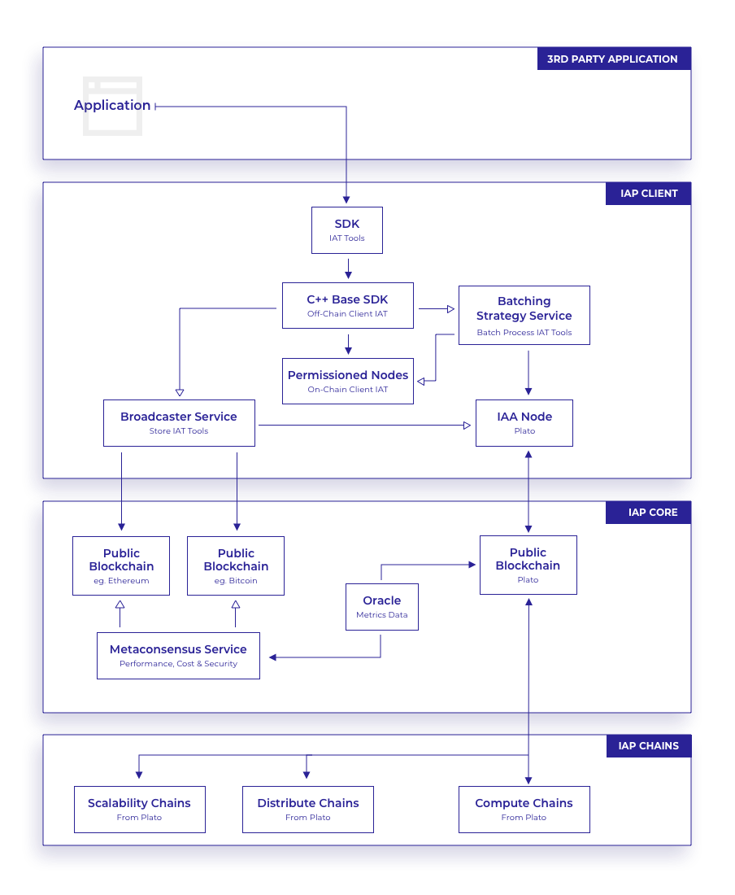
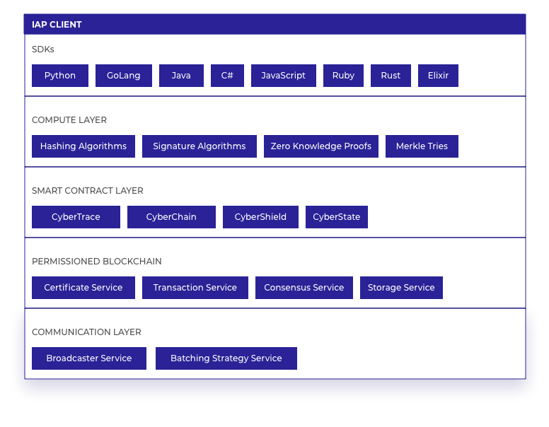
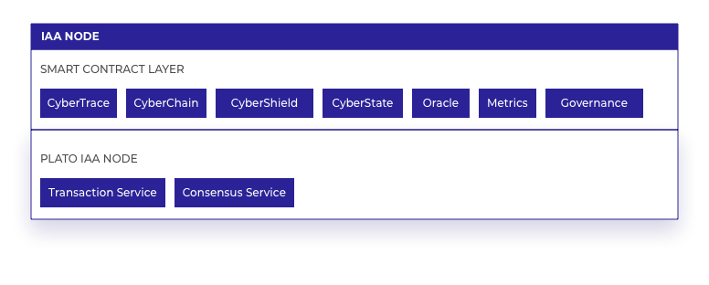
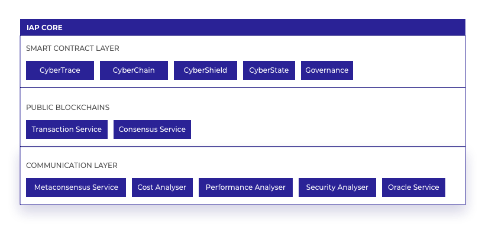
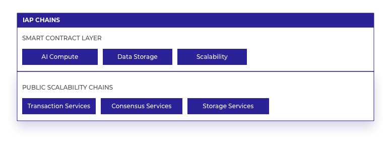
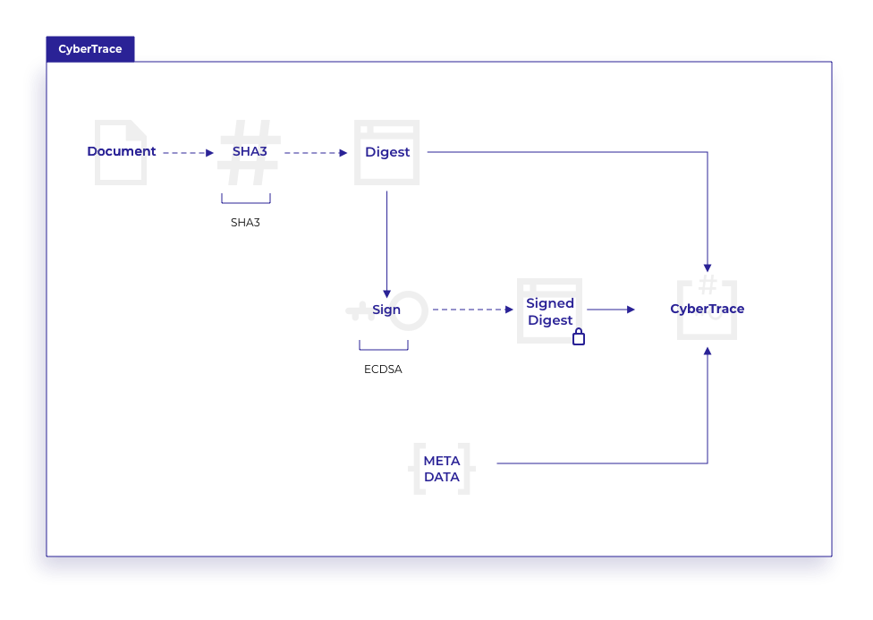
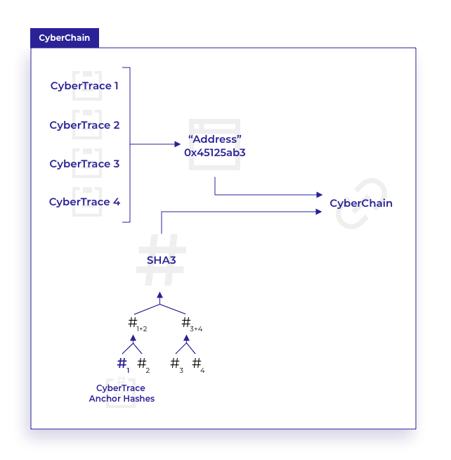
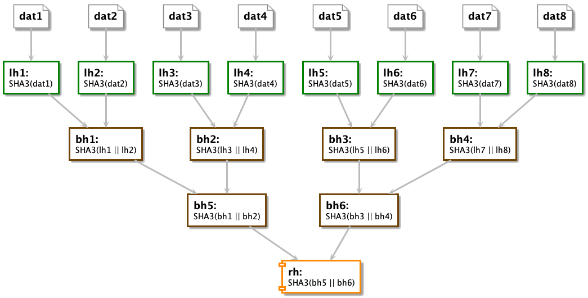
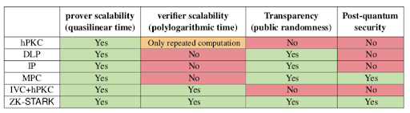
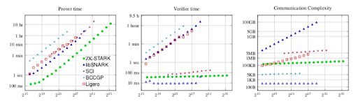

# Information Assurance Platform: A Technical Overview

[team@iap.network](mailto:team@iap.network)

## Abstract

The IAP is a set of tools (the Information Assurance Toolbelt) that runs across a set of layers (the IAP Stack) to deliver an ecosystem of digital trust. The ecosystem includes a platform for attestations and independent verifications about existence of data, processes (and procedures), machine and device state and computation, from sources capable of any kind of network connection. The platform provides four initial Cyber Assurance tools to cover a wide range of industry applications; proofs of provenance (CyberTrace), proofs of procedure (CyberChain), proofs of device state (CyberState) and proofs of computation (CyberShield). They are stored using blockchain technology to provide data provenance, immutability, auditability, non-repudiation, configuration, state (about machines, devices and their sensors), computational integrity with independent verification and distribution and distributed processing space. The platform is designed to be collaboratively developed by a stakeholder managed, polycentrically governed system of decision making with ethical considerations (the IAP Open Standard), with a policy that all components and tools remain open-source and appropriately licensed. This is done to develop a transparent and community managed platform for digital trust of the future that delivers on the IAP vision; to enable implicit trust[1](#1) by driving information assurance between devices, individuals, organisations, companies and governments globally. Its primary use cases are for compliance, regulatory technology and cybersecurity, with several products[A1](#a1) that rely upon the platform already in development.

## Index

- [Information Assurance Platform: A Technical Overview](#information-assurance-platform-a-technical-overview)
  - [Abstract](#abstract)
  - [Index](#index)
  - [Introduction](#introduction)
  - [The IAP](#the-iap)
    - [IAP Stack & IAT](#iap-stack--iat)
  - [IAP Open Standard](#iap-open-standard)
    - [Application Facilitation](#application-facilitation)
    - [Open Source](#open-source)
    - [Community Contributions](#community-contributions)
    - [An Agnostic Platform](#an-agnostic-platform)
    - [Polycentric Governance](#polycentric-governance)
    - [Ethical implications of Polycentric Governance](#ethical-implications-of-polycentric-governance)
    - [Controls on Application Privilege](#controls-on-application-privilege)
    - [Ethical Considerations of Machine Intelligence](#ethical-considerations-of-machine-intelligence)
  - [IAP Stack](#iap-stack)
    - [IAP Client](#iap-client)
      - [Installation](#installation)
      - [Software Development Kits (SDKs)](#software-development-kits-sdks)
      - [Compute Layer](#compute-layer)
      - [Smart Contract Layer - Client](#smart-contract-layer---client)
      - [Permissioned/Private Blockchain](#permissionedprivate-blockchain)
      - [Communication Layer - Client](#communication-layer---client)
    - [Universal Daemon](#universal-daemon)
      - [Reality State Transition System (RSTS)](#reality-state-transition-system-rsts)
    - [IAA Node](#iaa-node)
      - [Smart Contract Layer - IAA Node](#smart-contract-layer---iaa-node)
    - [IAP Core](#iap-core)
      - [Plato - IAP Mainnet](#plato---iap-mainnet)
      - [Public Blockchain](#public-blockchain)
      - [Smart Contract Layer - Anchor Hash](#smart-contract-layer---anchor-hash)
      - [Metaconsensus](#metaconsensus)
      - [Communication Layer - Core](#communication-layer---core)
    - [IAP Chains](#iap-chains)
      - [Smart Contract Layer - Chains](#smart-contract-layer---chains)
  - [Information Assurance Toolbelt](#information-assurance-toolbelt)
    - [CyberTrace](#cybertrace)
    - [CyberChain](#cyberchain)
    - [CyberShield](#cybershield)
    - [CyberState](#cyberstate)
  - [IAP Economics and Governance](#iap-economics-and-governance)
    - [Token Economics Model](#token-economics-model)
      - [IAP Token](#iap-token)
      - [IAP Token economy](#iap-token-economy)
    - [Participants](#participants)
    - [Polycentric Governance Contracts](#polycentric-governance-contracts)
  - [Machine Intelligence On The IAP](#machine-intelligence-on-the-iap)
    - [Governance](#governance)
    - [Voting](#voting)
    - [Metaconsensus](#metaconsensus-1)
    - [Entity Resolution](#entity-resolution)
    - [Computing Costs](#computing-costs)
  - [Technology Underpinning the IAP](#technology-underpinning-the-iap)
    - [Distributed Ledger Technologies](#distributed-ledger-technologies)
      - [Blockchains](#blockchains)
      - [Smart Contracts](#smart-contracts)
      - [Scalability](#scalability)
      - [Directed Acyclic Graph (DAG)](#directed-acyclic-graph-dag)
      - [Permissioned Blockchains](#permissioned-blockchains)
    - [Consensus algorithms](#consensus-algorithms)
      - [Proof of Work](#proof-of-work)
      - [Proof of Stake](#proof-of-stake)
      - [Delegated Proof of Stake](#delegated-proof-of-stake)
      - [Practical Byzantine Fault Tolerance](#practical-byzantine-fault-tolerance)
      - [DAG Consensus Protocols](#dag-consensus-protocols)
    - [Hashing Algorithms](#hashing-algorithms)
    - [Signing Algorithms](#signing-algorithms)
      - [Revocation](#revocation)
      - [Identity Governance](#identity-governance)
    - [Merkle Tries](#merkle-tries)
    - [Encrypted Data Storage / Post Quantum Security](#encrypted-data-storage--post-quantum-security)
    - [Zero-Knowledge Proofs](#zero-knowledge-proofs)
      - [Usage of Zero-Knowledge Proofs](#usage-of-zero-knowledge-proofs)
      - [Computational Integrity and Privacy (CIP)](#computational-integrity-and-privacy-cip)
      - [Terminology, Definitions and Properties of Zero-Knowledge Systems](#terminology-definitions-and-properties-of-zero-knowledge-systems)
      - [Advanced Zero-Knowledge Proof Systems](#advanced-zero-knowledge-proof-systems)
      - [Brief Overview of Advanced Zero-Knowledge Proof Systems](#brief-overview-of-advanced-zero-knowledge-proof-systems)
    - [ZK-STARKs](#zk-starks)
      - [Transformation of a Function to a Polynomial Representation](#transformation-of-a-function-to-a-polynomial-representation)
      - [Performance Evaluation of ZK-STARKs](#performance-evaluation-of-zk-starks)
  - [Conclusion](#conclusion)
  - [Glossary](#glossary)
  - [Copyright](#copyright)
  - [Disclaimer](#disclaimer)
  - [References](#references)

## Introduction

The IAP is an open platform for digital attestation and auditable verification that works in conjunction with the latest blockchain technologies to allow applications and users to attain assurance of different aspects of information relevant to them. These aspects include provenance, operational procedure, computation and device state, and can be thought of as information assured at specific points in time. Multiple commercial products that use these tools are already under development[A1](#a1). Additional relevant use cases are explored in the non technical white paper[A2](#a2), the cryptographic white paper[A3](#a3) and this document.

Computational Integrity and Privacy[5](#5) (CIP) systems can verify that the resultant data has been computed correctly, i.e. the reported result matches the result of the computation. Zero-knowledge proof systems such as ZK-SNARKs[5](#5) have been successful in satisfying CIP efficiently within the blockchain realm. ZK-STARKs[5](#5) add transparency to this (as there is no trusted set-up required) and the IAP implements zero-knowledge proofs to provide computational integrity throughout the platform.

In consideration of the longevity of data stored within blockchain systems the IAP is prioritising the use of quantum-resistant[2](#2) cryptographic algorithms within every component of the platform.

## The IAP

The IAP enables the creation of publicly independently verifiable evidence with a sufficiently low probability of fraud, removing both the need for off-chain trusted third parties and (encrypted) storage of data. The IAP separates the concerns of proof creation and proof storage, such that sensitive data is only processed privately. The first concern uses a permissioned blockchain and the second concern uses public blockchains. This ensures that sensitive data, such as personally identifiable information (PII) or confidential information is never presented on a public blockchain.

### IAP Stack & IAT

This separation of concerns defines the architecture of the IAP Stack, which contains three separate layers: The Client for processing sensitive data, the Core for assuring data immutability and Chains for processing large public compute sets. Each layer is explained in detail in the following chapters. Currently the IAP concerns itself with four different aspects of data proof: **Proof of existence**, **proof of process**, **proof of computation** and **proof of device state**. These first building blocks are referred to as the Information Assurance Toolbelt (IAT). The IAT is fully extensible by the open source community. The IAP employs modern cryptographic methods within the construct of the Stack to achieve trustless proofs for each of the tools.

## IAP Open Standard

The IAP is subject to the IAP Open Standard, which is in place to ensure that the platform maintains transparency across all aspects and appropriate polycentric governance of those aspects. This open visibility is essential to the security and reliability of the platform, and to maintaining its longevity and ultimate authority as the world’s chosen ecosystem for digital trust.

The IAP Open Standard builds upon the following core principles:

- Facilitate the creation, enhancement  and interaction of applications that require and benefit from implicit trust, encourage the use of the platform by implementing relevant policy, procedures, accessibility, standards, guidelines and SDKs.
- Open Source everything, to enable full disclosure and input from the whole community, keeping it open to scrutiny and transparent in its operations.
- Encourage contributions from the community, covering aspects such as enhancements and additions to the Assurance Toolbelt, expanding the range of blockchain support, expanding the product set out to new vertical markets.
- Maintain a platform that is agnostic to the distributed ledger technologies it is connecting to and transacting on.
- A polycentric governance system designed by experts including ethicists for the benefit of the whole community.

These core principles are expanded in the sections below.

### Application Facilitation

The primary function of the IAP is to enable applications to create trustless interactions between a proving party and a verifying party without having to rely on third party systems or manual processes that traditionally supply this trust. Providing a complete platform that is simple and intuitive to implement is key to building a wide and maintainable community. To provide these services as part of a community driven program enables wide adoption, allowing all stakeholders to contribute and expand the platform.

In order to facilitate application adoption, the IAP contains multiple resources to enable both new and existing users to be able to include the IAT into their applications quickly and effectively, including:

- Complete technical documentation.
- Installation and usage guides.
- SDKs in multiple programming languages.
- Testing applications and sandbox arenas.
- Discussion forums following set open communication policies.

### Open Source

The IAP Open Standard follows the Open Source Initiative[3](#3) on requirements for software, ensuring that all IAP components and dependencies follow this standard, that they must be freely available, and licensed appropriately.  The IAP Open Standard details the procedures in place for maintaining and updating all code and scripts that are part of the IAP Components. All code, scripts and documents that form any part of an IAP Component are subject to the IAP Open Standard and its procedures:

- Creation and acceptance of new code repositories.
- Coding standards.
- Fixing bugs and issues that arise.
- Creating and reviewing pull requests.
- Unit testing coverage.
- Security testing practices.
- Deployment and continuous integration procedures.
- Any imported libraries must be open source.

### Community Contributions

A key factor in the longevity and adoption of the IAP is encouraging usage by the wider community. In order to facilitate community contributions, the following provisions have been adopted:

- A transparent, polycentrically governed, machine learning modeled scoring system for managing contributions - see [Polycentric Governance](#polycentric-governance).
- The ability for community developers to contribute to the tools on the IAT and the wider platform itself - see [Information Assurance Toolbelt](#information-assurance-toolbelt).
- Expansion by the community of development and release procedures, as well as software coding standards.
- Expansion of the core team led by community involvement and decisions.
- Suggestions and actions to be taken for improvements and modifications of the Token Economics model.

### An Agnostic Platform

Distributed ledger technology (DLT) agnosticism is pervasive in the design of the IAP components, with its tooling using abstractions and supporting implementations over Ethereum, Bitcoin, Hyperledger Fabric and other DLTs. Support for each platform includes the assisted provision of contracts and supporting artifacts.

An application that uses the proposed IAP Open Standard and the IAT will be able to pull and push verifiable information to and from a number of different DLT implementations.

### Polycentric Governance

In order to promote effective governance of the IAP, with the aim of enabling it to be transparent and scrutinizable by all stakeholders, the IAP system of governance provides a system of review that covers the following items:

- The controlling keys for network code repositories and other accounts to be managed on chain, by making use of decentralised key management systems[4](#4).
- Reviewing proposed changes to any code in any IAP code repository by reviewing submitted pull requests.
- Modifying any code in any IAP code repository by merging a pull request in that repository.
- Reviewing proposals for adding new code to any part of the IAP Stack.
- Reviewing proposals for adding support for other DLTs to the IAP Core.
- Reviewing and updating the token economic model.
- Reviewing and implementing the addition, modification or deletion of network participants acting on any part of the IAP Stack.
- Evaluating and implementing machine learning models that could provide assistance with future governance of the IAP.

The IAP Client, acting as an Information Assurance Application node ([IAA node](#iaa-node)), drives and facilitates the polycentric governance review systems by enforcing the protocol that has been determined to be accepted by the relevant majority of stakeholders, in a weighted system of voting that is managed by ranking problem machine learning smart contracts on [Plato](#plato---iap-mainnet), the IAP Mainnet. The enforcement provided by the client is possible thanks to the fraud proof systems that include staking and slashing of tokens.

For more information on the system, please refer to our machine intelligence overview[A4](#a4).

### Ethical implications of Polycentric Governance

A separate document details the ethical considerations of the IAP[A5](#a5). The following items are relevant to the technical aspects of the platform:

- Management of common-pool resources is handled via the Client and recorded in Core.
- Client will enforce the protocol (as defined by the Open Standard) that defines incentives to create, monitor and enforce agreed patterns of behaviour amongst participants.
- The Open Standard on [Governance](#governance) requirements includes:
  - Clear boundaries to the resources (IAP tokens, IAT tools and other IAP resources).
  - Clear rules regarding how the resources are to be used by those with access to it.
  - Rules that are devised by those with access to the resource.
  - Monitoring of the behaviour of those with access to the resource.
  - Systems of enforceable sanctions such as staking and slashing of IAP tokens.
  - Consideration of the position of polycentric governance within a hierarchy of governance systems from stakeholders.

### Controls on Application Privilege

The IAP Admin screen allows developers to configure the feature set of the IAP Client to be as controlled as required[5](#5), to ensure that their application is only used as it is intended. Below is a screenshot of some configuration options:

### Ethical Considerations of Machine Intelligence

The stated goals of the IAP Open Standard for the governance and ethics of Machine Intelligence are:

- An expansion in the stakeholders engaged in the security considerations of AI.
- Research and development by technical and policy specialists such as the IAP team and government advisors.
- Awareness among engineers and developers as to the threats and risks of AI.
- Development and definitions of best practices and standards based on information security and cybersecurity standard models.

These goals can be achieved by:

- Actively involving the wider community in reviewing and testing all aspects of the AI systems.
- Ensuring all AI algorithms are published on Git and reviewed by community members.
- Any documents that describe or detail the functions and capabilities of the AI algorithms are publicly available and editable.
- All research and development documentation is published on public blog sites or peer reviewed journals and discussed on open forums and social media.
- Development best practices are enforced as part of the IAP Open Standard and supported as part of the token governance model.

For more information on the system, please refer to our machine intelligence overview.

## IAP Stack

The IAP is built as three separate layers, each with its own specific function; the IAP Client, IAP Core and IAP Chains. These layers work together to provide a base for a set of tools that form the Information Assurance Toolbelt (IAT). The IAT allows the development of applications that utilise the platform to achieve digital trust goals via specific tools such as CyberTrace, CyberChain, CyberState and CyberShield. These assurance tools process their resulting proof data on to Plato, the IAP mainnet.

Many software applications follow a multi-tier or multi-layer software architecture, with layers such as UI, API, data storage, caching, queuing, etc. The IAP adds to this paradigm with the IAP Stack, including three main capabilities provided by blockchain technologies - accessible, selective distributed information, data immutability and distributed computation. The layers within the IAP Stack are:

- **IAP Client**: A permissioned set of APIs connected to a combination of permissioned nodes and local IAA Nodes, running smart contracts for sensitive data processing, private storage and secure high-intensity tasks.
- **IAP Core**: Public blockchain layers, running smart contracts for storage of immutable proofs and processing non-sensitive data assisting the interoperability bridges, with connections to openly verifiable oracles for data gathering.
- **IAP Chains**: A public compute, distribution and scalability blockchain layer, and widely adopted data storage, with the flexibility to perform extra computation tasks.

The diagram below shows the main services and their interactions within the three layers of the IAP Stack - each of these services is discussed in detail in the sections following:

### IAP Client

The IAP Client layer is composed of several components, as can be seen in the diagram below; a permissioned blockchain, a compute layer above the blockchain for executing the algorithms formulated for the IAT, a set of SDKs for applications to interface with the compute layer and provide off-chain computation where necessary, and blockchain communication services. Different configurations of these components can be deployed for the third party application, determined by configuration settings set up during deployment. An IAA node runs alongside all other components of the Client, providing an interface between the permissioned blockchain and the Core blockchain and its services.

The diagram below shows each of the Client components arranged into their relevant architectural layers, with each component described in detail in the sections below:

#### Installation

The IAP Admin page allows application developers to configure the set of features required for their application. A developer can use the page to decide which tools and services they need, along with any particular configuration options, giving them the ability to restrict application access to the IAP. The configuration files can be modified to install any combination of the IAT tools that is required by the third party application. Each of the tools are also configured at this stage. The page creates the necessary containers, scripts and instruction sets to enable the developer to deploy the IAP Client in their environment, whether that be on local, remote, or cloud infrastructure or a combination of these. Other configuration settings are also determined during installation such as the batching strategy to be used and the extended list of public blockchains for the broadcaster service to use (described below).

#### Software Development Kits (SDKs)

SDKs available in Python, GoLang, Java, C#, Javascript, Ruby, Rust and Elixir provide a simple integration point into the Client layer. All SDKs are open source and follow the guidelines of the IAP Open Standard, with each having full unit test and security test coverage, and open to improvement and additions by the community.

Each of the SDKs contain function calls to support each of the IAT tools:

- **CyberTrace** contains calls to:

  - Create the cryptographic hash on the data requiring proof.
  - Validate that data hash created is correct.
  - Sign the hash with the prover’s private key.
  - Validate the signature with the public key (contained in the certificate).
  - Create the CyberTrace with the hash and the signature, and store the CyberTrace on the Client blockchain.
  - Validate the CyberTrace stored on the Client.
  - Store the CyberTrace Anchor[6](#6) hash on the IAA Node.
  - Validate the CyberTrace Anchor is stored on the IAA Node.
  - Validate the CyberTrace Anchor is stored on other Core blockchains they have been broadcast to.
  - Further details in the [CyberTrace](#cybertrace) section of this paper.

- **CyberChain** contains calls to:

  - Create the CyberChain container.
  - Add the CyberTraces to the CyberChain container in explicit order.
  - Verify the CyberTrace exists in the correct place within the CyberChain container.
  - Store the CyberChain on the Client blockchain.
  - Verify the CyberChain is stored on the Client.
  - Store the CyberChain Anchor hash on the IAA Node.
  - Validate the CyberChain Anchor is stored on the IAA Node.
  - Validate the CyberChain Anchor is stored on the other Core blockchains they have been broadcast to.
  - Further details in the [CyberChain](#cyberchain) section of this paper.

- **CyberShield** contains calls to:

  - For the function that requires a computational integrity proof, create the compile function token and fingerprint with the zero-knowledge proof ([ZKP](#zero-knowledge-proofs)) library.
  - Collect and store the token and the fingerprint of the compiled function.
  - Using the SDK, call the function with the token and the standard function parameters.
  - Collect the function output and the ZKP certificate, and add them to a new CyberShield, and store the CyberShield on the Client blockchain.
  - Verify the CyberShield is stored on the Client.
  - Validate the ZKP certificate with the fingerprint and the output.
  - Store the CyberShield Anchor hash on the IAA Node.
  - Validate the CyberShield Anchor is stored on the IAA Node.
  - Validate the CyberShield Anchor is stored on the other Core blockchains they have been broadcast to.
  - Further details in the [CyberShield](#cybershield) section of this paper.

- **CyberState** contains calls to:

  - Configure the device state data to be included in the proof.
  - Create a CyberTrace of the device state.
  - Create a CyberShield of the create CyberTrace function.
  - Store the CyberTrace and CyberShield in a new CyberState, including some device state information in the metadata.
  - Store the CyberState on the Client blockchain.
  - Verify the CyberState is stored on the Client.
  - Store the CyberState Anchor hash on the IAA Node.
  - Validate the CyberState Anchor is stored on the IAA Node.
  - Validate the CyberState Anchor is stored on the other Core blockchains they have been broadcast to.
  - Add the CyberStates into a CyberChain, and store on the Client.
  - Further details in the [CyberState](#cyberstate) section of this paper

#### Compute Layer

The SDKs each call into a module created in C++ and distributed both in binary and source forms; the choice of C++ was made out of its portability, safety (when avoiding inline Assembly), extensive support on every platform, and expressiveness, but could change in the future without affecting existing client code if the community, governed by the IAP Open Standard, so wishes. This module contains the main functions provided in the Client and is detailed below. The C++ module is open source and follows the guidelines of the IAP Open Standard, having full unit test and security test coverage. The C++ module is available as both and off-chain and on-chain component, giving flexibility to the third party application needs and constraints.

In order to create applications using the IAP, the compute layer executes all of the algorithms required for the full functionality of the IAP Client, which are:

- Creation of cryptographic hashes of any type of file or data stream. A hash (see [Hashing](#hashing-algorithms)) is computed on the complete file or stream (in either full or parts), and is stored as part of a CyberTrace. Hashes are also computed on the complete data contents of a Client IAA tool, and are called Anchor hashes. These IAA tool Anchor hashes are stored on Core and provide an anchor point from the Client to the Core (see [Anchor Hashes](#smart-contract-layer---anchor-hash)).

- Signing of hash digests to achieve non-repudiation, i.e. verifiably identifying parties. The CyberTrace creator’s private key is used to digitally sign the hash digest in a non-repudiable fashion, while the public key and associated digital certificate published by the creator can be used to verify this assertion. The digital signature is stored as part of the CyberTrace. (see [Signing](#signing-algorithms)).

- Creation, validation and modification of Merkle tries (see [Merkle Tries](#merkle-tries)). These are a core aspect of a CyberChain, allowing for a simple compute of the validation of the ordered list of CyberTraces contained within it[7](#7). Only parts of the trie need to be recalculated with validating the CyberChain. The Merkle Root of the CyberChain is stored as an Anchor hash on the Core blockchain.

- Execution of computational verification systems. Creating a cryptographic hash of a file is not enough to prove its existence, it is also needed to prove that the algorithms that were used to create the cryptographic hash were executed correctly, and not maliciously. The IAP uses computational integrity solutions to provide this complete proof of existence in its CyberShield tool (see [Zero-Knowledge Proofs](#zero-knowledge-proofs)).

#### Smart Contract Layer - Client

Smart contracts provide the mechanism to both execute the full functions of each of the IAT tools and to process the tool output data on the blockchain[8](#8). In cases where the input data of a tool cannot be processed on the blockchain, e.g. due to sensitive data, executing the tool’s functions can be processed off-chain[9](#9).

The functionalities the smart contract layer provides includes:

- **CyberTrace**: stored as a structure by the smart contract, which contains the file hash, the signature and a JSON object of any associated metadata (see [CyberTrace](#cybertrace)). This complete CyberTrace only exists on the Client blockchain; the Core blockchain contains an Anchor hash of the Client CyberTrace to protect data security, and to reduce the data processing and storage size on the public blockchain[10](#10).

- **CyberChain**: stored as a Merkle trie by the smart contract, which contains all of the CyberTrace Anchor hashes, plus all of the branch and root hashes (see [CyberChain](#cyberchain)). The structure of the trie is stored as a JSON object. The Core blockchain stores only the CyberChain Anchor hash, which is the Merkle root hash, to reduce the data processing and storage size on the public blockchain.

- **CyberShield**: the zero-knowledge proof certificate is stored by the smart contract, which also processes the computational verification requests to validate that the computation has executed with the correct output (see [CyberShield](#cybershield)). The Core blockchain only stores a hash of the proof certificate, known as the Anchor hash.

- **CyberState**: the hash of the current device state is stored in the smart contract, along with a boolean check on whether the previous stored hash matches the current one (see [CyberState](#cyberstate)). CyberState is executed on the device state data to validate that the cryptographic hash is correct. The Core blockchain only stores the Anchor hash, which is the complete hash of this data.

#### Permissioned/Private Blockchain

Proof data can be stored on a permissioned blockchain (see [Permissioned Blockchains](#permissioned-blockchains)) in the initial instance, for applications where sensitive proof data is required for the full operation of the application. The IAP provides interfaces to permissioned blockchains, with different blockchain solutions supported for different application needs.

The Client layer provides support for the internal storage of data and their proofs, distribution of data and compute processing. This chain is not part of a public network as it is processing and potentially storing sensitive data (see [Encrypted Data Storage](#encrypted-data-storage--post-quantum-security)).

#### Communication Layer - Client

The Client communication layer provides connector services between the compute layer, the permissioned nodes, the IAA nodes and the IAP Core. The following services are currently off-chain in the design (using CyberShields to verify the correctness of the output), while the IAP is actively researching on-chain solutions:

- **Batching Strategy Service**: For instances where it is costly to process the output of each Client IAT tool’s Anchor hashes to the IAA node, the Client IAT outputs can be processed by a configurable batching strategy. The strategy takes a tuple of IAT tool outputs, in the order they were created, and creates a Merkle Trie of the complete set. The Merkle root hash is used as the Anchor hash for the Core IAT tool, and the Merkle trie is added to the tool metadata. The configuration settings determine which strategy will be processed and at what interval the process will occur.

- **Broadcaster Service**: This increases the immutability of IAT tool Anchors by distributing the Anchor hashes out to other public blockchains after they are stored on the IAA node. This service watches the status of IAT tool transactions processed on the IAA node; once the appropriate block consensus is met, it fetches the list of public blockchains recommended by the Metrics smart contract on the IAA node. The service then updates the metadata of the IAT tool transaction as recommended by the Metrics smart contract. Finally, the signed[11](#11) IAT tool Anchor hash is then broadcast to the listed public blockchains.

  This service also listens to Core blockchains for events raised on IAT tool transactions it has published. When these events are raised this service collects the data and raises its own events. Applications can register to this service via the SDK to listen for these events and collect their IAT tool transaction information.

Blockchain bridging solutions that can deliver on-chain interoperability between different blockchain platforms to replace off-chain services are being researched. Global standards organisation GS1[12](#12) recognises the importance of these solutions for driving data sharing on blockchain systems. Current solutions, such as Cosmos[13](#13), AION[14](#14), Wanchain[15](#15) and Polkadot[16](#16) are notable implementations.

### Universal Daemon

A Universal Daemon (UD) is an installation of the Client  that can be deployed to a wide range of devices, including most types of Internet of Things (IoT) devices. These are typically small footprint devices with limited space for memory and storage, ranging from typically less than 1Gb in total on single-chip systems to micro SSD readers (with slow to very slow data transmission rates). The UD installation of the Client uses a small set configuration that allows it to be installed on an IoT device or added to device firmware. An IoT device installation of the Client thus requires a DLT that can survive limited disk space, and as such doesn’t store the whole history of the DLT back to genesis. Directed Acyclic Graphs (see [DAG](#directed-acyclic-graph-dag)) are one solution for this, and the IAP Client can be installed in this configuration.

#### Reality State Transition System (RSTS)

The UD is installed with the CyberState tool which is used to take either memory or file state evidence of the device (by either a dump file or a byte stream) and store the proof of this state onto Core. A network of IoT devices can have the UD installed and configured so that each device maintains a current and complete state of all devices, with servers running DAG nodes that are maintaining a full history of device state transactions. Monitoring and analytics services query the servers for a real-time stream of information on all of the device states, providing insight within seconds of an unexpected device state update. The IAP refers to such a system as a “reality state transition system (RSTS)”.

### IAA Node

An Information Assurance Application (IAA) node is installed as part of the Client install, and is synchronised to Plato, providing the gateway to the IAP Core. Plato nodes have the capability to store IAT Anchor hashes to provide proof data immutability. All data transactions processed on an IAA node are synchronised out to all other Plato nodes in the Core.

The diagram below shows the IAA Node components arranged into their relevant architectural layers, with each component described in the sections below:

#### Smart Contract Layer - IAA Node

The functionalities the IAA node smart contract layer provides includes:

- **CyberTrace**, **CyberChain**, **CyberShield**, **CyberState**: Each of these IAT tools stores the tool Anchor hash and metadata regarding blockchain metrics for the Broadcaster Service to use when it processes the IAT tool Anchor hash for other public blockchains.

- **Metrics**: The Metrics smart contract queries the Oracle smart contact for performance, cost and security information of public blockchains. This is then returned back to the Metrics smart contract via a callback function. The Metrics smart contract uses this data as input for algorithms that determine rankings on the public blockchains that are used within Core. Application configuration data is combined with these rankings to create a list of public blockchains that the Broadcaster Service uses. When an IAT tool transaction is created by an IAA node, this application specific list of Core blockchains is added to the tool metadata. The Broadcaster service then sends the Anchor hash of the tool to the specified list of Core blockchains.

- **Oracle**: This smart contract creates events for the Core Oracle Service listener. These are events for requesting data from the Oracle Server regarding blockchain performance, cost and security. These data are passed back to a callback function in the calling smart contract.

- **Governance**: This manages the systems that determine the governance models in use on the IAP. These use community driven voting mechanisms to enable decision making for these governance systems (See [Polycentric Governance](#polycentric-governance-contracts)) supported by machine intelligence prescriptive analysis models as explored in the IAP Machine Intelligence documentation[A4](#a4).

### IAP Core

A key aspect of the IAP is to provide the ability for information assurance in an immutable and publicly accessible manner. These data are stored in public blockchain systems, and have an extremely low probability that they could be modified at any time. These data can be validated by anyone at any time, without the need for a trusted party or any other trusted system, thus providing the implicit trust that the data will remain unchanged for as long as the public blockchain (or combination of public blockchains) is in operation.

Core is composed of several layers as can be seen in the diagram below; a public blockchain, a smart contract layer above the blockchain for executing the algorithms formulated for the IAT, a communication layer to provide interoperability to other blockchain technologies, and an oracle layer to provide blockchain access to externalised data.

The diagram below shows each of the Core components arranged into their relevant architectural layers, with each component described in the sections below:

#### Plato - IAP Mainnet

The pace of change in the blockchain community is rapid when considering solutions to the scalability issues facing many current public blockchains. The IAP  is currently researching both blockchain and directed acyclic graph solutions (see [Distributed Ledger Technologies](#distributed-ledger-technologies)).

**Plato** is comprised of:

- A distributed ledger technology that is capable of maintaining the full, current transactional world state.
- A Turing complete smart contract layer.
- A proven consensus protocol that is highly resistant to malicious actors.
- The ability to scale out high computation without impacting transaction performance or price on the blockchain.
- A system that is maintainable and upgradable without impact to the functioning of the production blockchain.

These are discussed in more detail in the [Distributed Ledger Technologies](#distributed-ledger-technologies) section.

#### Public Blockchain

The public blockchain[17](#17) is used to store the proof data gathered on the IAP Client to provide immutable assurance and the ability for independent verification of that assurance. Core is designed to be blockchain agnostic, however in order to support the IAT tools, the blockchain system must have a smart contract layer that can store at least a 32 byte string in a transaction on the blockchain.

#### Smart Contract Layer - Anchor Hash

Within the IAP Core, smart contracts process the IAT Anchor hashes with a maximum size of 32 bytes in order to keep transaction costs at a minimum. State channels (see [Scalability](#scalability)) can be used to allow a restricted set of other parties to have access to the contract transactions, if it is required by the overlying application. The functionalities provided are:

- **CyberTrace**: An Anchor hash of the complete IAP Client CyberTrace is sent to the Core contract for storage on the public blockchain. Collections of CyberTraces that are sequential or part of a consistent set generated by the IAP Client can be processed by the batching strategy, which outputs one Merkle root hash for the complete collection of Anchor hashes. The maximum size of this single hash to be stored is 32 bytes.

- **CyberChain**: The Merkle root hash of the Client CyberChain is sent to the Core contract, as the Anchor hash, for storage on the public blockchain, with a maximum length of 32 bytes.

- **CyberShield**: The zero-knowledge proof certificate and output data can also be sent to the public blockchain for extra verification purposes. The proof certificate can require more kilobytes of storage than is presently efficient to process and store on a public blockchain, therefore the Anchor hash of the certificate is stored to maintain the maximum length of 32 bytes.

- **CyberState**: An Anchor hash of the complete IAP Client CyberState proof of state is sent to the Core contract for storage on the public blockchain. Collections of CyberState proofs of state that are sequential or part of a consistent set generated by the IAP Client can be processed by the batching strategy, which outputs one Merkle root hash for the complete collection of Anchor hashes. The maximum size of this single hash to be stored is 32 bytes.

#### Metaconsensus

Metaconsensus is a term used within the IAP to refer to the combined consensus information of multiple blockchains simultaneously. In some cases, applications using the IAP may prefer to pay above average costs in order to provide additional layers of redundancy to their data storage or data processing needs. In such cases, Plato will deliver the requested data to more suitable blockchains than simply itself and Ethereum (for example). This provides additional information assurance as to the integrity of a prover and the reliability of independent public verifications. Instead of consensus being provided by IAP alone, a combined consensus of *N* blockchains is calculated when validating a CyberTrace, CyberChain, CyberState or CyberShield.

#### Communication Layer - Core

The Core communication layer provides the ability for applications to decide what is more important to them in the typical triangle of cost, performance and security, where:

- Cost refers to the transaction fees for processing IAT tool data transactions.
- Performance refers to the amount of time taken for the blockchain’s consensus to reach the accepted probability of a transaction’s confirmation on the network.
- Security refers to the distribution and decentralisation of processed data transactions across the entire network.

This triangle of data points is collected by the Metaconsensus service and processed by its analysers that output cost, performance and security metrics for each of the IAP connected blockchains. These metrics are collected by the Core Oracle service when IAT Anchor hashes are processed on the IAA Node, and then consumed by the Client Broadcaster service when distributing the IAT Anchor hashes.

The following Core communication services are provided:

- **Metaconsensus Service**: this service collects cost, performance and security data information, as described above, from public blockchains interfaced with IAP Core, such as Bitcoin and Ethereum. The collected data are analysed for past trends to output a weighted reference score. This score is comparable with all other IAP interfaced public blockchains. These data are collated and made available for the Oracle Service to query, which is used by applications when determining which other blockchains (in addition to Plato) to send IAT Anchors to. These services allow the application to be able to switch over to another Core blockchain if the blockchain is experiencing increased transaction costs. The switching choice is set in the Client configuration. They have three main functions:

  - **Cost Analyser**: Collects the transaction costs of each of the Core blockchains and obtains a Gaussian distribution of current transaction costs, with positions of each blockchain on the curve. These data points are ranked and then analysed for past trends, which are used to predict possible forthcoming costs.

  - **Performance Analyser**: Collects the current number of transaction confirmations required on each of the Core blockchains, along with the time to create each confirmation. For example, Bitcoin recommends [six block confirmations](https://en.bitcoin.it/wiki/Confirmation), with a block confirmation time of an average ten minutes. This information is ranked per blockchain, and also analysed to allow the application to predict whether there will be delays on the Core blockchains.

  - **Security Analyser**: Collects current node and wallet distribution numbers to calculate the distribution curves of transactional power over the blockchain networks. These curves are analysed for their apparent security and ranked accordingly. This collated information is further analysed to predict possible security weaknesses in the networks.

  Machine learning based models are used to optimise for desired application specific outcomes; if an application specifies a priority for security to the communications layer then a suggested combination of Core blockchains will be prescribed based on past data of all blockchains available, including off-chain data such as cryptocurrency market trends.

- **Oracle Services**: This is an off-chain service running at multiple locations governed by multi-signature addresses[18](#18). The service listens for events created on-chain by the Oracle smart contract, then collects the requested Oracle data from the relevant data source, e.g. the Metaconsensus Service. It then returns the data to the calling smart contract, e.g. the  Metrics smart contract, on the IAA node. All of the software that is used for these services is open source and the services follow the IAP Open Standard. Software functions also run under computational verification schemes, to validate the output generated is correct.

IAP Network is currently researching decentralised oracle services that use governance and economic incentives to provide a distributed network of public oracles, which are all kept synchronised and in agreement by a consensus protocol. Notable implementations are [ChainLink](https://chain.link/), Astraea[19](#19) and Shintaku[20](#20).

### IAP Chains

These are decentralised side chains (see [Scalability](#scalability)) of Plato. These offer the scalability required for IAP public data storage and processing, leveraging the almost zero cost transactional processing fees and potentially unlimited data storage scalability. These are provided by any valid network participant (see [Participants](#participants)), to supply the necessary computing power for the delegated tasks. The diagram below represents a simplified view of the layers within IAP Chains:

Applications that are built on the IAP can take advantage of the AI services running on IAP Chains. Customers process their private data on IAP Client, but the publicly publishable parts of this data can be pushed to IAP Chains for AI processing. E.g. a company running Blockliance can make use of the PCI-DSS data processed by the AI to gain insights and recommendations on how to action the PCI rules for their company and data.

#### Smart Contract Layer - Chains

- **Data Storage**: Chains provide the storage space on large data sets, keeping this away from Plato storage. Vast amounts of data can be stored on these side-chains without any impact to transactional throughput on Plato.
- **ML**: Algorithms scan through all of the data on the side-chains for no transactional processing cost, but at a cost of computing power to execute the algorithms and the cost of initiating and finalizing the contract function.
  - Preparation of the model training data is done off-chain. It is  published into Chains data Storage. The model is then trained on this data on a side-chain. A snapshot of the model is taken periodically and published into Core for processing by Core machine learning algorithms. The IAP Open Standard determines the regularity with which model data is updated for on-chain algorithms.
  - Algorithms provide descriptive, predictive, prescriptive and reinforcement learning benefits for decision making within the polycentric governance system among other aspects. Please see the IAP Machine Intelligence documentation[A4](#a4) for further details.
- **Scalability**: Non-ML high computation data analysis and processing can be managed off Plato, to side-chains with as many instances as required to complete the task.

## Information Assurance Toolbelt

The IAP offers a suite of tools that can be used independently of one another and in combination to provide information assurance and drive cybersecurity, information security and regulatory technology applications. They are collectively referred to as the Information Assurance Toolbelt (IAT).

### CyberTrace

**Proof of existence**: A piece of information (or data) existed in a certain state at a certain point in time.

CyberTraces are immutable references to any type of information that requires evidence of its provenance. That information can be verified at any later date to be unequivocally the same as when the AP was created. Selected changes made to the information after its creation can be proven to have been made by checking the CyberTrace’s history. The non-corruptibility of the CyberTrace within a secure IAP thus provides the basis for implicit trust.

As shown in the diagram below, a CyberTrace is first generated by the Client. It is stored as a structure of three elements in the smart contract of the Client blockchain. The first element is generated by cryptographically hashing the input data using the SHA3 algorithm, which outputs the digest as a 32 byte string (see [Hashing](#hashing-algorithms)). This hash digest is then signed with the private key of the creator to output a signature, using ECDSA (see [Signing](#signing-algorithms)). This signature is added to the structure as the second element. Lastly, an optional metadata JSON object is added to the structure.

The complete CyberTrace data is then sent to the Client blockchain. Once this transaction has been verified, i.e. it has been published into a verified block on the blockchain, then the Client processes the CyberTrace to the Core. It creates a hash of the complete data structure, and sends this hash to the Core CyberTrace smart contract. The transaction address produced by the Core blockchain storage event is also captured by the Client Broadcaster Service.

Reproduction of these hashes can be processed at any time to check the validity of the original document.

### CyberChain

**Proof of procedure**: The composition of proof in the shape of a chain with ordered and time-stamped messages in blocks that provide evidence that a certain procedure was undertaken

CyberChains are a tuple of CyberTraces. CyberChains provide verifiable proof that each of the CyberTraces has been created in a certain order, as constrained by the application’s particular procedure workflow. An application can create a new CyberChain for each of its procedures. There are no restrictions to the number of CyberChains that can be created nor the number of CyberTraces that can be added to them.

As shown in the diagram below, a CyberChain is stored as a structure of two elements within the smart contract of the Client blockchain. The first element is the storage location for the tuple of CyberTrace hashes that are added to the CyberChain. The second element is a map of the Merkle Trie of the tuple of CyberTrace hashes, stored as a JSON object (see [Merkle Tries](#merkle-tries)). Once a CyberTrace has been created, its Anchor hash can be added to a CyberChain on the Client blockchain. Whenever a CyberTrace Anchor hash is added, the Merkle Trie is recalculated and stored in the metadata of the CyberChain.

The Client Broadcaster Service registers the transaction address created on the Client blockchain, which can be collected by the application. The Client then processes the CyberChain Merkle root for storage on Core as the Anchor hash. As more CyberTraces are created and added to the CyberChain, the Merkle Trie is recalculated each time and the meta is updated. Each time the Merkle Trie is recalculated, the Merkle Root of the CyberChain is pushed to the Core blockchain, maintaining the complete CyberChain procedure list.

Any CyberTrace can be verified to exist within its CyberChain by recalculating the Merkle Trie at that point in the collection. CyberChain Anchor hashes can also be added to other CyberChains for more complex process and procedure mapping.

### CyberShield

**Proof of computation**: a statement is verified to be computed correctly, without exposing any additional information.

Even though the math required to enable the creation and verification of algorithms execution was developed in the 1980s, it was only recently that it was put to use in viable and widespread computer implementations. An important role was played in this space by the libsnark library[21](#21), and the development of the ZCash company products[22](#22).

Any computation that is carried out off a public blockchain is less transparent, and can use a computational verification solution to prove its integrity. Zero-knowledge proof schemes provide this computational integrity while maintaining the privacy of the underlying data (see [Zero-Knowledge Proofs](#zero-knowledge-proofs) or the IAP Computational Verification and Privacy whitepaper[A3](#a3)). Such information can then be provided publicly, allowing for implicit verification of the proofs.

For any computation that is executed off-chain that outputs insensitive data, usually because some of the input data is sensitive and must not be processed on a public blockchain, then a zero-knowledge proof certificate can be computed. Both the output data and the proof certificate are used to verify that the computation output is correct. The IAP incorporates multiple zero-knowledge proof schemes for different purposes, enabling flexible application development by users. Quantum secure proof schemes are of particular importance. (see [Zero-Knowledge Proofs](#zero-knowledge-proofs) or the IAP Computational Verification and Privacy whitepaper[A3](#a3)).

A CyberShield is a computed value stored as a structure containing two elements within the smart contract on the Client blockchain. The first element is the data output of the computation that is under verification. The second element is the proof certificate output from the creation of the zero-knowledge proof. The proof certificate verifies that the computation was originally executed correctly when outputting the data.

CyberShield has the potential to improve transaction and verification times between nodes (a major blockchain concern) by avoiding the need to repeat computations on every node. Instead of repeating a computation, a first node can carry out heavier computations and other nodes only check the validity of the proof produced by it. Such mechanics are being evaluated and implemented at the time this paper is written.

### CyberState

**Proof of device state**: The overall state of a device is verified as expressed.

Any device that wishes to provide proof of its current internal state (e.g. state is at its expected value) can use the IAT CyberState tool. Based upon the concept of a Universal Daemon[A6](#a6), this uses a combination of CyberTraces and CyberShields to record the device state. These data point tuples can be stored on CyberChains to provide context on the state. A universal daemon is the simplest use of the IAP Client, and has far reaching applicability to emerging technologies requiring secure small-footprint devices. Information assurance and cybersecurity baselines can be supported by CyberStates.

The CyberState tool accepts either a byte stream or a file as input to record the device state. This gives applications flexibility when determining which device state information they would like to assure. The input data is then passed to the SHA3 cryptographic hashing algorithm, using the same method as a CyberTrace to output a 32 byte hash digest. This digest is optionally signed if the device has access to a securely stored private key, and the outputs create a complete CyberTrace. A CyberShield can also be used to verify that the computations that generate the CyberTrace are correct.

A complete hash of the CyberState is taken when processing to Core, where this hash is called the Anchor hash. The Anchor hash is optionally processed by the Batching Strategy service, and once on Core these CyberState Anchor hashes can be monitored by anyone running a Plato node to observe changes in the device’s state. None of the private device information is stored on Plato, so the data is only meaningful to those who know which transaction address belongs to which device, typically the device owner.

## IAP Economics and Governance

### Token Economics Model

#### IAP Token

While the IAP token is technically a cryptocurrency[23](#23) in its own right (it resides on a native blockchain), in practice the economic implications are better described as a medium of exchange token. Tokens with this label have historically been subject to controversy; usually due to multiple tokens in the past having been created as a currency/medium of exchange, while the company behind the token relies on third parties for the creation of demand. This is not the case with IAP; the platform itself is the service which is being provided. Vitalik Buterin, Ethereum co-founder and chief scientist, explains the  difference between the two concepts[24](#24):

> *“If it were the developers themselves that were acting as the seller, then this would be a very reasonable and normal arrangement, very similar in nature to a Kickstarter-style product sale. The token actually would, in a meaningful economic sense, be backed by the services that are provided by the developers.*
>
> *We can see this in more detail by describing what is going on in a simple economic model...Nobody feels like they made an avoidable mistake in participating, and everyone’s expectations have been met. This kind of economic model is clearly stable.”*

This is the case with the IAP token, where the platform itself is the only vendor offering services through smart contracts.

Medium of exchange tokens are most commonly modelled[25](#25) by the quantity theory of money[26](#26) and the equation of exchange[27](#27):

(1) &nbsp;&nbsp;&nbsp;&nbsp;&nbsp;&nbsp;&nbsp;&nbsp;&nbsp;&nbsp;&nbsp;&nbsp;*M* x *V* = *P* x *T*  

Where:

- *M* is the amount of money in circulation, within a specific system
- *V* is the velocity of money, or in other words: how often does money change hands within a predefined period (most commonly - annually)
- *P* is the price at which transactions are happening within the system
- *T* is the number of transactions for a predefined period (same period, as the velocity)
- *P* x *T*  in this regard is essentially the total economic output of the system for the selected period, sometimes referred to as GDP of the system.

The above formula (1) is not directly applicable to cryptocurrencies due to the fact that in a token/cryptocurrency economy the two sides of the above equation are denominated in different units. When talking about the systems GDP, expected Revenue is generally expressed in USD. The left hand side of the equation is still denominated in the native token. This can be solved by introducing an additional parameter *E**T/USD* which represents the exchange rate between the token and USD (or any other FIAT currency based on the denomination of the system’s GDP). The equation then becomes:

(2) &nbsp;&nbsp;&nbsp;&nbsp;&nbsp;&nbsp;&nbsp;&nbsp;&nbsp;&nbsp;&nbsp;&nbsp;*M**T* x *E**T/USD* x *V* = *P**USD* x *T*

This can be solved for (3) to get the expected token exchange rate (or token value), provided adequate estimations for the other variables can be obtained. From (2) this solves for the token value as:

(3) &nbsp;&nbsp;&nbsp;&nbsp;&nbsp;&nbsp;&nbsp;&nbsp;&nbsp;&nbsp;&nbsp;&nbsp;*E**T/USD* = ( *P**USD* x *T* ) / ( *M**T* x *V* )

A common problem with (and criticism of) medium of exchange tokens is the unpredictability of the velocity *V*. There are multiple actors holding large amounts of the token; all of them have an interest in selling the token, potentially undercutting one another. In the IAP token scenario there is technically only one major recipient of tokens and the velocity can be kept in check and under control by deciding the amount of tokens to release back into circulation.

#### IAP Token economy

Managing the economy of the IAP ecosystem requires more than having control of the token velocity. This is achieved via three main levers which will be under the control of the polycentric governance of IAP:

- **Treasury**: The IAP treasury is responsible for managing the circulation of IAP tokens. When a service on the platform is used, the tokens used up in the process are not directly released back into circulation but rather deposited into the treasury. Treasury tokens can be used for multiple purposes for the health of the network; invested in development, provided as incentive for service maintenance, reward for development of additional tools in the IAT, used to mitigate risks from economic complications such as insufficient circulation and sold at par value explicitly for the use of services on the platform. Such uses are determined by the IAP Open Standard and polycentric governance of the platform. This scenario is described in further detail below.

- **IAP token inflation**: Similar to other cryptocurrencies, new tokens are created with each new block on the IAP blockchain in order to compensate block validators. The majority of IAP tokens will be sold during the token generation event (TGE) and the inflation afterwards will be minimal. This is similar to Ethereum’s setup; where 60m Ether were created during the pre-mine out of the total current supply of 104m Ether. Newly created IAP tokens will be distributed between block validators and the treasury at a pre-defined ratio. It is expected that the IAP inflation rate would be lower than Ethereum’s. The rate of this inflation will in part be determined by the outstanding amount of tokens in the treasury.

- **Par value**: Par value is one of the most important concepts in the IAP Token Ecosystem. A common problem with almost all digital currencies is the volatility in price which presents a deterrent to most businesses. Par value is the mechanism which will guarantee stable price for the users of the system, while allowing the IAP token itself to fluctuate in price on the free market. This is best explained with an example: let us assume that use of certain functionality on the IAP platform costs 100 USD. Let us also assume that the IAP tokens were sold for 1 USD per token during the TGE. During year 1, the use of the aforementioned service would cost 50 IAP, effectively setting the par value of the token to 2 USD. This would be a 100 USD service paid with 50 tokens; effectively a 50% discount on the service compared to the TGE. The actual market price of the IAP token can, and most likely will, be different. There are three economically significant scenarios:

  - The token market price is lower than the TGE price. This would mean that the demand for the services offered on the platform is lower than anticipated or that the outstanding circulation of the token is too high. For anyone wanting to use the services on the platform, this means a discount for those services (since the token price is not variable). The most likely outcome is increase in demand and in turn the treasury should hold off on putting those tokens back into circulation. Where circulation is increased it should be for the purposes of developing additional services which drive demand up in the long run.

  - The token price is higher than the TGE price, but lower than the par price; this is the golden spot, where both TGE participants and platform service users’ expectations have been met.

  - The token price is higher than the par value. While this is a good situation for TGE participants, it poses a threat to the usage of services on the platform. If for example the price of the token is 5 USD, this would mean that a 100 USD service would practically cost  250 USD which can be a deterrent to demand. This is where par value is relevant; at any given time, the treasury will be offering tokens at par value, **for the use of services only**. This means that the price of a service on the platform will always be lower or equal to the intended price, while at the same time, allowing the price of the token to exceed the par value. This is possible due to the fact that treasury tokens will only be released for the purpose of IAP service usage, but not for arbitrage on the free market.

An additional stabilisation mechanism is that par value will continuously increase. The exact rate is under the control of the polycentric governance of IAP. If it’s assumed the rate is 10% per annum, this would have the following effect (based on the example used above):

- The par value of the IAP token becomes 2.20 USD in year two
- The token cost for using the 100 USD IAP service becomes 45.45 tokens.

The above situation has several interesting economic implications:

- It creates an incentive to purchase in advance for projected use. Provided that there is enough demand for the services offered on the IAP platform, a business would be incentivised to pre-purchase tokens in advance for its application requirements rather acquire them at the last moment. Using our example numbers, each year of pre-purchase would be equal to a 9.09% discount on the price of the service (not accounting for discount compared to the TGE price).

- Even in a scenario where par value, token inflation and the treasury end up creating a downward pressure on the price of the IAP token, this pressure is relieved year-on-year at a rate higher than an investment in an S&P 500 ETF (for example).

No system is perfect. There are risks with the setup as described; such as having too low a demand or having tokens distributed to block producers which is technically equivalent to forfeiting part of the control on velocity. More details on the risks and assumptions of the model are discussed within the token economy document[A7](#a7). The instruments described above have one goal; to ensure that the IAP token has adequate monetary and fiscal policies, under a system of polycentric governance, enabling the stability and usability of the token without direct interference.

The token economic model is the responsibility of the IAP Open Standard and the design and governance of the economic model is therefore a collaborative, open and transparent set of processes that any stakeholder can join[A8](#a8). Those organisations actively involved in building projects to use the IAP and organisations who have agreed to utilise these projects, and thereby drive demand for the network, have the opportunity to secure allocations of IAP at discounts to ensure their ability to use the network services.

### Participants

As described in the IAP White Paper[A2](#a2), there are a number of different platform participants whose roles ensure continued network economic health. These are:

- **Network Verifiers**: running Client IAA nodes requires computational resources operating with high availability.
- **Devices**: any device, be it a server, a laptop, an IoT device, or any electronic device with some network capability can install the Client to run the CyberState tool and interface with Plato. A wide distribution of honest devices ensures network durability.
- **Provers**: pay for submitting IAT proofs to the Client IAA node.
- **Validators**: pay for validating IAT proofs to the Client IAA node.
- **Data Providers**: receive rewards whenever other network participants make use of the data they have provided to the IAP Core via IAP Chains.
- **IAP Token Holders**: anyone holding IAP tokens can stake them in the network to earn staking rewards.
- **Code Contributors**: receive rewards whenever their pull requests have been merged into the master branch. Amounts are set by the IAP Open Standard (developer committee).
- **Ethical Hackers**: receive rewards for bug bounties from master or staging code branches. Amounts are set by the IAP Open Standard (developer commitee).

### Polycentric Governance Contracts

The IAP governance is managed by a set of smart contracts running on Core that allow anyone running an IAA node to interact with them. These smart contracts contain both procedural and machine learning algorithms that have the following features:

- The management and maintenance of public/private key pairs issued to designated identities that have access to Git repositories and smart contract functions. IAP Network is actively researching on-chain solutions to this, such as the NuCypher KMS[4](#4).
- The management and maintenance of roles and permissions of identity access to Git repositories and restricted smart contract functions.
- The rules and regulations that identities must follow when maintaining IAP Network Git repositories, including creation of new repositories, branch maintenance, pull request submission and acceptance.
- Identities are governed by an on-chain reputation system, where reputation is gained by metrics such as:
  - Tokens staked (both amount and time).
  - Tokens spent by using IAT tools.
  - Tokens received from contributions to the IAP.
  - Tokens that have been slashed via IAPs system of fraud proofs and other protocol rule breaking within the network will not positively impact reputation.
- Rules surrounding proposal submission, review and acceptance or rejection of any extension to the IAP Stack or  the IAT tools, that are maintained in the Governance Git repository.
- Rules surrounding proposal submission, review and acceptance or rejection of any modification to the Token Economics model, the Network Participants or the Governance model itself, that are maintained in the Governance Git repository.
- Rules surrounding proposal submission, review and acceptance or rejection of any new technology that is to be incorporated into the IAP, that are maintained in the Governance Git repository.

## Machine Intelligence On The IAP

The concepts of supervised versus unsupervised versus reinforcement learning is a very common paradigm[90](#90) used in artificial intelligence studies. For the purposes of the IAP, the perspective most relevant is that of decision making. The IAP focuses on analytical machine learning algorithms that follow a custom paradigm best described as a descriptive, predictive, prescriptive paradigm. IAP Open Standard defines these terms in the following manner as they pertain to the use of machine learning within the IAP:

We define these terms in the following manner as they pertain to the use of machine learning within the IAP:

- Descriptive analytics involves describing the world, where the output generates insights from the past data analysed. These insights then can be incorporated into the decision making process of members of the IAP Open Standard. Other world examples of this include market research and customer segmentation. This type of analysis is also called business intelligence or data analysis.

- Predictive analytics involves predicting the unknown, where the output typically generates models from processing large data sets. These models can then be used to analyse data that is known to predict information that is unknown. Examples of this include election results polling and loan approvals. This type of analysis is also called machine learning.

- Prescriptive analytics involves prescribing an action, where the output typically generates agents based on inputs to a black box system. These agents use the data they have learnt from and actually make decisions on which outcomes to take. Examples of this include game-playing robots and autonomous cars. This type of analysis is also called decision analysis or artificial intelligence.

### Governance

IAP Polycentric Governance is a set of smart contracts that use predictive and prescriptive analytics to make recommendations of actions to be taken with weighted confidence rankings. These actions are represented as a probability value for the recommendation to be made.

Based upon the reward functions of real and simulated governance decision processes, the IAP prescriptive model agents learn over time how best to transform from certain governance and network states to actions based upon the human conditioned governance policies of the IAP Open Standard. Since good decisions are more likely the higher the number of trials are run, simulations will be generated in lieu of real governance decisions. Minimal machine learning support will be possible for the first few years of operation, after which it is expected that human governance in the form of the IAP Open Standard will be fully supported by prescriptive analysis.

### Voting

In the simplest form, distributed autonomous organisations allow a one man one vote or one token one vote model. These models are open to certain types of abuse and prone to certain systemic problems. Stakeholders within the polycentric governance system of voting may often need to be weighted to allow for the context of the vote to be more balanced, fair or ethical. Determining how best to serve the needs of a relevant section of the community may be counter intuitive and as such, the IAP allows for the addition of prescriptive machine learning models that transition states to recommended actions via the policies of the IAP Open Standard that may be relevant to the agent or to those it is trying to represent in the network.

This allows the system to recommend a certain weighting of tokens to vote ballots or similar adjustments to ensure that those most likely to be impacted by a proposed change are able to adequately represent themselves despite significant imbalances in the token distribution or holding across multiple concerned identities.

### Metaconsensus

Metaconsensus is the combined state of consensus information for all Core blockchains. It is collected to be processed by machine learning algorithms. These algorithms are trained on all historic Core blockchain transactional data along with data such as historical validator distribution, market trends, and other off-chain data. The models can be trained to output predictions of actual values of metaconsensus at T time steps in the future, and trained to predict a movement category of whether the value will increase or decrease at T time steps in the future. The model checkpoint files are deployed into Core for the smart contract predictive analysis algorithm to output predictions of cost, performance and security metrics of Core blockchains.

Models that attempt to predict further into the future have a lower probability of correctly predicting the outcome due to accumulation of errors, i.e. a small or unforeseen error in the near future compounds itself the further into the future the prediction is made. One method to reduce this shortcoming is to stack prediction algorithms where each is created to model different future points in time, e.g. one particular model predicts costs one hour into the future, while another model predicts one day into the future and so on. Each model is distinct and focuses on predicting for a designated future point in time. This improves the probability of correct predictions. A recent paper by Deepmind[29](#29) proposes a single model that uses deep learning to allow for predictions of a variable number of time steps into the future.

### Entity Resolution

Entity resolution within the IAP machine learning usage is the action of mapping different identities to similar sources. This is analogous to matching different users by their search history on a search engine. These models can be trained by splitting one user’s usage history and pushing it into the model as two separate user histories. The more data that the model can be trained with the higher the probability it will be able to make successful matches on new data.

Examples of input data that are used to train models:

- Related data: it can be used to compare data entries on the same variable and determine if they are related, e.g.:
  - Email address
  - Names
- Behavioural data: it can be used to compare user habits and application uses and determine if they are the same user, e.g.:
  - Previous transactional data
  - Messaging data
  - IAT tool usage data
  - Governance history
  - Related contributions via Open Standard
  - Additional General usage data

### Computing Costs

Training algorithms can take hours to days (and even longer for deep learning) and incur high costs that only increase as new data is introduced. IAP Chains will provide distributed computing options, as will other computation marketplaces and assured cloud solutions where appropriate.

## Technology Underpinning the IAP

### Distributed Ledger Technologies

Blockchain is a type of Distributed Ledger Technology[30](#30) that follows a set of rules to create a list of transactions that are not subject to change. This list of transactions is distributed amongst many parties, with each party usually having the same items in the list. The order of the list is set by the consensus algorithms, ensuring that the lists are wholly complete and ordered correctly. The systems are designed to maintain resistance to malicious usage, referred to as Byzantine Fault Tolerance[31](#31).

Blockchain technology has advanced since the development of the Bitcoin network, driven by improvements to the smart contract systems, transaction processing times, system scalability and consensus mechanisms. IAP Network focuses on the following areas of distributed ledger technology development and research:

- Transaction focused blockchains, such as [Bitcoin](https://bitcoin.org/), [Litecoin](https://litecoin.org/), [Dash](https://www.dash.org/), [Dogecoin](https://dogecoin.com/).
- Blockchains with an integrated smart contract layer, such as [Ethereum](https://www.ethereum.org/), [EOS](https://eos.io/), [NEO](https://neo.org/), [NEM](https://nem.io/), [QTUM](https://qtum.org/).
- Scalability solutions to support large user loads and micro transactions, such as [Lightning Network](https://lightning.network/), [Raiden](https://raiden.network/), [Loom](https://loomx.io/), [Plasma](https://plasma.io/plasma.pdf).
- Directed Acyclic Graphs (DAG) are a different mechanism to store ledger transactions, aimed primarily at IoT device networks, such as [Hedera Hashgraph](http://www.hedera.com/), [Constellation Labs](https://www.constellationlabs.io/), [IOTA](https://www.iota.org/).

#### Blockchains

An immutable ledger that is wholly verifiable and widely distributed gave birth to cryptocurrencies which allow two parties to transfer ownership of monetary units without third parties such as banks, removing the requirement for trusted intervention.

The IAP can interact with blockchains by processing a cryptographic digest with a transaction for storage on the blockchain. It is possible to use this for IAP Core transactions only, as IAP Client transactions require more complex and possibly sensitive data storage.

Notable implementations are [Bitcoin](https://bitcoin.org/), [Litecoin](https://litecoin.org/), [Dash](https://www.dash.org/), [Dogecoin](https://dogecoin.com/).

#### Smart Contracts

The introduction of Turing complete programming languages on top of blockchain layers allows the blockchain to perform computation and store state[32](#32). Mining nodes act as distributed servers that will execute a smart contract and perform operations as instructed. This opens the possibility of creating and executing distributed applications that are truly owned by the community. The IAP can interact with these blockchains at in any of its layers.

Notable implementations are [Ethereum](https://www.ethereum.org/), [EOS](https://eos.io/), [NEO](https://neo.org/), [NEM](https://nem.io/), [QTUM](https://qtum.org/).

#### Scalability

Current blockchain technologies face issues with scalability and there are a number of solutions that are being researched and developed throughout the blockchain community. The most notable solutions are side-chains (including their related sub-chains and child-chains[33](#33)), state channels and sharding, which are briefly outlined below.

- Side-chains are a separate instances of the blockchain, that are pegged to Plato by some monetary value. These can be spawned by anyone, and can be mined by any number of operators. These are typically a lot less decentralized than Plato, but have economic incentives to reduce the risk of malicious use.

  Transactions that are processed on a side-chain won’t be acknowledged and processed by miners on the main chain, until certain events from sub-chains are reported to the main chain to conclude balance of transactions on the side-chain. This helps off-loading transactions from the main chain, especially when they are many and frequent, because the main chain will only acknowledge the concluded balance and know nothing about transactions conducted on the side-chain in between. Only transactions conducted on the main chain require fees, such as creation of the side-chain, balance reporting and transaction conclusion; transactions on the side chain are free of network fees.

  Since, fewer participants involve in each side-chain, compared to the main chain, this renders them less secure, but damage is also limited to the attacked side-chain and doesn’t affect the main chain.

 Notable implementations are [Loom](https://loomx.io/), [Plasma](https://plasma.io/plasma.pdf), [Ardor](https://ardorplatform.org/).

- State Channels[34](#34) are smart contracts that have a set of rules requiring both parties to stake funds in the smart contract for the duration of the state channel. This stake ensures that both parties cover the costs of any transactions that are processed within the state channel. These transactions are not processed on the main chain and are considered to be off-chain. The rules in the smart contract ensure that both parties make transactions correctly and that neither party can extract funds maliciously, with monetary penalties if an attempt is made. Processing the transactions off-chain results in no transactions fees and very fast processing times, with fees only occurring when creating or concluding the state channel, or processing smart contract functions for resolving disputes.

 Notable implementations are [Lightning Network](https://lightning.network/), [Raiden](https://raiden.network/).

- Sharding[35](#35) is a technique commonly used on many databases to increase scalability by splitting the database into multiple sections that can process data in parallel. This technique has been applied to some blockchains, where the complete network state is split into multiple partitions, with each containing its own transaction history and state. Only nodes that are running certain shards can process certain transactions, allowing for an increased level of transactional throughput. With the blockchain state split across multiple shards, it is then open to an attack on once of the shards, known as a Single Shard Takeover Attack, which can be mitigated by randomly sampling validators on each shard[36](#36).

 Notable implementations are [Ethereum](https://www.ethereum.org/), [Zilliqa](https://zilliqa.com/).

#### Directed Acyclic Graph (DAG)

Directed acyclic graphs[37](#37) use mathematical graph theory to produce a network of nodes that link together, where one node references at least two others. All nodes do not necessarily contain the whole chain of data, they can contain subsets. These provide more scalability options, while maintaining the security through consensus protocols. An important difference to blockchain consensus is that a DAG consensus assumes that no more than 33% of the network is malicious.

A significant performance improvement comes from the consensus protocol where a node that receives updates from another node, can safely assume that its sender has already voted for transactions up to that timestamp as being part of the current status. That is, it is not necessary for all nodes to express a vote at every change. Another performance improvement is obtained with regional sharding, where clusters of nodes with locality to operations will consolidate transactions on their region, while receiving nodes on other regions will see the aggregations as validated by the local nodes. This is very similar to the way that current world-wide distributed applications work.

With these levels of improvement, DAGs are of great interest to IAP Network, with the ability to greatly surpass the throughput achieved by other blockchains, and are an active area of research and development of integration in the IAP.

Notable implementations are [Hedera Hashgraph](http://www.hedera.com/), [Constellation Labs](https://www.constellationlabs.io/), [IOTA](https://www.iota.org/).

#### Permissioned Blockchains

Private or permissioned blockchains exist on private networks, typically in use by enterprise systems. Multiple semi-trusted organisations can join the network by authentication with an off-chain Certificate Authority system, which can set up secure channels for limited participants to share and view sensitive data. Information is processed by signed transactions and is immutable within the system.

Notable implementations are [Hyperledger Fabric](https://www.hyperledger.org/projects/fabric), [Hyperledger Mercury](https://github.com/hashgraph/hl-mercury).

### Consensus algorithms

Consensus algorithms[38](#38) are the driving force behind blockchain technology, using algorithms to guarantee that the same block of data is written to every distributed copy of the blockchain in the agreed order. Consensus algorithms must also be resilient against attack. In a network without fully trusted parties, monetary incentives are used to ensure that the cost of an attack greatly outweighs the benefits that could be achieved by the attack.

#### Proof of Work

Proof of Work[39](#39) (PoW) is a consensus protocol wherein miners compete with each other to guess a correct solution to a mathematical puzzle to verify a transaction. Each time that a miner verifies a transaction successfully they will receive a transaction fee. This protocol has been in use and proven by multiple cryptocurrencies for over a decade. Currently it is considered wasteful[40](#40), as miners increase the performance and quantities of their mining equipment in the race to solve the mathematical puzzle, thus consuming ever larger amounts of electricity.

#### Proof of Stake

As the main issues with distributed consensus based on PoW were assessed, alternatives were devised that could offer similar possibilities but avoid the drawbacks. Arguably the most notable so far has been Proof of Stake[41](#41) (PoS) (PoS) systems, that enable the signature of blocks of transactions, and thus the award of coins, to the same proportion of ownership of the initiating coin. For instance, a miner owning 3% of the existing coins, is able to mine up to 3% of the existing blocks and get a proportionate reward.

In order to keep proportionality and in absence of a PoW system, the network needs to abide to a way of defining the next party enabled for the validation of a block. Simply assigning to the biggest balance would only make the one richest account always richer. So alternatives have been created. One of the alternatives is selection of the reward issued is randomised from a common seed. The fact that a seed is common (available to every node) makes the calculation transparent. Another alternative is coin age-based selection. Preference is given to coins that have not been spent or awarded coinage for the longest period.

[Nxt](https://nxtplatform.org/) is an example of a cryptocurrency that uses the PoS method. Some currencies like [Peercoin](https://peercoin.net/) use a mixed system where both methods are incorporated. In 2017, Ethereum is in the process of completely switching from a PoW to a PoS system[42](#42).

#### Delegated Proof of Stake

On a Delegated Proof of Stake[43](#43),[44](#44) (DPoS) system, a smaller set of “representative” nodes (for example, in the case of EOS, 21 of them[45](#45)) will carry out all block validations until a new election happens. Each system assigns reputability (points that allow a node to win a “seat”) differently, and most allow for back-up validators to replace former reputable nodes before the “term” expires.

Various projects such as [EOS](https://eos.io/), [Bitcoin-sCrypt](https://bitcoinscrypt.io/), [Steem](https://steem.com/), [Ark](https://ark.io/) and [Bitshares](https://bitshares.org/) are using DPoS. In this view of PoS, the stake allows every node to cast a proportionate number of share-votes when elections occur. This drastically reduces day-to-day operation times by simplifying the possible assignees to just a few out of the possible thousands of nodes. And when a representative doesn’t performed well, it can be voted out by community. However, DPoS requires voters to trust in elected validators, unlike PoW and PoS because stakeholders are incentivised to maintain the system out of self interest.

#### Practical Byzantine Fault Tolerance

An optimisation of Byzantine Fault Tolerance introduced in the paper Practical Byzantine Fault Tolerance[46](#46). The algorithm assigns one node to be the leader and the rest of the nodes as sequential backup nodes. Nodes engage in significant amounts of communication with each other to verify transaction content and origin. Once consensus is agreed then the transactions are considered final. This requires less than 33% of nodes to be cooperating to avoid sybil-like attacks. This consensus protocol is implemented in the Hyperledger Fabric permissioned blockchain which is utilised in the IAP Client.

#### DAG Consensus Protocols

DAG technologies use different consensus protocols to blockchains. Transactions are linked together as nodes on the graph, instead of transactions within a block, where processing each transaction includes previous transaction confirmations. Constellation Labs[47](#47) uses as reputation based consensus solution, where increased reputation leads to a higher chance of being selected as a delegate for performing consensus on designated checkpoint blocks, and thus earning block rewards. IOTA[48](#48) currently uses a off-chain coordinator, that creates transactions with no value every two minutes, and any transaction that is referenced by these milestone transactions have complete consensus. A future on-chain consensus model[49](#49) is proposed that uses a tip[50](#50) selection algorithm based on a MCMC[51](#51) technique, giving a probabilistic confirmation confidence of the transaction which increases with time. Hedera Hashgraph uses a consensus protocol built on asynchronous Byzantine Fault Tolerance, gossip protocol history hashgraph consistency and a virtual voting algorithm executed on the hashgraph[52](#52). This protocol allows any node to push its updates to other nodes available at the time, with receiving nodes safely assuming that the blocks pushed by the other party are agreed upon implicitly, i.e. the act of carrying the copy of new changes relieves the sending node from separately voting for any of the changes included.

### Hashing Algorithms

Cryptographic verification and integrity preservation is based on a tuple of algorithms (hash, verify) creating a digest that is directly related to a binary input. Its hashed part is said to be destructive, in the sense that it should not be possible to re-obtain the input by possessing the output. A hash function typically takes an arbitrary length input and produces a fixed length output.

An effective hashing algorithm is one that has a very low probability that the same fixed length output could be created by two or more different inputs. These are termed collisions, and hash algorithms are constructed to be highly resistant against these collisions. IAP prioritises the use of SHA-3 where possible, which is a NIST standardisation[53](#53) of the Keccak[54](#54) cryptographic function that uses a sponge construction[55](#55) with high claimed complexity against finding collision attacks and claimed resistance against attack by quantum computers.

Comparing SHA-3 with SHA-2 over the same parameters, SHA-3 may be the stronger, with both hash functions claiming collision resistance of 2^n/2. Both hash functions are currently supported by NIST policy[56](#56), and while SHA-3 is not as quick as previous algorithms, the probability of collisions less likely. Faster modifications of SHA3 have been developed that still maintain high security and a quantum resistant nature[57](#57),[58](#58) and are under current research by IAP Network.

For further information regarding hashing algorithms used in the IAP, please refer to the separate cryptography document; IAP Computational Verification and Privacy white paper[A3](#a3)

### Signing Algorithms

Asymmetric encryption allows for the creation of electronic signatures which can ensure the authenticity of a signing party. In simple terms, signatures rely on the asymmetric properties of specific arithmetic operations, so that the relationship between a given secret set of inputs can produce a set of outputs that is mathematically related and is made public. The signer party uses its secret information (typically a private key) to create a signature over the information to be sent to the verifier, while a party in possession of the public key can verify that the the output was created by the signer (but is unable to carry it out on their own).

One of the first practical implementations of asymmetric algorithms was RSA, based on the difficult problem of factoring large numbers efficiently.  There are currently other asymmetric schemes that are lighter in execution, broader in usage.  IAP Network prioritises one based on elliptic curves[A3](#a3), called Elliptic Curve Digital Signature Algorithm (ECDSA)[59](#59), due to the smaller key size and faster signature generation time compared with RSA[60](#60). Its security is based on the discrete logarithm problem[61](#61).

#### Revocation

One important feature that necessarily augments identity is the existence of a viable revocation process. That is, given a way to prove identity by possession of a token, it is important to be also able to revoke such a token forcibly. Doing so either periodically or under certain circumstances is necessary for preventing or countering exposure.

The Bitcoin network provides one form of identity: ownership/knowledge of a private key authorises transfer of the value associated with an address (public key). Arguably, a convenient method for “revocation” does exist - transferring all value on an address, to a new address for which we also possess the corresponding key. In a fashion that is similar to Bitcoin, Ethereum network contracts can be created with provisions for emptying their value/validity under certain circumstances. As long as the contact recognises the origin address for such an instruction, it can execute such reconfigurations (it just takes extra programming steps). Hyperledger Fabric networks take a different approach, building on the X509 certification authority infrastructure. Such networks require centralisation of identities on the standard PKI constructs and are only used within permissioned environments.

#### Identity Governance

Under typical use of the IAP, signing principals represent particular roles on organisations. It is necessary for the authorities of such organisations to be able to forcibly/externally revoke any of those roles and thus the validity of signature execution. For a Hyperledger Fabric permissioned network, the process is straightforward since such governance already exists for an X509 certification authority. In the case of Plato, support for governance of identity is programmed within smart contracts, and managed by multisignature principles.

### Merkle Tries

A Merkle trie is a cryptographic construction that always combines (i.e. hashes) two sibling nodes to a new node creating a tree structure. Data is typically stored in the leaf nodes. Building the tree structure through all the branches leads to the root hash that can be used to validate the whole tree construction. The resulting tree is a hierarchical hash verification system. The pairs of hashes are always combined in the same manner:

(4) &nbsp;&nbsp;&nbsp;&nbsp;&nbsp;&nbsp;&nbsp;&nbsp;&nbsp;&nbsp;&nbsp;&nbsp;*H3* = *SHA3* ( *H1* &#124;&#124; *H2* )

Where:

- *H3* is the resulting cryptographic hash.
- *SHA3* is the cryptographic hashing algorithm used on the two hashes after they are concatenated[62](#62) together.
- *H1* is the first hash string to be concatenated.
- *H2* is the second hash string to be concatenated.

This results in a consistent mechanism for creation and verification of hashes within the trie. This can be described more clearly by the following simple diagram:

Where:

- *dat* represents the base data.
- *lh* represents a leaf hash.
- *bh* a branch hash node.
- *rh* the Merkle root hash

In the case where there are not an even number of data pieces, then the leaf hash is an empty string. From the diagram above, dat8 would not exist, and therefore *lh8* would be an empty string. The resulting branch hash *bh4* would simply be a SHA3 hash of *lh7*. This can be simplified further by removing *bh4* completely, replacing it with *lh7*, as this is already a fixed string hashed output of *dat7*. In this case, bh6 would then be a SHA3 hash or *bh3* concatenated with *lh7*, i.e.:

(5) &nbsp;&nbsp;&nbsp;&nbsp;&nbsp;&nbsp;&nbsp;&nbsp;&nbsp;&nbsp;&nbsp;&nbsp;*bh6* = *SHA3*( *bh3* &#124;&#124; *lh7* )

However, in practical applications where the extra computational effort is not a major concern, a double hashing of *dat7* occurs in order to keep the trie creation algorithm simple. This is standard handling of building a Merkle trie, and it highlights how the structure is built.

To verify a document within the trie, e.g. *dat4*, the following procedure would take place:

1. *lh4*\* = *SHA3*( *dat4*\* )
2. *bh2*\* = *SHA3*( *lh3* &#124;&#124; *lh4*\* )
3. *bh5*\* = *SHA3*( *bh1* &#124;&#124; *bh2*\* )
4. *rh*\* = *SHA3*( *bh5*\* &#124;&#124; *bh6* )
5. *rh*\* = *rh*  &#8756;  *dat4*\* = *dat4*

Where the asterisk (*) denotes the new pieces of data generated by the verification mechanism. The full description of this procedure is:

1. Take the hash of the document to verify *dat4** to give *lh4**.
1. Get the leaf hash *lh3* of *dat3* from the trie, concatenate with *lh4** and hash the result to obtain the branch hash *bh2**.
1. Get the branch hash *bh1* from the trie, concatenate with *bh2** and hash the result to obtain the branch hash *bh5**.
1. Get the branch hash *bh6*, concatenate with *bh5** and hash the result to obtain the root hash *rh**.
1. Validate the calculated root hash *rh** with the root hash of the trie to verify that *dat4** is consistent and at the correct place within the trie.

It is possible to prefix the hashes within the Merkle trie with a marker, that can indicate either the explicit placement of the data leaf nodes or of the depth of each of the branch nodes. For instance in the diagram above, 0x00 is added to the leaf hash *lh1*, and 0x01 is added to the first branch hash *bh1*, then 0x02 is added to *bh5*, and lastly 0x03 is added to the root hash *rh*. The root hash defines the structure of the Merkle Trie, as any change to positions within the structure result in a different Merkle root hash being generated. However, this depth marker can be a useful data point used in the verification of CyberChains.

### Encrypted Data Storage / Post Quantum Security

The IAP is set up in two stages; the first on a permissioned blockchain for processing sensitive data, the second on Core to attain the immutability assurance of the proofs created. This ensures that sensitive data, even if it is encrypted, is never presented to a public blockchain.

### Zero-Knowledge Proofs

This section provides a brief overview of zero-knowledge proof (ZKP) systems. Some of the stable ZKP libraries available are already implemented in the IAT CyberShield tool. For further explanation and detail on zero-knowledge systems, see the separate IAP Computational Verification and Privacy white paper[A3](#a3).

#### Usage of Zero-Knowledge Proofs

ZKPs are useful in verifying computation, especially in cases where there is incentive to report incorrect computational results. As such, a ZKP provides computational integrity, while ensuring privacy of the computation. ZKPs are embedded directly into the IAT CyberShield tool, enabling any industry application built on the IAP to provide proof that such application has computed its output data correctly.

ZKPs are integrated into the IAT CyberShield tool to provide proof of computational integrity whenever a computation is executed off Plato. Computations executed off-chain are less trustworthy than on-chain computations, as they are not available for recomputation on Plato. To be able to prove that the computations on data executed off-chain are correct, i.e. the claimed result of the computation is truly the result of the computation, a ZKP certificate can be computed, which is then stored in the CyberShield. The result of the computation and the associated CyberShield certificate can then be pushed back to Plato. It is in this way possible for the Client to prove the correctness of the off-chain computation while keeping the computation private. The CyberShield certificate proves the correctness, but doesn’t reveal anything other than the correctness of this assertion.

The IAP offers many possible solutions to improve transparency of computational processes when properly paired with CyberShields. The following table highlights uses cases currently being undertaken by IAP Network:

<table>
  <tr>
    <th>Use Case</th>
    <th>Statement</th>
    <th>Private Input</th>
    <th>Examples / Applications</th>
  </tr>
  <tr>
    <td colspan="4"> <b>Cybersecurity</b></td>
  </tr>
  <tr>
    <td>Continuous Identity and Authentication</td>
    <td>“I am authorised to use this service”</td>
    <td>Identity</td>
    <td><a href="https://www.miracl.com/miracl-labs/m-pin-a-multi-factor-zero-knowledge-authentication-protocol">M-Pin</a></td>
  </tr>
  <tr>
    <td>Supply Chain Security</td>
    <td>“I am participant x” “Box x contains content y”</td>
    <td>Identity Content of Cargo</td>
    <td><a href="https://medium.com/@adrianbarwicki/the-path-to-supply-chain-transparency-with-origintrail-dc25cbd67a03">OriginTrail</a></td>
  </tr>
  <tr>
    <td>Internet of Things (IoT) device monitoring and control</td>
    <td>“The device state of x is as expected”</td>
    <td>Device state</td>
    <td><a href="http://www.ijritcc.org/download/1429528713.pdf">Research Paper</a></td>
  </tr>
  <tr>
    <td>Digital identity, authentication and signing of video/audio</td>
    <td>“I am x” “I want to prove my signature”</td>
    <td>Identity Signature</td>
    <td><a href="https://en.wikipedia.org/wiki/Element_(mathematics)">Set membership f(x)<a/></td>
  </tr>
  <tr>
    <td>Secure code scanning</td>
    <td>“The source code scanner completed scan X of code Y”</td>
    <td>Source code</td>
    <td>Verification of code scan</td>
  </tr>
  <tr>
    <td>Vulnerability management</td>
    <td>“Software x  complies with security controls y”</td>
    <td>Software code & configuration</td>
    <td><a href="https://www.sciencedirect.com/science/article/pii/S0167404817300664">Research Paper<a/></td>
  </tr>
  <tr>
    <td>Intrusion detection and analysis machine learning and AI</td>
    <td>“A baseline X has been interrupted by type Y”</td>
    <td>Historical activity of systems in aggregate</td>
    <td><a href="http://www.ijmer.com/papers/Vol2_Issue5/CJ2535123516.pdf">Research Paper</a></td>
  </tr>
  <tr>
    <td>Source code malware analysis with machine learning</td>
    <td>“Source code x is free of known malware indicators”</td>
    <td>Source code</td>
    <td><a href="https://arxiv.org/pdf/1601.01405.pdf">BitAV<a/></td>
  </tr>
  <tr>
    <td>Disaster Recovery and Data Redundancy</td>
    <td>“We have computed backups at date X and successfully transmitted them to site Y” “Operational procedure X was successfully tested at site Y with expected outcome Z”</td>
    <td>Data</td>
    <td><a href="https://console.bluemix.net/docs/services/Cloudant/guides/disaster-recovery-and-backup.html#disaster-recovery-and-backup">IBM Cloud<a/></td>
  </tr>
  <tr>
    <td>Digital forensics</td>
    <td>“Hash X was computed using library Y”</td>
    <td>Confidential data</td>
    <td><a href="https://cis.upenn.edu/~sga001/papers/spice-osdi18.pdf">Research Paper<a/></td>
  </tr>
  <tr>
    <td>Change management & auditing, FIM</td>
    <td>“Approved Change X was deployed using procedure Y with integrity”</td>
    <td>Yes Historical valid file changes</td>
    <td><a href="https://dci.mit.edu/zkledger/">zkledger</a></td>
  </tr>
  <tr>
    <td colspan="4"> <b>Development, Operations & Security</b></td>
  </tr>
  <tr>
    <td>Smart contract security</td>
    <td>“smart contract x follows security requirement y”</td>
    <td>Smart Contract</td>
    <td><a href="https://www.aztecprotocol.com/">aztec protocol</a></td>
  </tr>
  <tr>
    <td>Secure continuous delivery assurance</td>
    <td>“Item x has been processed at location y”</td>
    <td>Location y</td>
    <td><a href="https://www.chronicled.com/solutions">Chronicled<a/></td>
  </tr>
  <tr>
    <td>Asset discovery and scanning</td>
    <td>“Network discovery scan Y completed successfully”</td>
    <td>Private IP ranges</td>
    <td>Computation verification</td>
  </tr>
  <tr>
    <td colspan="4"> <b>Society, Charity & Humanitarian</b></td>
  </tr>
  <tr>
    <td>Transparency in donations and funding</td>
    <td>“Agency accepted donation amount x from entity y, x is within the approved donation range,  y is on the list of approved donors”</td>
    <td>Amount x, Entity y</td>
    <td><a href="https://www.researchgate.net/publication/329374059_Determinants_and_Consequences_of_Nonprofit_Transparency">Research Paper<a/></td>
  </tr>
  <tr>
    <td>Non-profit agency spending</td>
    <td>“Agency spent money on x, and x is within the set of approved expenses”</td>
    <td>Expense x</td>
    <td><a href="https://www.researchgate.net/publication/329374059_Determinants_and_Consequences_of_Nonprofit_Transparency">Research paper<a/></td>
  </tr>
  <tr>
    <td>Assurance of expenditures</td>
    <td>“I’ve spend amount x on expense y”</td>
    <td>Amount x</td>
    <td><a href="https://www.aicpa.org/interestareas/notforprofit/resources/assurance.html">Nonprofit Assurance<a/></td>
  </tr>
  <tr>
    <td>Asset tracking</td>
    <td>“The location of asset x is y”</td>
    <td>Location</td>
    <td><a href="https://stratumn.com/thinking/zero-knowledge-proof-of-location/">Stratumn</a>, <a href="https://platin.io/">Platin</a></td>
  </tr>
  <tr>
    <td colspan="4"> <b>Identity Management & Privacy</b></td>
  </tr>
  <tr>
    <td>Account takeovers mitigation</td>
    <td>I am the authorised person to access account x</td>
    <td>Identity</td>
    <td><a href="https://sovrin.org/the-sovrin-network-and-zero-knowledge-proofs/">Sovrin</a></td>
  </tr>
  <tr>
    <td>Personal document assurance</td>
    <td>“My passport number is y”</td>
    <td>Passport information</td>
    <td><a href="https://www.ibm.com/blogs/blockchain/2019/01/privacy-in-blockchain-collaboration-with-zero-knowledge-proofs/">IBM Blockchain Platform</a></td>
  </tr>
  <tr>
    <td>Qualifications and education assurance</td>
    <td>“I have qualification x” “I have a MSc degree in y”</td>
    <td>Qualification certificate</td>
    <td><a href="https://tiiqu.com/">TiiQu<a/></td>
  </tr>
  <tr>
    <td>Licensing assurance</td>
    <td>“I have license x”</td>
    <td>Licence certificate</td>
    <td><a href="https://www.chronicled.com/solutions">Chronicled<a/></td>
  </tr>
  <tr>
    <td colspan="4"> <b>Medical Health</b></td>
  </tr>
  <tr>
    <td>Medical record integrity and trust</td>
    <td>“Patient x has disease y”</td>
    <td>Patient record</td>
    <td><a href="https://iryo.network/iryo_whitepaper.pdf">Iryo<a/></td>
  </tr>
  <tr>
    <td>Assurance of compliance and best practices</td>
    <td>“Process x has been computed following y steps”</td>
    <td>Y steps</td>
    <td><a href="https://www.aapc.com/healthcare-compliance/healthcare-compliance.aspx">Healthcare compliance<a/></td>
  </tr>
  <tr>
    <td colspan="4"> <b>Business</b></td>
  </tr>
  <tr>
    <td>KYC, AML, anti-fraud</td>
    <td>“I am person x”</td>
    <td>Identity</td>
    <td><a href="https://www.bitrates.com/news/p/ing-bank-introduces-new-zero-knowledge-privacy-tool-with-kyc-applications">ING</a>, <a href="https://sphereidentity.com/">Sphere</a></td>
  </tr>
  <tr>
    <td colspan="4"> <b>Government</b></td>
  </tr>
  <tr>
    <td>Polling of electorate (referendums, elections)</td>
    <td>“Votes x1...xn sum to y”</td>
    <td>Votes x1...xn</td>
    <td><a href="https://stratumn.com/thinking/zero-knowledge-proof-systems-in-anonymous-publicly-verifiable-boardroom-elections/">Stratumn</a></td>
  </tr>
  <tr>
    <td>Direct politics</td>
    <td>"Person X does not exist within voting set Y”</td>
    <td>Person x</td>
    <td><a href="https://en.wikipedia.org/wiki/Element_(mathematics)">Set membership<a/></td>
  </tr>
  <tr>
    <td>Transparency of spending and allocation</td>
    <td>“We’ve spend amount x on y”</td>
    <td>Amount x</td>
    <td><a href="https://sunlightfoundation.com/policy/documents/budget-and-spending-transparency/">Government transparency<a/></td>
  </tr>
  <tr>
    <td>Proof of process</td>
    <td>“Y is the result of executing process x”</td>
    <td>Process x</td>
    <td><a href="https://sunlightfoundation.com/policy/documents/budget-and-spending-transparency/">Government transparency<a/></td>
  </tr>
  <tr>
    <td>Tax</td>
    <td>“For item x I’ve paid y tax”</td>
    <td>Item x, tax amount y</td>
    <td><a href="https://qed-it.com/2018/06/25/zero-knowledge-taxation-on-ethereum/">QED-it</a></td>
  </tr>
  <tr>
    <td colspan="4"> <b>Law Enforcement</b></td>
  </tr>
  <tr>
    <td>Transparency of process</td>
    <td>Y is the result of x steps of process z</td>
    <td>X steps of process z</td>
    <td></td>
  </tr>
  <tr>
    <td>Equality of application of law</td>
    <td>“Case x and y result in charge z”</td>
    <td>Cases x and y</td>
    <td><a href="https://books.google.com/books?hl=en&lr=&id=AzDGWwKmFBwC&oi=fnd&pg=PA61&dq=law+enforcement+transparency&ots=GIA4H_gLOa&sig=kOAr4RVHy4pmSnV0Px1ghbF8sbQ#v=onepage&q=law%20enforcement%20transparency&f=false">Book<a/></td>
  </tr>
  <tr>
    <td>Verification of data with privacy</td>
    <td>“Y is the result of f(x)”</td>
    <td>Data input x</td>
    <td><a href="https://qed-it.com/#the-solution">QED-it</a></td>
  </tr>
  <tr>
    <td>Chain of Custody</td>
    <td>“Party X transferred item y to Party Z”</td>
    <td>Item y</td>
    <td><a href="https://www.chronicled.com/solutions">Chronicled</a></td>
  </tr>
  <tr>
    <td>Integrity of evidence</td>
    <td>“Evidence x has not been altered”</td>
    <td>Evidence</td>
    <td><a href="https://stratumn.com/thinking/in-proofs-we-trust/">Stratumn</a></td>
  </tr>
  <tr>
    <td>Presence of suspect in database</td>
    <td>“Suspect X has not had a record in Database Y before”</td>
    <td>Evidence</td>
    <td><a href="https://github.com/ing-bank/zkproofs">ING</a></td>
  </tr>
</table>

#### Computational Integrity and Privacy (CIP)

ZKP schemes ensure computational integrity while maintaining privacy of the underlying data. Computational integrity is defined as the property to detect changes of data while in transition or at rest. For example, consider two parties Peggy and Victor.  Suppose Peggy wants to send a message to Victor. Victor wants to make sure that the message sent by Peggy is exactly the message he received. Computational integrity ensures exactly this. Privacy, in this context, is defined as the property to restrict access to the message. In other words, from the example above, Victor must not learn the message that Peggy sent.

The combination of both properties is understood as computational integrity and privacy (CIP). A ZKP scheme can, probabilistically, guarantee both of these properties. In the integrity property, Peggy is able to send a message to Victor who can be assured that the message was not altered. In the privacy property, while Peggy is sending the message, Victor does not learn anything about the message. ZKPs leverage the combination of these two properties to combine verifiable computation (integrity of the computation) and privacy (obfuscation of the computation).

#### Terminology, Definitions and Properties of Zero-Knowledge Systems

The following paragraphs overview notations and notions arising from the cryptographic community used to describe ZKPs.

A ZKP typically involves two parties, a prover and a verifier. Special cases may involve multiple provers and multiple verifiers, and this later assumption plays an important role to increase the scalability of ZKPs. It is usual to consider Peggy as the prover and Victor as the verifier. The idea behind a ZKP is that the prover can convince the verifier about a statement, denoted by *x*. In other words, Peggy can convince Victor about the truth of a statement, without revealing that statement.

A statement, denoted by *x*, is typically something that Peggy wants to prove to Victor, which is called a decision problem[63](#63). A decision problem is a problem that given the input values, the result yields in a yes or no answer. In ZKPs, Victor either accepts the proof or rejects the proof. As an example, consider the output of a relation:

(6) &nbsp;&nbsp;&nbsp;&nbsp;&nbsp;&nbsp;&nbsp;&nbsp;&nbsp;&nbsp;&nbsp;&nbsp;*x*=*f*(*a*)

Where:

- *a* is some secret input.
- *f*(*a*) is some public function.
- *x* is a public output.

Then the statement “I have knowledge of a secret value whose output under a public function *f*() is *x*” is true when *x*=*f*(*a*).

Commonly, the statement *x* is referred as an instance, and is contained within a language, denoted by *L*. The language describes the rules and conditions that statements must fulfill in order to be contained in the language. The above relation *x*=*f*(*a*)is equivalent to stating that the statement *x* is contained within the language *L*, i.e.:

(7) &nbsp;&nbsp;&nbsp;&nbsp;&nbsp;&nbsp;&nbsp;&nbsp;&nbsp;&nbsp;&nbsp;&nbsp;*x* &#8712; *L*.

In a ZKP system, Peggy makes a claim *x* &#8712; *L*, which states that for a selected *x*, the selected *x* is an element of the language *L*, i.e.. This claim is known to both Peggy and Victor. Peggy typically has an additional private input which is called a witness, denoted by *w*, which is a piece of information that efficiently allows someone to verify the correctness of a statement. Using a witness, Peggy can easily prove that *x* &#8712; *L*. Importantly, it must hold, that only if Peggy knows witness *w*, she should be able to prove *x* &#8712; *L*. If she doesn’t know a witness *w* for *x* &#8712; *L*, she should not be able to prove such an assertion.

A ZKP protocol follows the following procedures:

1. Peggy makes a claim *x* &#8712; *L*. In addition, she knows a witness *w*, such that she can quickly prove that *x* &#8712; *L*.
2. Peggy computes an proof string *π* - *π* proves that she knows (*x*,*w*) such that *x* &#8712; *L*. The proof *π* is non-reversible and doesn’t leak anything about *w* except that, in the end, Victor is convinced that *x* &#8712; *L*.
3. Peggy sends the proof *π* to Victor or publicly announces *π*.
4. Victor interacts with *π* - he can decide to either accept or reject the proof *π*.

In a ZKP protocol the following properties are defined:

- **Completeness**: A PoK system satisfies the completeness property, if a honest prover, Peggy, is able to convince a honest verifier, Victor, about the truth of a correct statement *x*.

- **Soundness**: A PoK system satisfies the soundness property if a malicious prover, Pat, is not able to convince a honest verifier, Victor, about the truth of a false statement *x*.

- **Zero-Knowledge**: A PoK system satisfies the zero-knowledge property, if a verifier, Victor, is not able to learn anything else from the proof except that the statement is true or false.

ZKP protocols are either interactive or non-interactive. An interactive protocol involves two parties, Peggy and Victor, who exchange messages. Dependent on the protocol, either Victor initiates by sending a challenge to Peggy or Peggy initiates the interaction. The protocol terminates after *k* rounds, when Victor accepts or rejects the proof, where the proof consists of the exchanged messages between both parties. A non-interactive protocol involves typically one prover, Peggy, and one or multiple verifiers Victor, Vanessa, Vanna, etc. Peggy starts the interaction by creating the proof π and announces the proof (publicly) to the verifier(s). A verifier investigates the proof and either accepts or rejects it. Non-interactive proof protocols attain better overall scalability by allowing multiple verifiers to verify a proof without recomputation.

The power of the prover allows ZKPs to be distinguished as either proofs of knowledge or arguments of knowledge. Power here indicates how the prover may be limited in what she can do. In a proof of knowledge, the prover is all-powerful. This means, that the prover may use unlimited computational resources in order to convince a verifier about a statement. In other words, the prover operates in an information-theoretical setting.  In an argument of knowledge, the prover is computationally restricted. In such an computationally bounded setting, the prover may be limited to use only a certain amount of memory (known as space complexity[64](#64)) and/or use only a certain amount of time (known as time complexity[65](#65)) for her interactions (e.g. exchange of messages, creating of proof certificate, etc.) with the verifier.

In order to evaluate the performance of a ZKP system with regards to speed, scalability and efficiency the following measures are used. In general, ZKP systems fall into categories of computational complexity classes[A9](#A9). A complexity class ranks computational problems with regards to the existence of efficient algorithms which can solve such problems relating to the class.

For ZKPs, the following complexity classes[A9](#A9) are considered:

- Polynomial Time (P).
- Non-deterministic Polynomial Time (NP).
- Arthur Merlin (AM).
- Interactive Polynomial Time (IP).
- Quantum Interactive Polynomial Time (QIP).
- Multi-Prover Interactive Polynomial Time (MIP).
- Probabilistically Checkable Proofs (PCP).
- Interactive Oracle Proofs (IOP).
- Probabilistic Checkable Proofs of Proximity (PCPP).
- Interactive Oracle Proofs of Proximity (IOPP).

While complexity classes are used to classify a computational problem with regards to its hardness (i.e., complexity) to solve these problems, the speed and scalability of a ZKP system are measured in terms of time and space complexity. The time complexity[65](#65) describes the amount of time it takes to run the algorithm (eg. the time Peggy takes to create a proof; or the time Victor takes to verify a proof). The space complexity[64](#64) describes the amount of memory which is used while computing the proof certificate *π*, as well as the amount of data which is communicated between Peggy and Victor. These two amounts, computational space complexity and communication space complexity,  may be evaluated separately.

#### Advanced Zero-Knowledge Proof Systems

Recent years have seen vast improvements towards practical ZKP systems as well as real-world implementations. These advanced systems comprise a variety of properties which makes them indispensable for the use in a wide range of real-world applications. In addition, these developments open up a diverse collection of new applications which were previously restricted due to privacy concerns.

Advanced ZKP systems typically attain the following properties, in addition to the already discussed properties of completeness, soundness, and zero-knowledge:

- **Universality**: a zero-knowledge protocol should support any computational problem which is  stated in the class of non-deterministic polynomial (NP). Simply, any computational decision problem should be (efficiently)[66](#66) decidable by a ZKP.

- **Scalability**: a zero-knowledge protocol should be scalable. A zero-knowledge protocol is doubly scalable if the prover scalability complexity is quasilinear and the verifier scalability complexity is in polylogarithmic time.

- **Post-Quantum Security**: a zero-knowledge protocol is post-quantum secure, if a quantum computer is not able to significantly reduce the security claims of the protocol. Quantum computers are currently known to be able to break certain cryptographic schemes, eg. those based on the integer factorisation problem[67](#67) or discrete logarithm problem[68](#68), but are not believed to significantly outperform classical computers in breaking systems based on collision-resistant hash functions or lattice problems.

- **Succinctness**: a zero-knowledge protocol achieves the property of succinctness if the time to verify a proof *π* is significantly more efficient than recomputing the generation of the proof *π*. In other words, the recompuation of a function a proof *π* asserts to be computed correctly must be much more computationally expensive than verifying that the proof *π* is correct.

- **Transparency**: a zero-knowledge system is transparent if the protocol is public. This means that the random choices of the verifier are public and can be accessed by the prover or any other party.

#### Brief Overview of Advanced Zero-Knowledge Proof Systems

The following briefly covers a range of advanced ZKP systems used within the IAP CyberShield IAT tool:

- **ZK-SNARK**: a zero-knowledge succinct non-interactive argument of knowledge[69](#69) is a class of proof systems that requires a trusted setup phase to establish a common reference string between the communication partners, i.e. the prover and verifier, and other setup parameters, e.g. for the elliptic curve pairings. ZK-SNARK systems are typically based on elliptic curve pairings such as those used in Zcash[70](#70). These systems are also based on the security of the discrete logarithm problem, and as such they are susceptible to quantum attacks.

- **Bulletproofs**: a bulletproof[71](#71) is a class of non-interactive ZKP systems that does not have a trusted setup phase, but has a short proof size, i.e. it is logarithmic in witness size. Bulletproofs are well suited for use in efficient range proofs.

- **Ligero**: a ligero[72](#72) proof is a class of ZKP systems with short proof size, i.e. the communication complexity is proportional to the square root of the verification circuit size. Ligero proofs may be based on any collision-resistant hash function and, as such, are secure with respect to quantum attacks. Furthermore, these proofs can be made non-interactive via the Fiat-Shamir transformation.

- **ZKBoo/ZKB++**: a ZKBoo[73](#73) is a class of ZKP systems tailored for efficient Boolean circuit evaluation. ZKB++[74](#74) proofs improve upon ZKBoo and are a class of digital signature schemes and ZKP systems. These are solely based on symmetric key primitives, and so are believed to be post-quantum secure. They also have extremely small key pair sizes, i.e. efficient, and are highly parameterizable.

- **ZK-STARKs**: a zero-knowledge scalable transparent argument of knowledge, proposed by Ben Sasson et al.[75](#75), is a class of proof systems that have improved on the above proof systems by:

  - Efficiency: Improvements to the arithmetic circuit complexity.
  - Scalability: Doubly scalable, both on verifier and prover.
  - Privacy: Believed to be post-quantum secure due to reliance only on collision-resistant hash functions.
  
- **ZK-SHARKs**: a zero-knowledge succinct hybrid arguments of knowledge, proposed recently by Virza el al. [92](#92), is a hybrid between ZK-SNARKs and ZK-STARKs. Typically, zero-knowledge proofs achieve two out of three desired properties for large-scale circuits: (a) fast (milliseconds) verifier; (b) short proofs (kilo-bytes) ; and (c) a trusted setup phase for soundness or zero-knowledge. ZK-SHARKs combine the fast verification of zk-SNARKs with the no-trusted-setup of some non-succinct Non-interactive Zero-Knowledge Proofs.
  
The following table summarises the above advanced ZKPs and their properties:

<table>
  <tr>
    <th></th>
    <th>Succinct</th>
    <th>Transparent</th>
    <th>Post-quantum secure</th>
    <th>Scalability</th>
  </tr>
  <tr>
    <td>ZK-SNARKs</td>
    <td>&#10003;</td>
    <td>-</td>
    <td>-</td>
    <td>&#10003;</td>
  </tr>
  <tr>
    <td>Bulletproofs</td>
    <td>&#10003;</td>
    <td>&#10003;</td>
    <td>-</td>
    <td>&#10003;</td>
  </tr>
  <tr>
    <td>Ligero</td>
    <td>&#10003;</td>
    <td>&#10003;</td>
    <td>&#10003;</td>
    <td>&#10003;</td>
  </tr>
  <tr>
    <td>ZKBoo/ZKB++</td>
    <td>&#10003;</td>
    <td>&#10003;</td>
    <td>&#10003;</td>
    <td>&#10003;</td>
  </tr>
  <tr>
    <td>ZK-STARKs</td>
    <td>&#10003;</td>
    <td>&#10003;</td>
    <td>&#10003;</td>
    <td>&#10003;</td>
  </tr>
</table>

In addition to these zero-knowledge systems, the following systems have recently been proposed: Aurora[76](#76), DIZK[77](#77), Hybrid NIZK[78](#78), and Hyrax[79](#79).

### ZK-STARKs

As described above, ZK-STARKs are advanced ZKP systems which evolved from a long line of research and are superior to its predecessors in terms of efficiency, scalability and its cryptographic assumptions. ZK-STARKs fulfill a variety of properties, which promote the use of ZKPs for long-term use in real-world applications to ensure computational integrity and verifiability while retaining privacy.

ZK-STARK technology improves upon related ZKPs in a number of advanced properties:

- **Transparency**: in comparison to ZK-SNARKs, a ZK-STARK does not depend on a trusted setup phase. The security assumptions of ZK-STARKs are entirely based on primitives falling into the category of symmetric key cryptography, i.e. Merke trees with collision-resistant hash functions, where these hash-functions are typically based on AES[80](#80) constructs. While ZK-SNARKs use elliptic curve pairings, and thus require a secure setup phase for certain parameters, ZK-STARK proofs can be setup entirely transparently. The prover may learn the randomness of the verifier at a certain stage, but not in advance, as otherwise the prover may be able to create a non-sound proof.

- **Post-Quantum Security**: the use of collision-resistant hash functions is currently believed to be post-quantum secure, as there is currently no known efficient algorithm which enables quantum computers to significantly better break symmetric key primitives than classical computers[81](#81).

- **Improved Performance**: ZK-STARKs improve upon the communication and computation complexity in regards to other existing ZKP systems. Concretely, in a ZK-STARK the prover achieves quasi-linear time complexity while a verifier achieves polylogarithmic time complexity. ZK-STARKs utilise novel methods to attain improved efficiency and scalability, by using innovative components such as Algebraic Intermediate Representation, Algebraic Linking Interactive Oracle Proof, Algebraic Placement and Routing, Reed-Solomon Proximity Testing and the Fast Reed-Solomon Interactive Oracle Proof of Proximity protocol. Further details to these methods are explained in the IAP Computational Verification and Privacy whitepaper[A3](#a3).

#### Transformation of a Function to a Polynomial Representation

One of the applications of the ZKP libraries is enabling the creation of functions in a high level programming language, such as C, which are translated into a reduced machine instruction set, which can then be expressed in polynomial form, i.e. the constraint system. This allows for creation of a computational side proof using the libraries by processes such as Algebraic Placement and Routing properties. In particular, by using the toolset provided by libsnark, or the newer implementations proposed by the cryptographic team at ZCash, it is possible to create programs in C, and then process them with a GCC compiler. At the moment the Clang meta-compiler toolset is not supported.

With the program processed to output a simplified assembly language, using a very short stacked ideal processor, an executable can be created by linking the corresponding library. The executable will output whatever result is processed, plus a set of configuration items describing points on two curves which can be processed by a verifier. A valid input on the curve points effectively serves as proof that the computation carried out corresponds to only the initial algorithm, so the result can be asserted valid.

#### Performance Evaluation of ZK-STARKs

ZK-STARKs have been evaluated with regards to their performance in a theoretical and practical side-by-side fashion with other schemes[82](#82). Overall, ZK-STARKs dominate the current state-of-the-art transparent ZKP systems in terms of prover complexity, as they are 10 times faster, and with regards to large-scale computations a ZK-STARK dominates in terms of verification time and communication complexity.

The following table presents the results of the theoretical evaluation of ZK-STARKs in comparison to homomorphic public-key cryptography (hPKC) schemes[83](#83), discrete logarithm problem (DLP) schemes[84](#84), interactive proofs, also known as proofs for muggles (IP)[85](#85), MPC-in-head (MPCh) schemes[86](#86), and incrementally verifiable computation (IVC) schemes[87](#87).

 &nbsp;&nbsp;&nbsp;&nbsp;&nbsp;&nbsp;&nbsp;&nbsp;*Table taken from the ZK-STARKs paper by Ben Sasson et al.*[75](#75)

The following graphs present concrete numbers of an evaluation of specific zero-knowledge system implementations of the classes discussed before. Concretely, the ZK-STARKs as implemented in the libSTARK library[88](#88) are evaluated against the libSNARK library[21](#21), the SCI implementation[89](#89), the BCCGP implementation[90](#90) and the Ligero implementation[91](#91).

 &nbsp;&nbsp;&nbsp;&nbsp;&nbsp;&nbsp;&nbsp;&nbsp;*Figure taken from the ZK-STARKs paper by Ben Sasson et al.*[75](#75)

As displayed, ZK-STARKs are evaluated in terms of prover time complexity (left), verifier time complexity (middle) and communication complexity (right). As mentioned before, ZK-STARKs clearly dominate in terms of prover time complexity. For large-scale problem statements, ZK-STARKs also dominate against the compared ZKP systems.

## Conclusion

The IAP serves functionality to applications that rely upon the IAT for information assurance purposes. It is therefore not a general purpose computing platform or so called “smart contract” or other middle-ware platform. The IAP is the source of functionality that applications utilising the IAT require. This makes the IAP a more simple proposition that the majority of public blockchains today, which typically act as middle men to other providers of value. Developers wishing to modify the functionality of the IAP need to follow the IAP Open Standard, which ensures adherence to the vision and purpose of the platform as the authoritative ecosystem for digital trust. In doing so, the IAP provides the assurance of information for regulatory technologies, information security and cybersecurity applications in ways that enhance transparency, accountability, privacy and trust.

## Glossary

Below is a brief description of common IAP names that appear throughout this document:

<table>
  <tr>
    <td><b>IAP Network</b></td>
    <td>The organisation building the IAP.</td>
  </tr>
  <tr>
    <td><b>The IAP</b></td>
    <td>All components, tools, services, rules, regulations and documentation that make up the platform.</td>
  </tr>
  <tr>
    <td><b>IAP Open Standard</b></td>
    <td>A completely transparent and open set of rules and principles to govern the future of the IAP.</td>
  </tr>
  <tr>
    <td><b>IAP Stack</b></td>
    <td>The set of 3 layers that provide the infrastructure of the IAP.</td>
  </tr>
  <tr>
    <td><b>Plato</b></td>
    <td>The IAP distributed ledger technology system.</td>
  </tr>
  <tr>
    <td><b>IAP Client</b></td>
    <td>The set of tools and services deployed on a non-public network.</td>
  </tr>
  <tr>
    <td><b>IAA node</b></td>
    <td>A local node of Plato.</td>
  </tr>
  <tr>
    <td><b>IAP Core</b></td>
    <td>The public network of IAP tools and services.</td>
  </tr>
  <tr>
    <td><b>IAP Chains</b></td>
    <td>Scalability & distributed computation solutions for Core.</td>
  </tr>
  <tr>
    <td><b>IAT</b></td>
    <td>The set of tools that run on the IAP Stack layers.</td>
  </tr>
  <tr>
    <td><b>CyberTrace</b></td>
    <td>The tool that provides proof of existence and optional non-repudiation.</td>
  </tr>
  <tr>
    <td><b>CyberChains</b></td>
    <td>The tool that provides proof of procedure / operations.</td>
  </tr>
  <tr>
    <td><b>CyberState</b></td>
    <td>The tool that provides proof of state of devices / machines.</td>
  </tr>
  <tr>
    <td><b>CyberShield</b></td>
    <td>The tool that provides proof of computational integrity with preserved privacy.</td>
  </tr>
</table>

## Copyright

&copy; 2018 IAP Network

## Disclaimer

Without permission, anyone may use, reproduce or distribute any material in this white paper for non-commercial and educational use (i.e., other than for a fee or for commercial purposes) provided that the original source and the applicable copyright notice are cited.

This IAP Technical White Paper is for information purposes only. IAP Network does not guarantee the accuracy of or the conclusions reached in this white paper, and this white paper is provided “as is”. IAP Network does not make and expressly disclaims all representations and warranties, express, implied, statutory or otherwise, whatsoever, including, but not limited to: (i) warranties of merchantability, fitness for a particular purpose, suitability, usage, title or non-infringement; (ii) that the contents of this white paper are free from error; and (iii) that such contents will not infringe third-party rights. IAP Network and its affiliates shall have no liability for damages of any kind arising out of the use, reference to, or reliance on this white paper or any of the content contained herein, even if advised of the possibility of such damages. In no event will IAP Network or its affiliates be liable to any person or entity for any damages, losses, liabilities, costs or expenses of any kind, whether direct or indirect, consequential, compensatory, incidental, actual, exemplary, punitive or special for the use of, reference to, or reliance on this white paper or any of the content contained herein, including, without limitation, any loss of business, revenues, profits, data, use, goodwill or other intangible losses.

## References

<a id="1">[1]</a> 'Trustless' or 'implicit trust' is found in systems that do not rely upon a trusted third party to function correctly. "When a system is claiming to be 'trustless', what it is actually trying to do is expand the possible set of motivations that individuals are allowed to have while still maintaining a particular low probability of failure", from "Visions, Part 2: The Problem of Trust - Ethereum Blog - Ethereum.org." 27 Apr. 2015, <https://blog.ethereum.org/2015/04/27/visions-part-2-the-problem-of-trust/>. 

<a id="2">[2]</a> "PQCrypto.org." <https://pqcrypto.org/>. 

<a id="3">[3]</a> "Open Standards Requirement for Software &#124; Open Source Initiative." <https://opensource.org/osr>. 

<a id="4">[4]</a> "e.g. NuCypher KMS: decentralized key management system - HubSpot." <https://cdn2.hubspot.net/hubfs/2807639/NuCypher%20KMS%20Technical%20White%20Paper.pdf>. 

<a id="5">[5]</a> See ‘least privilege’, “The Protection of Information in Computer Systems”, Jerome H. Saltzer and Michael D. Schroeder, <https://ieeexplore.ieee.org/abstract/document/1451869>. 

<a id="6">[6]</a> An Anchor hash is the digest of a cryptographic hash of the data stored in a Client IAT tool. 

<a id="7">[7]</a> Prefix byte characters can be added to the hashes in sequence, before the Merkle trie is generated, to explicitly state the order of the hashes within the trie. 

<a id="8">[8]</a> It is assumed here that the underlying blockchain technology is capable of supporting executing algorithms written with a Turing complete (or near complete) programming language, such as Solidity or GoLang. 

<a id="9">[9]</a> The storage size of each of the IAT tools output data has no transactional value impact as the Client is running on a permissioned blockchain. 

<a id="10">[10]</a> A batching strategy is available to further reduce the cost of public blockchain transactional processing - see Batching Strategy Service in the [Communication Layer](#communication-layer---client) for further information. 

<a id="11">[11]</a> Asymmetric keys are optionally created during the Client configuration and install. The Client configuration allows the application developer to choose which public blockchains to give to the Broadcaster Service. 

<a id="12">[12]</a> "Bridging Blockchains - GS1." <https://www.gs1.org/sites/default/files/bridging_blockchains_-_interoperability_is_essential_to_the_future_of_da.pdf>. 

<a id="13">[13]</a> "Whitepaper - Cosmos - Internet of Blockchains - Cosmos Network." <https://cosmos.network/cosmos-whitepaper.pdf>. 

<a id="14">[14]</a> "White Paper - Aion." 31 Jul. 2017, <https://aion.network/media/en-aion-network-technical-introduction.pdf>. 

<a id="15">[15]</a> "wanchain whitepaper english version 0120." <https://wanchain.org/files/Wanchain-Whitepaper-EN-version.pdf>. 

<a id="16">[16]</a> "POLKADOT: VISION FOR A HETEROGENEOUS MULTI-CHAIN ...." <https://polkadot.network/PolkaDotPaper.pdf>. 

<a id="17">[17]</a> The term 'public blockchain' is used to refer to the set of public blockchains that the Client needs to send transactions to, depending on the security, performance and cost of immutability required. 

<a id="18">[18]</a> Provide access to external trusted data, for approval & validation to and from the blockchain, governed by the IAP Open Standard. See Vitalik Buterin’s post "Ethereum and Oracles - Ethereum Blog - Ethereum.org." 22 Jul. 2014, <https://blog.ethereum.org/2014/07/22/ethereum-and-oracles/>. Notable implementation is Oraclize <https://www.oraclize.it/>. 

<a id="19">[19]</a> "Astraea: A Decentralized Blockchain Oracle." 1 Aug. 2018, <https://arxiv.org/abs/1808.00528>. 

<a id="20">[20]</a> "Shintaku group / shintaku · GitLab." 26 Jul. 2018, <https://gitlab.com/shintaku-group/shintaku>. 

<a id="21">[21]</a> "GitHub - scipr-lab/libsnark: C++ library for zkSNARKs." <https://github.com/scipr-lab/libsnark>. 

<a id="22">[22]</a> "What are zk-SNARKs? &#124; Zcash." <https://z.cash/technology/zksnarks/>. 

<a id="23">[23]</a> A digital or virtual currency that uses cryptography for security - <https://www.investopedia.com/terms/c/cryptocurrency.asp>. 

<a id="24">[24]</a> Vitalik Buterin (2017) On Medium-of-Exchange Token Valuations <https://vitalik.ca/general/2017/10/17/moe.html>. 

<a id="25">[25]</a> Chris Burniske (2017) Cryptoasset Valuations <https://medium.com/@cburniske/cryptoasset-valuations-ac83479ffca7>. 

<a id="26">[26]</a> Friedman M. (2008) Quantity Theory of Money. In: Palgrave Macmillan (eds) The New Palgrave Dictionary of Economics. Palgrave Macmillan, London <https://link.springer.com/referenceworkentry/10.1057%2F978-1-349-95121-5_1640-2>. 

<a id="27">[27]</a> Bordo M.D. (1989) Equation of Exchange. In: Eatwell J., Milgate M., Newman P. (eds) Money. The New Palgrave. Palgrave Macmillan, London <https://link.springer.com/chapter/10.1007/978-1-349-19804-7_17>. 

<a id="28">[28]</a> "Difference Between Supervised, Unsupervised ... - NVIDIA Blog." 2 Aug. 2018, <https://blogs.nvidia.com/blog/2018/08/02/supervised-unsupervised-learning/>. 

<a id="29">[29]</a> "Temporal Difference Variational Auto-Encoder." 2 Jan. 2019, <https://arxiv.org/abs/1806.03107>. 

<a id="30">[30]</a> "Distributed ledger technology: Applications and ... - Wiley Online Library." 21 Sep. 2017, <https://onlinelibrary.wiley.com/doi/abs/10.1002/jsc.2148>. 

<a id="31">[31]</a> The term Byzantine originates from the seminal paper by Leslie Lamport et al. "The Byzantine Generals Problem - ACM Digital Library - Association ...." <https://dl.acm.org/citation.cfm?id=357176>. 

<a id="32">[32]</a> "Introduction to Smart Contracts — Solidity 0.4.24 ... - Read the Docs." <http://solidity.readthedocs.io/en/v0.4.24/introduction-to-smart-contracts.html>. 

<a id="33">[33]</a> "Explaining Side Chains, The Next Breakthrough In Blockchain - Forbes." 7 Feb. 2018, <https://www.forbes.com/sites/shermanlee/2018/02/07/explaining-side-chains-the-next-breakthrough-in-blockchain/>. 

<a id="34">[34]</a> "Force-Move Games - Magmo." 21 Jun. 2018, <https://magmo.com/force-move-games.pdf>. 

<a id="35">[35]</a> "Sharding." <https://vitalik.ca/files/Ithaca201807_Sharding.pdf>. 

<a id="36">[36]</a> "Sharding FAQs · ethereum/wiki Wiki · GitHub." 15 Dec. 2018, <https://github.com/ethereum/wiki/wiki/Sharding-FAQs>. 

<a id="37">[37]</a> "Directed acyclic graph - IPFS." <https://ipfs.io/ipfs/QmXoypizjW3WknFiJnKLwHCnL72vedxjQkDDP1mXWo6uco/wiki/Directed_acyclic_graph.html>. 

<a id="38">[38]</a> "Comparative analysis of blockchain consensus algorithms - IEEE Xplore." <https://ieeexplore.ieee.org/document/8400278>. 

<a id="39">[39]</a> "Developer Guide - Bitcoin.org." <https://bitcoin.org/en/developer-guide#proof-of-work>. 

<a id="40">[40]</a> "Bitcoin mining consumes more electricity a year than Ireland ...." 27 Nov. 2017, <https://www.theguardian.com/technology/2017/nov/27/bitcoin-mining-consumes-electricity-ireland>. 

<a id="41">[41]</a> "Proof of Stake FAQ · ethereum/wiki Wiki ...." 16 Jun. 2018, <https://github.com/ethereum/wiki/wiki/Proof-of-Stake-FAQ>. 

<a id="42">[42]</a> "Casper Proof of Stake compendium · ethereum/wiki Wiki · GitHub." 28 Sep. 2018, <https://github.com/ethereum/wiki/wiki/Casper-Proof-of-Stake-compendium>. 

<a id="43">[43]</a> "What is Delegated Proof of Stake? (DPoS) &#124; Lisk Academy - Lisk.io." <https://lisk.io/academy/blockchain-basics/how-does-blockchain-work/delegated-proof-of-stake>. 

<a id="44">[44]</a> "Pros and Cons of the Delegated Proof-of-Stake Consensus Model - Very." 16 Aug. 2018, <https://www.verypossible.com/blog/pros-and-cons-of-the-delegated-proof-of-stake-consensus-model>. 

<a id="45">[45]</a> "Documentation/TechnicalWhitePaper.md at master · EOSIO ... - GitHub." <https://github.com/EOSIO/Documentation/blob/master/TechnicalWhitePaper.md#consensus-algorithm-bft-dpos>. 

<a id="46">[46]</a> "Practical Byzantine fault tolerance - ACM Digital Library - Association ...." <https://dl.acm.org/citation.cfm?id=296824>. 

<a id="47">[47]</a> "whitepaper-technical/constellation_whitepaper_v0.1.pdf at master ...." <https://github.com/Constellation-Labs/whitepaper-technical/blob/master/constellation_whitepaper_v0.1.pdf>. 

<a id="48">[48]</a> "Tangle - IOTA." <https://iota.readme.io/docs/what-is-iota>. 

<a id="49">[49]</a> "The Tangle." 30 Apr. 2018, <https://assets.ctfassets.net/r1dr6vzfxhev/2t4uxvsIqk0EUau6g2sw0g/45eae33637ca92f85dd9f4a3a218e1ec/iota1_4_3.pdf>. 

<a id="50">[50]</a> A tip is a previously unapproved transaction - <https://docs.iota.org/introduction/tangle/tip-selection>. 

<a id="51">[51]</a> "Introduction to Markov Chain Monte Carlo - Handbook of Markov ...." <https://www.mcmchandbook.net/HandbookChapter1.pdf>. 

<a id="52">[52]</a> "THE SWIRLDS HASHGRAPH CONSENSUS ALGORITHM: FAIR ...." <https://www.swirlds.com/downloads/SWIRLDS-TR-2016-01.pdf>. 

<a id="53">[53]</a> "FIPS 202 - NIST Page." ,https://nvlpubs.nist.gov/nistpubs/fips/nist.fips.202.pdf>. 

<a id="54">[54]</a> "Team Keccak - Keccak Team." <https://keccak.team/keccak.html>. 

<a id="55">[55]</a> "Sponge, duplex and variants - Keccak Team." <https://keccak.team/sponge_duplex.html>. 

<a id="56">[56]</a> "NIST Policy on Hash Functions - Hash Functions &#124; CSRC." <https://csrc.nist.gov/projects/hash-functions/nist-policy-on-hash-functions>. 

<a id="57">[57]</a> "Papers - Keccak Team." <https://keccak.team/papers.html>. 

<a id="58">[58]</a> "Cryptology ePrint Archive: Report 2017/771 - Post-quantum security of the sponge construction." 2 Aug. 2017, <https://eprint.iacr.org/2017/771>. 

<a id="59">[59]</a> "Digital Signature Standard (DSS) - NIST Page." <https://nvlpubs.nist.gov/nistpubs/fips/nist.fips.186-4.pdf>. 

<a id="60">[60]</a> "Performance and Security of ECDSA - Semantic Scholar." <https://www.semanticscholar.org/paper/Performance-and-Security-of-ECDSA-Levy/7b2033159cc8ef7f50619b1592eeea639e2807a3>. 

<a id="61">[61]</a> "The Discrete Logarithm Problem - Springer Link." <https://link.springer.com/chapter/10.1007/978-1-4757-2226-0_6>. 

<a id="62">[62]</a> Concatenation is denoted by &#124;&#124; 

<a id="63">[63]</a> "Decision problem - Wikipedia." <https://en.wikipedia.org/wiki/Decision_problem>. 

<a id="64">[64]</a> "DSPACE - Wikipedia." <https://en.wikipedia.org/wiki/DSPACE>. 

<a id="65">[65]</a> "Time complexity - Wikipedia." <https://en.wikipedia.org/wiki/Time_complexity>. 

<a id="66">[66]</a> It can be [shown](https://www.researchgate.net/publication/239335409_A_Primer_on_Zero_Knowledge_Protocols) that every computational problem in the class of NP can be associated with a ZKP, yet, deciding such problems efficiently may be desired but must not hold. 

<a id="67">[67]</a> "Integer factorization - Wikipedia." <https://en.wikipedia.org/wiki/Integer_factorization>. 

<a id="68">[68]</a> "Discrete logarithm - Wikipedia." <https://en.wikipedia.org/wiki/Discrete_logarithm>. 

<a id="69">[69]</a> "From extractable collision resistance to succinct ... - Semantic Scholar." <https://www.semanticscholar.org/paper/From-extractable-collision-resistance-to-succinct-Bitansky-Canetti/35f2ee0596493100b94325632265116faaeea741>. 

<a id="70">[70]</a> "What are zk-SNARKs? &#124; Zcash." <https://z.cash/technology/zksnarks/>. 

<a id="71">[71]</a> "Cryptology ePrint Archive: Report 2017/1066 - Bulletproofs: Short ...." 1 Nov. 2017, <https://eprint.iacr.org/2017/1066>. 

<a id="72">[72]</a> "Ligero - ACM Digital Library - Association for Computing Machinery." 30 Oct. 2017, <https://dl.acm.org/citation.cfm?id=3134104>. 

<a id="73">[73]</a> "ZKBoo - ACM Digital Library - Association for Computing Machinery." 10 Aug. 2016, <https://dl.acm.org/citation.cfm?id=3241177>. 

<a id="74">[74]</a> "Post-Quantum Zero-Knowledge and Signatures from Symmetric-Key ...." 3 Nov. 2017, <https://dl.acm.org/citation.cfm?doid=3133956.3133997>. 

<a id="75">[75]</a> "Cryptology ePrint Archive: Report 2018/046 - Scalable, transparent ...." 9 Jan. 2018, <https://eprint.iacr.org/2018/046>. 

<a id="76">[76]</a> "Cryptology ePrint Archive: Report 2018/828 - Aurora - Cryptology ePrint Archive - IACR." 4 Sep. 2018, <https://eprint.iacr.org/2018/828>.  

<a id="77">[77]</a> "Cryptology ePrint Archive: Report 2018/691 - DIZK: A Distributed Zero ...." 18 Jul. 2018, <https://eprint.iacr.org/2018/691>. 

<a id="78">[78]</a> "Cryptology ePrint Archive: Report 2018/557 - Non-Interactive Zero ...." 3 Jun. 2018, <https://eprint.iacr.org/2018/557>. 

<a id="79">[79]</a> "Cryptology ePrint Archive: Report 2017/1132 - Doubly-efficient zkSNARKs without trusted setup." 22 Nov. 2017, <https://eprint.iacr.org/2017/1132>. 

<a id="80">[80]</a> "Advanced Encryption Standard - Wikipedia." <https://en.wikipedia.org/wiki/Advanced_Encryption_Standard>. 

<a id="81">[81]</a> [Grover’s algorithm](https://en.wikipedia.org/wiki/Grover%27s_algorithm) achieves a quadratic speedup in comparison to its classical counterparts. 

<a id="82">[82]</a> The ZK-STARK paper by Ben Sasson et al. provides benchmarking results. These have been analysed further by Adam Luciano in this blog post, "ZK-STARKs — Create Verifiable Trust, even against Quantum ...." 25 Jun. 2018, <https://medium.com/coinmonks/zk-starks-create-verifiable-trust-even-against-quantum-computers-dd9c6a2bb13d>. 

<a id="83">[83]</a> "Efficient Arguments without Short PCPs - ACM Digital Library." 13 Jun. 2007, <https://dl.acm.org/citation.cfm?id=1252172>. 

<a id="84">[84]</a> "Efficient zero-knowledge arguments from two ... - ACM Digital Library." 4 Dec. 2011, <https://dl.acm.org/citation.cfm?id=2184052>. 

<a id="85">[85]</a> "Delegating Computation - ACM Digital Library - Association for ...." 11 Sep. 2015, <https://dl.acm.org/citation.cfm?id=2699436>. 

<a id="86">[86]</a> "Zero-knowledge from secure multiparty ... - ACM Digital Library." 11 Jun. 2007, <https://dl.acm.org/citation.cfm?id=1250794>. 

<a id="87">[87]</a> "Incrementally verifiable computation or proofs of ... - ACM Digital Library." 19 Mar. 2008, <https://dl.acm.org/citation.cfm?id=1802616>. 

<a id="88">[88]</a> "GitHub - elibensasson/libSTARK: a library for zero-knowledge (ZK ...." <https://github.com/elibensasson/libSTARK>. 

<a id="89">[89]</a> "Cryptology ePrint Archive: Report 2016/646 - Computational integrity ...." 21 Jun. 2016, <https://eprint.iacr.org/2016/646>. 

<a id="90">[90]</a> "Cryptology ePrint Archive: Report 2016/263 - Efficient Zero ...." 8 Mar. 2016, <https://eprint.iacr.org/2016/263>. 

<a id="91">[91]</a> "Ligero - ACM Digital Library - Association for Computing Machinery." 30 Oct. 2017, <https://dl.acm.org/citation.cfm?id=3134104>. 

<a id="92">[92]</a> "zk-SHARKs - Combining succinct verification and public-coin setup." 10 Apr. 2019, <https://dci.mit.edu/zksharks>. 

<a id="a1">[A1]</a> “IAP Network - Products”, <https://iap.network/products>. 

<a id="a2">[A2]</a> "IAP Whitepaper - Information Assurance Platform (IAP)." <https://github.com/iapnetwork/docs/blob/master/whitepapers/iap-whitepaper.md>. 

<a id="a3">[A3]</a> “Information Assurance Platform: Computational Verification and Privacy”, IAP Network, <https://github.com/iapnetwork/docs/blob/master/whitepapers/crypto-whitepaper.md>. 

<a id="a4">[A4]</a> “Information Assurance Platform: Machine Intelligence Overview”, IAP Network, <https://iapnetwork.github.io/docs/whitepapers/ai-whitepaper.html>. 

<a id="a5">[A5]</a> See “Ethical Considerations and Long Term Vision”, Information Assurance Platform, Boulter et al. <https://iapnetwork.github.io/docs/whitepapers/ethical-paper.html>. 

<a id="a6">[A6]</a> Section 2.5 “Universal Daemons”, "IAP Whitepaper - Information Assurance Platform (IAP)." <https://github.com/iapnetwork/docs/blob/master/whitepapers/iap-whitepaper.md#25-universal-daemons--cyberstates>. 

<a id="a7">[A7]</a> Information Assurance Platform, “Token Economy Overview”, <https://iapnetwork.github.io/docs/whitepapers/token-economics.html>. 

<a id="a8">[A8]</a> IAP Open Standard mailing list, <https://iap.network/iapos>. 

<a id="a9">[A9]</a> Section “Computational Complexity Classes”, “Information Assurance Platform: Computational Verification and Privacy”, IAP Network, <https://github.com/iapnetwork/docs/blob/master/whitepapers/crypto-whitepaper.md#computational-complexity-classes>. 
